# ERNI-KI System Architecture

> **Doc version:**12.1 ·**Updated:**2025-11-23 ·**Status:**Production Ready 32
> services in `compose.yml`; 5/5 Grafana dashboards provisioned; 20 active alert
> rules. LiteLLM v1.80.0.rc.1, Docling, MCP Server, Apache Tika, Watchtower
> monitor-only. Monitoring: Prometheus v3.0.0, Loki v3.0.0, Fluent Bit v3.1.0,
> Alertmanager v0.27.0.**Prometheus targets: 32/32 UP (100%)**[TOC]

## Architecture Overview

ERNI-KI is a modern microservice AI platform built for containerization,
security, and scalability. The stack includes**32 services**: OpenWebUI v0.6.36,
Ollama 0.12.11 (GPU), LiteLLM v1.80.0.rc.1 (Context Engineering), SearXNG,
Docling, Tika, EdgeTTS, MCP Server, Watchtower (monitor-only), and a full
observability stack (Prometheus v3.0.0, Grafana v11.3.0, Alertmanager v0.27.0,
Loki v3.0.0, Fluent Bit v3.1.0, 8 exporters + RAG Exporter). External access is
via Cloudflare tunnels (5 domains).

## System Architecture Diagram (v0.61.3 – 2025-11-24)

```mermaid
graph TB
 subgraph " External Access"
 CF[Cloudflare Tunnels 2024.10.0<br/>5 domains live]
 NGINX[Nginx 1.28.0<br/>:80/:443/:8080<br/>SSL/TLS + WAF]
 end

 subgraph " AI & ML Services"
 WEBUI[OpenWebUI v0.6.36<br/>:8080 GPU<br/> Healthy]
 OLLAMA[Ollama 0.12.11<br/>:11434 GPU<br/>4GB VRAM limit<br/> Healthy]
 LITELLM[LiteLLM v1.80.0.rc.1<br/>:4000<br/>12GB memory<br/> Healthy]
 MCP[MCP Server<br/>:8000<br/>7 tools<br/> Healthy]
 end

 subgraph " Document Processing"
 DOCLING[Docling<br/>:5001 OCR CPU<br/> Healthy]
 TIKA[Apache Tika<br/>:9998<br/> Healthy]
 EDGETTS[EdgeTTS<br/>:5050<br/> Healthy]
 SEARXNG[SearXNG<br/>:8080<br/>6+ sources<br/> Healthy]
 end

 subgraph " Data Layer"
 POSTGRES[(PostgreSQL 17 + pgvector<br/>:5432 internal<br/> Healthy)]
 REDIS[(Redis 7-alpine<br/>:6379 internal<br/> Healthy)]
 BACKREST[Backrest v1.9.2<br/>:9898<br/> Healthy]
 end

 subgraph " Observability (32/32 Healthy)"
 PROMETHEUS[Prometheus v3.0.0<br/>:9091<br/>20 alert rules<br/>]
 GRAFANA[Grafana v11.3.0<br/>:3000<br/>5 dashboards<br/>]
 ALERTMANAGER[Alertmanager v0.27.0<br/>:9093-9094<br/>]
 LOKI[Loki v3.0.0<br/>:3100<br/>TSDB v13<br/>]
 FLUENT_BIT[Fluent Bit v3.1.0<br/>:24224/:2020<br/>]
 WEBHOOK_REC[Webhook Receiver<br/>:9095<br/>]
 end

 subgraph " Exporters (8 + RAG + Proxy)"
 NODE_EXP[Node Exporter v1.9.1<br/>:9101]
 PG_EXP[PostgreSQL Exporter v0.15.0<br/>:9187]
 PG_PROXY[Socat Proxy<br/>:9188 IPv4→IPv6]
 REDIS_EXP[Redis Exporter v1.62.0<br/>:9121]
 NVIDIA_EXP[NVIDIA GPU Exporter<br/>:9445]
 BLACKBOX_EXP[Blackbox Exporter v0.27.0<br/>:9115]
 CADVISOR[cAdvisor v0.52.1<br/>:8081]
 OLLAMA_EXP[Ollama Exporter<br/>:9778]
 NGINX_EXP[Nginx Exporter v1.4.2<br/>:9113]
 RAG_EXP[RAG Exporter<br/>:9808<br/>SLA metrics]
 end

 subgraph " Infrastructure"
 WATCHTOWER[Watchtower 1.7.1<br/>:8091<br/>Monitor-only]
 AUTH[Auth Service<br/>:9092<br/>JWT]
 DOCKER[Docker + NVIDIA Runtime<br/>32/32 Healthy]
 end

 %% External
 USER --> CF
 CF --> NGINX

 %% Gateway
 NGINX --> AUTH
 NGINX --> WEBUI
 NGINX --> SEARXNG
 NGINX --> LITELLM

 %% AI/Data flows
 WEBUI --> OLLAMA
 WEBUI --> LITELLM
 LITELLM --> OLLAMA
 LITELLM --> REDIS
 WEBUI --> DOCLING
 WEBUI --> TIKA
 WEBUI --> EDGETTS
 WEBUI --> SEARXNG
 WEBUI --> POSTGRES

 %% Exporters → Observability
 NODE_EXP --> PROMETHEUS
 PG_EXP --> PROMETHEUS
 PG_PROXY --> PG_EXP
 REDIS_EXP --> PROMETHEUS
 NVIDIA_EXP --> PROMETHEUS
 BLACKBOX_EXP --> PROMETHEUS
 CADVISOR --> PROMETHEUS
 OLLAMA_EXP --> PROMETHEUS
 NGINX_EXP --> PROMETHEUS
 RAG_EXP --> PROMETHEUS
 FLUENT_BIT --> LOKI
 GRAFANA --> PROMETHEUS
 GRAFANA --> LOKI
 ALERTMANAGER --> PROMETHEUS
 ALERTMANAGER --> WEBHOOK_REC

 %% Watchtower (monitor-only)
 WATCHTOWER -.-> WEBUI
 WATCHTOWER -.-> OLLAMA
 WATCHTOWER -.-> SEARXNG
```

### Latest updates (v0.61.3 — Nov 2025)

#### Prometheus Exporters fix (07 Nov 2025)

-**Prometheus Targets: 32/32 UP (100%)**— full availability

- Fixed Postgres Exporter (IPv6-only binding)
- Fixed Redis Exporter authentication
- Health Score: 92/100 → 94/100 (EXCELLENT - Production Ready) -**Postgres
  Exporter v0.15.0**: Socat IPv4→IPv6 proxy
- Sidecar `postgres-exporter-proxy` with alpine/socat
- Shared network namespace, latency <1 ms
- Port 9188 IPv4 → proxy to IPv6 localhost:9187
- Full compatibility with PostgreSQL 17.6 without network changes -**Redis
  Exporter v1.62.0**: URL auth format
- Switched to `redis://:password@host:port`
- Enabled system metrics and debug
- `redis_up 1` is stable

### Previous updates (v12.0 — Oct 2025)

#### Maintenance & monitoring automation (24 Oct 2025)

-**Prometheus Alerts:**20 active rules (`conf/prometheus/alerts.yml`)

- Critical: Disk <15%, Memory <5%, Container Down, PostgreSQL/Redis/Ollama GPU
  Down
- Performance: OpenWebUI >5s, SearXNG >3s, Docker storage >85% -**Maintenance
  automation:**VACUUM (Sun 03:00), Docker Cleanup (Sun 04:00), log rotation,
  Backrest backups (01:30); freed ~20GB disk (65% → 60%). -**Node Exporter
  tuning:**interval 60s→30s, timeout 15s→25s, log level warn→ error.

#### Monitoring refresh & stabilization (02 Oct 2025)

- Prometheus v2.47.2 → v3.0.0, Loki v2.9.2 → v3.0.0, Fluent Bit v2.2.0 → v3.1.0,
  Alertmanager v0.26.0 → v0.27.0, Grafana v10.2.0 → v11.3.0.
- 32/32 services healthy; OpenWebUI v0.6.36 (GPU), Ollama 0.12.11 (VRAM 4GB),
  LiteLLM v1.80.0.rc.1 (12GB), Watchtower 1.7.1 monitor-only.

#### Monitoring optimized (19 Sep 2025)

-**5 Grafana dashboards**provisioned; load <3s.

- Prometheus queries optimized with safe fallbacks; SLA probes
  restored. -**Context Engineering:**LiteLLM + Context7 (thinking tokens,
  advanced reasoning).

#### Earlier optimizations (11 Sep 2025)

-**Nginx config dedup:**removed 91 duplicate lines, 4 reusable include files,
CSP/CORS fixed, SSL config corrected. -**HTTPS/CSP fixes:**restored full
functionality; expanded CORS; SSL fixes. -**SearXNG API:**routing repaired;
response <2s.

#### Components (as of 2025-10-02)

**AI & ML Services**

- OpenWebUI v0.6.36 (GPU), Ollama 0.12.11 (GPU 4GB limit)
- LiteLLM v1.80.0.rc.1 (Context Engineering Gateway, 12GB)
- MCP Server, Docling (multilingual OCR), Apache Tika, EdgeTTS

**Data Layer**

- PostgreSQL 17 + pgvector (shared: OpenWebUI + LiteLLM)
- Redis 7-alpine (WebSocket manager, cache, active defrag)
- Backrest v1.9.2 (local backups 7 days + 4 weeks)

**Search & Processing**

- SearXNG with 6+ search sources (Brave, Startpage, Bing, Wikipedia)

**Gateway & Security**

- Nginx 1.28.0 (reverse proxy, SSL termination, WAF)
- Auth Service (JWT)
- Cloudflared 2025.9.1 (Zero Trust tunnels, 5 domains)

#### Observability (updated 2025-11-23)

- Prometheus v3.0.0 (35+ targets, 20 alert rules), Grafana v11.3.0 (5
  dashboards)
- Loki v3.0.0 (TSDB v13), Fluent Bit v3.1.0, Alertmanager v0.27.0
- 8 exporters: node, postgres, redis, nginx, ollama, nvidia, cadvisor, blackbox;
  plus RAG Exporter
- Watchtower 1.7.1 monitor-only

## Architectural Principles

### Security First

- JWT for all API requests; rate limiting; full SSL/TLS
- Current network: Docker bridge + localhost binds for monitoring; further
  ingress/services/logging/data segmentation planned

### Scalability & Performance

- Horizontal scaling via Docker Compose
- GPU acceleration for AI workloads
- Redis caching; asynchronous document processing

### Reliability & Monitoring

- Observability-first: full metrics, logs, traces
- Healthchecks for all critical services; automated maintenance + status blocks

### Documentation & Governance

- Single source of truth: `docs/overview.md` + MkDocs nav
- Status snippet shared with locales; docs/version tracking in
  `docs/VERSION.yaml`
- Runbooks linked to scripts; audits tracked in `docs/archive/`

## Network Topology

- Default Docker bridge; localhost bindings for Prometheus/Grafana/Alertmanager
  (ingress via Nginx/Cloudflare).
- Sidecars: socat proxy for Postgres Exporter (IPv4→IPv6), Watchtower
  monitor-only.

## Data Flows (high level)

- User → Cloudflare/Nginx → OpenWebUI → LiteLLM/Ollama → Redis/PostgreSQL →
  Observability (Prometheus/Loki).
- RAG path: OpenWebUI ↔ LiteLLM ↔ SearXNG/Docling/Tika → vector storage
  (pgvector) → responses; metrics exported via RAG Exporter.

## Dependency Matrix (core)

- OpenWebUI depends on LiteLLM, Redis, PostgreSQL, Nginx.
- LiteLLM depends on PostgreSQL, Redis, Ollama (models) or external providers.
- Docling/Tika ingest flows feed OpenWebUI; logs/metrics to Fluent
  Bit/Prometheus.
- Monitoring: Prometheus scrapes all exporters; Grafana dashboards provisioned
  from `conf/grafana`; Alertmanager routes to Slack/Teams.

## Status & SLAs (ops view)

- Availability: 99.9% target for critical services; Prometheus targets 32/32 UP.
- Response: critical alerts <5 min response; fixes/triage within 30 min.
- Backups: Backrest daily (7d) + weekly (4w); tests monthly.

## Release Notes Snapshot (v0.61.3)

- Exporters stabilized (IPv6 fixes, auth fixes); all targets UP.
- Maintenance automation hardened (cron + scripts).
- Observability stack pinned to stable versions; dashboards optimized.
- Context Engineering (LiteLLM) upgraded; Watchtower monitor-only.
