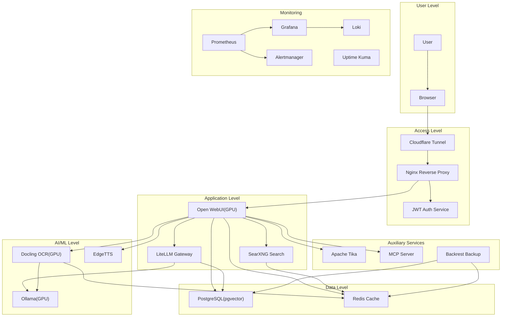

# ERNI-KI Architecture Overview

## High-Level Architecture

## Layer Descriptions

### User Level

- Access via web browser
- HTTPS connection

### Access Level

- **Cloudflare Tunnel**: Secure external access
- **Nginx**: Reverse proxy and SSL termination
- **Auth**: JWT authentication

### Application Level

- **Open WebUI**: Main user interface (GPU-accelerated)
- **LiteLLM**: Context Engineering Gateway
- **SearXNG**: Search engine

### AI/ML Level

- **Ollama**: LLM inference (GPU RTX 5000)
- **Docling**: OCR and document processing (GPU)
- **EdgeTTS**: Speech synthesis

### Data Level

- **PostgreSQL**: Main database with pgvector extension
- **Redis**: Cache and queues

### Auxiliary Services

- **Apache Tika**: File processing
- **MCP Server**: Request processing
- **Backrest**: Backup

### Monitoring

- **Prometheus**: Metrics collection
- **Grafana**: Visualization
- **Loki**: Logging
- **Alertmanager**: Alert management
- **Uptime Kuma**: Availability monitoring
