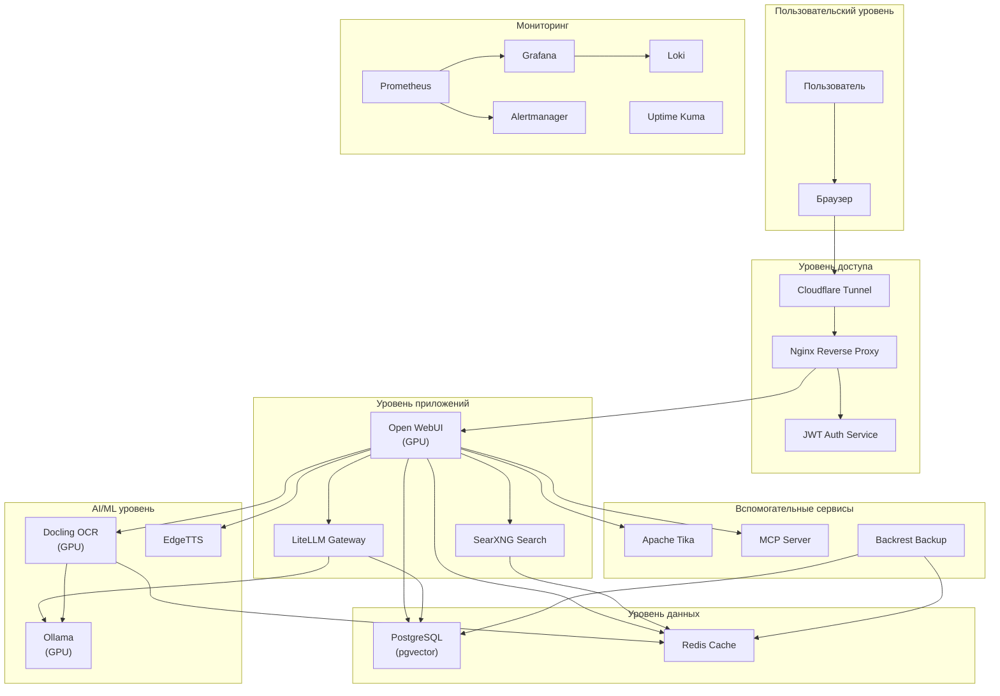

# Обзор архитектуры ERNI-KI

## Высокоуровневая архитектура

## Описание уровней

### Пользовательский уровень

- Доступ через веб-браузер
- HTTPS соединение

### Уровень доступа

- **Cloudflare Tunnel**: Безопасный внешний доступ
- **Nginx**: Reverse proxy и SSL termination
- **Auth**: JWT аутентификация

### Уровень приложений

- **Open WebUI**: Основной пользовательский интерфейс (GPU-ускорение)
- **LiteLLM**: Context Engineering Gateway
- **SearXNG**: Поисковый движок

### AI/ML уровень

- **Ollama**: LLM инференс (GPU RTX 5000)
- **Docling**: OCR и обработка документов (GPU)
- **EdgeTTS**: Синтез речи

### Уровень данных

- **PostgreSQL**: Основная БД с pgvector расширением
- **Redis**: Кэш и очереди

### Вспомогательные сервисы

- **Apache Tika**: Обработка файлов
- **MCP Server**: Обработка запросов
- **Backrest**: Резервное копирование

### Мониторинг

- **Prometheus**: Сбор метрик
- **Grafana**: Визуализация
- **Loki**: Логирование
- **Alertmanager**: Управление алертами
- **Uptime Kuma**: Мониторинг доступности
