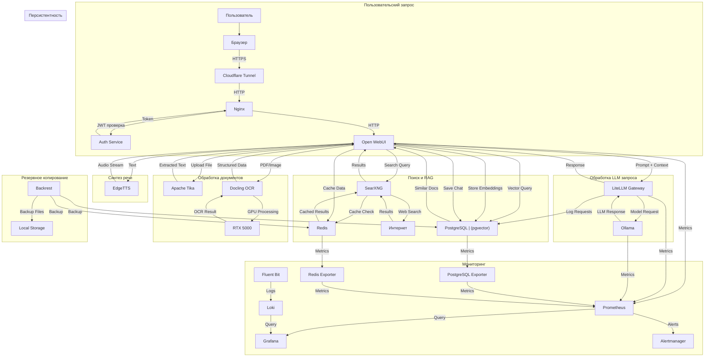

# Поток данных

## Основные потоки данных в ERNI-KI

## Описание потоков

### 1. Пользовательский запрос

1. Пользователь отправляет запрос через браузер
2. Cloudflare Tunnel обеспечивает безопасное соединение
3. Nginx проверяет JWT токен через Auth Service
4. Запрос передается в Open WebUI

### 2. Обработка LLM запроса

1. Open WebUI формирует промпт с контекстом
2. LiteLLM Gateway маршрутизирует запрос к Ollama
3. Ollama генерирует ответ на GPU
4. Ответ возвращается пользователю

### 3. Поиск и RAG

1. Поисковые запросы обрабатываются SearXNG
2. Результаты кэшируются в Redis
3. Векторный поиск выполняется в PostgreSQL (pgvector)
4. Релевантные документы добавляются в контекст

### 4. Обработка документов

1. Файлы обрабатываются Apache Tika для извлечения текста
2. PDF/изображения обрабатываются Docling с GPU-ускорением
3. Эмбеддинги сохраняются в PostgreSQL
4. Структурированные данные возвращаются в Open WebUI

### 5. Синтез речи

1. Текст отправляется в EdgeTTS
2. Генерируется аудио-поток
3. Аудио возвращается пользователю

### 6. Персистентность

1. Чаты сохраняются в PostgreSQL
2. Временные данные кэшируются в Redis
3. LiteLLM логирует все запросы в PostgreSQL

### 7. Мониторинг

1. Метрики собираются Prometheus
2. Логи агрегируются Fluent Bit → Loki
3. Grafana визуализирует метрики и логи
4. Alertmanager управляет алертами

### 8. Резервное копирование

1. Backrest создает резервные копии PostgreSQL и Redis
2. Бэкапы сохраняются локально
3. Автоматическое расписание через cron
