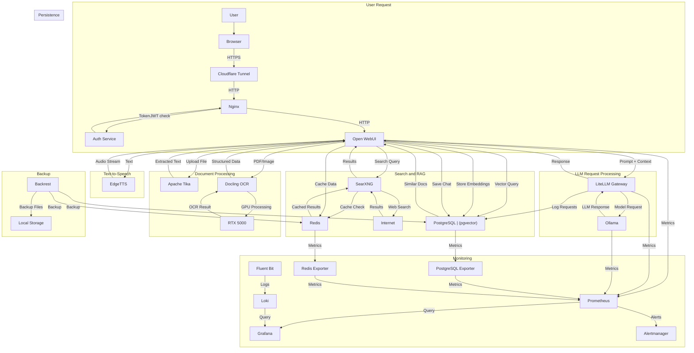

# Data Flow

## Main Data Flows in ERNI-KI

## Flow Descriptions

### 1. User Request

1. User sends request via browser
2. Cloudflare Tunnel provides secure connection
3. Nginx validates JWT token via Auth Service
4. Request is forwarded to Open WebUI

### 2. LLM Request Processing

1. Open WebUI forms prompt with context
2. LiteLLM Gateway routes request to Ollama
3. Ollama generates response on GPU
4. Response is returned to user

### 3. Search and RAG

1. Search queries are processed by SearXNG
2. Results are cached in Redis
3. Vector search is performed in PostgreSQL (pgvector)
4. Relevant documents are added to context

### 4. Document Processing

1. Files are processed by Apache Tika for text extraction
2. PDFs/images are processed by Docling with GPU acceleration
3. Embeddings are stored in PostgreSQL
4. Structured data is returned to Open WebUI

### 5. Text-to-Speech

1. Text is sent to EdgeTTS
2. Audio stream is generated
3. Audio is returned to user

### 6. Persistence

1. Chats are saved to PostgreSQL
2. Temporary data is cached in Redis
3. LiteLLM logs all requests to PostgreSQL

### 7. Monitoring

1. Metrics are collected by Prometheus
2. Logs are aggregated by Fluent Bit → Loki
3. Grafana visualizes metrics and logs
4. Alertmanager manages alerts

### 8. Backup

1. Backrest creates backups of PostgreSQL and Redis
2. Backups are stored locally
3. Automated schedule via cron
