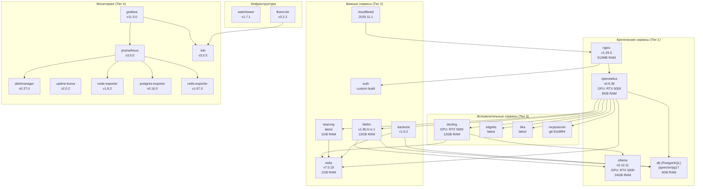

# Диаграмма развертывания

## Docker Compose архитектура

## Ресурсы и ограничения

### GPU-сервисы (NVIDIA RTX 5000, 16GB VRAM)

- **Ollama**: 24GB RAM, 12 CPU cores, OOM score: -900
- **OpenWebUI**: 8GB RAM, 4 CPU cores, OOM score: -600
- **Docling**: 12GB RAM, 8 CPU cores, OOM score: -500

### Критические сервисы

- **PostgreSQL**: 4GB RAM, 2 CPU cores
- **Nginx**: 512MB RAM, 1 CPU core
- **LiteLLM**: 12GB RAM, 1 CPU core, OOM score: -300

### Стратегия логирования (4-tier)

- **Tier 1 (Critical)**: Dual logging (json-file + fluentd backup)
- **Tier 2 (Important)**: Fluentd with buffering
- **Tier 3 (Auxiliary)**: Fluentd with separate tags
- **Tier 4 (Monitoring)**: Minimal logging

## Auto-update политика

### Отключены (monitor-only)

- Ollama (GPU-critical)
- PostgreSQL (database)
- Nginx (proxy)
- OpenWebUI (web interface)
- LiteLLM (gateway)
- Docling (GPU service)

### Включены

- Redis, SearXNG, Auth
- Cloudflared, Backrest
- Все мониторинг-сервисы
- Tika, EdgeTTS, MCP
