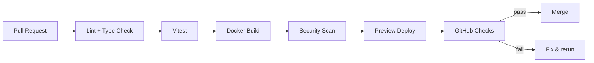

# CI Health Log — GitHub Actions context fixes

_Last updated: 2025-11-17_

## 1. Сводка инцидента

- **Симптом**: GitHub Actions пайплайны `ci.yml`, `security.yml` и
  `deploy-environments.yml` падали уже на стадии интерпретации выражений.
- **Проявление**: отказывали джобы `notify`, `security-report` и `deploy`, а
  логи содержали `Unrecognized named-value: 'needs.test'` /
  `Unrecognized named-value: 'needs.dependency'`.
- **Влияние**: финальный статус workflow помечался как `failure`, release и
  deploy блокировались даже при зелёных тестах.

## 2. Корневая причина

GitHub Expressions не позволяют обращаться к ключам с дефисом через точечную
нотацию. В workflow-ах использовались конструкции вида `needs.test-go.result` и
`steps.grype-scan.outputs.sarif`, из-за чего выражения превращались в попытку
арифметики (`needs.test - go.result`). Это ломало парсинг ещё до выполнения
шагов.

## 3. Исправления

- Применили скобочную нотацию для всех job/step IDs с дефисами:
- `ci.yml`: `needs['test-go']`, `needs['test-js']`, `needs['docker-build']` в
  summary job.
- `security.yml`: `needs['dependency-scan']`, `needs['secret-scan']`,
  `needs['container-scan']`, `needs['config-scan']`, а также
  `steps['grype-scan']`.
- `deploy-environments.yml`: валидация секретов, сборка и деплой теперь
  используют `needs['determine-environment']` при обращении к
  outputs/conditions.
- Провели локальную проверку скриптами (`npm run lint`, `npm run test`,
  `go test ./...`, `npm run test:e2e:mock`) чтобы убедиться, что кодовая база
  здорова перед повторным запуском CI.

## 4. Проверка и дальнейшие действия

1. Запустить вручную workflows ` Continuous Integration`, ` Advanced Security` и
   ` Environment Deploy` (через `workflow_dispatch`) и убедиться, что summary
   job проходит.
2. Если нужно локально валидировать, можно использовать
   `act pull_request -j lint` / `act workflow_dispatch -j security-report` —
   теперь выражения корректно обрабатываются.
3. При добавлении новых job/step IDs с дефисами сразу использовать скобки
   (`needs['job-id']`, `steps['step-id']`). См.
   [документацию GitHub](https://docs.github.com/en/actions/learn-github-actions/expressions#example-access-properties-using-keys)
   для подробностей.

## Визуализация: поток CI

> Ответственный: Codex · 2025-11-17
