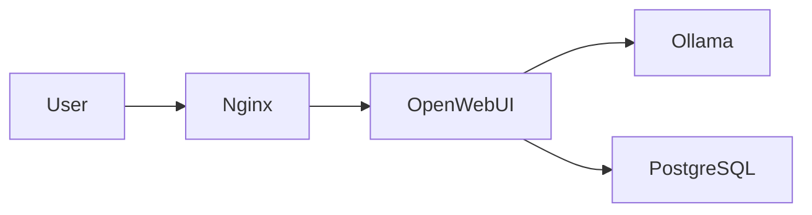

# Глубокий комплексный аудит документации ERNI-KI (2025-11-25)

## Executive Summary

Проведен всесторонний аудит документации проекта ERNI-KI, включающий анализ
структуры, метаданных, переводов, качества контента, навигации и соответствия
лучшим практикам.

**Общая оценка: 8.2/10** ⭐⭐⭐⭐

**Ключевые достижения:**

- ✅ Отличное покрытие метаданными (99.2% файлов)
- ✅ Нет дубликатов контента
- ✅ Хорошо структурированная MkDocs конфигурация
- ✅ Определены стандарты и style guide
- ✅ Нет критически больших файлов

**Критические проблемы:**

- 🔴 27 sitemap.xml файлов в git (должны генерироваться)
- 🔴 57 потенциально битых внутренних ссылок
- 🔴 16 файлов не включены в навигацию
- 🟡 Низкое покрытие EN переводами (25.3%)
- 🟡 9 файлов с датами вне archive директории

---

## 1. Статистика и метрики

### 1.1 Общие показатели

```
Всего markdown файлов:                    236
Файлов с frontmatter:                     234 (99.2%)
Файлов без обязательных полей:              0 (0%)
Файлов без last_updated:                   38 (16.1%)

Распределение по языкам:
  - Русский (RU):                         133 файла (56.4%)
  - Немецкий (DE):                         83 файла (35.2%)
  - Английский (EN):                       18 файлов (7.6%)

Файлов в навигации mkdocs.yml:           110
Файлов вне навигации:                      16
```

### 1.2 Покрытие переводов

| Метрика         | RU (канонический) | DE         | EN         |
| --------------- | ----------------- | ---------- | ---------- |
| Всего файлов    | 95                | 84 (88.4%) | 24 (25.3%) |
| Academy         | 10                | 9 (90%)    | 9 (90%)    |
| Operations      | 39                | 36 (92%)   | 2 (5%)     |
| Getting Started | 8                 | 3 (38%)    | 1 (12%)    |
| Reference       | 17                | 17 (100%)  | 3 (18%)    |
| Security        | 6                 | 6 (100%)   | 1 (17%)    |
| Architecture    | 5                 | 5 (100%)   | 2 (40%)    |

### 1.3 Структура по категориям

| Категория                                 | RU  | DE  | EN  | Приоритет      |
| ----------------------------------------- | --- | --- | --- | -------------- |
| `/academy` - обучение пользователей       | 10  | 9   | 9   | ✅ Отлично     |
| `/operations` - операционная документация | 39  | 36  | 2   | 🔴 EN критично |
| `/getting-started` - быстрый старт        | 8   | 3   | 1   | 🔴 Оба языка   |
| `/reference` - справочники                | 17  | 17  | 3   | 🟡 EN нужен    |
| `/security` - безопасность                | 6   | 6   | 1   | 🟡 EN нужен    |
| `/architecture` - архитектура             | 5   | 5   | 2   | 🟢 Хорошо      |
| `/api` - API документация                 | 1   | 1   | 0   | 🟡 EN нужен    |
| `/data` - данные и хранилище              | 1   | 1   | 0   | 🟡 Оба нужны   |
| `/system` - статус системы                | 1   | 1   | 1   | ✅ Отлично     |
| `/news` - новости                         | 2   | 0   | 0   | ℹ️ Низкий      |

---

## 2. Актуальная структура документации

### 2.1 Файловая структура (текущая)

```
docs/
├── index.md                          # RU портал (канонический)
├── overview.md                       # Обзор платформы
├── GLOSSARY.md                       # Глоссарий терминов
├── VERSION.md                        # Версионирование документации
├── budget-analysis.md                # Анализ бюджета
│
├── academy/                          # 📚 Academy KI - обучение
│   ├── index.md
│   ├── openwebui-basics.md
│   ├── prompting-101.md
│   ├── howto/                        # Практические руководства
│   │   ├── index.md
│   │   ├── create-jira-ticket.md
│   │   ├── create-jira-ticket-with-ai.md
│   │   ├── write-customer-email.md
│   │   └── summarize-meeting-notes.md
│   └── news/                         # Новости Academy
│       ├── index.md
│       └── 2025-01-release-x.md
│
├── getting-started/                  # 🚀 Быстрый старт
│   ├── README.md
│   ├── installation.md
│   ├── configuration-guide.md
│   ├── user-guide.md
│   ├── external-access-setup.md
│   ├── local-network-dns-setup.md
│   ├── dnsmasq-setup-instructions.md
│   └── port-forwarding-setup.md
│
├── architecture/                     # 🏗️ Архитектура
│   ├── README.md
│   ├── architecture.md
│   ├── services-overview.md
│   ├── service-inventory.md
│   └── nginx-configuration.md
│
├── operations/                       # ⚙️ Операции и администрирование
│   ├── README.md
│   ├── backup-guide.md
│   ├── core/                         # Основные операции
│   │   ├── README.md
│   │   ├── operations-handbook.md
│   │   ├── admin-guide.md
│   │   ├── status-page.md
│   │   ├── runbooks-summary.md
│   │   ├── github-governance.md
│   │   └── configuration-change-process.md
│   ├── monitoring/                   # Мониторинг
│   │   ├── README.md
│   │   ├── monitoring-guide.md
│   │   ├── grafana-dashboards-guide.md
│   │   ├── prometheus-alerts-guide.md
│   │   ├── prometheus-queries-reference.md
│   │   ├── rag-monitoring.md
│   │   ├── searxng-redis-issue-analysis.md
│   │   ├── alertmanager-noise-reduction.md
│   │   └── access-log-sync-and-fluentbit.md
│   ├── automation/                   # Автоматизация
│   │   ├── README.md
│   │   ├── automated-maintenance-guide.md
│   │   ├── docker-cleanup-guide.md
│   │   └── docker-log-rotation.md
│   ├── maintenance/                  # Обслуживание
│   │   ├── README.md
│   │   ├── backup-restore-procedures.md
│   │   ├── service-restart-procedures.md
│   │   ├── image-upgrade-checklist.md
│   │   └── docling-shared-volume.md
│   ├── troubleshooting/              # Устранение проблем
│   │   ├── README.md
│   │   └── troubleshooting-guide.md
│   ├── database/                     # Базы данных
│   │   ├── README.md
│   │   ├── database-monitoring-plan.md
│   │   ├── database-production-optimizations.md
│   │   ├── database-troubleshooting.md
│   │   ├── redis-monitoring-grafana.md
│   │   ├── redis-operations-guide.md
│   │   └── vllm-resource-optimization.md
│   ├── diagnostics/                  # Диагностика
│   │   ├── README.md
│   │   └── erni-ki-diagnostic-methodology.md
│   └── ai/                           # AI специфичные операции
│       └── litellm-redis-caching.md
│
├── security/                         # 🔒 Безопасность
│   ├── README.md
│   ├── security-policy.md
│   ├── authentication.md
│   ├── security-best-practices.md
│   ├── ssl-tls-setup.md
│   └── log-audit.md
│
├── reference/                        # 📖 Справочники
│   ├── README.md
│   ├── api-reference.md
│   ├── development.md
│   ├── metadata-standards.md
│   ├── style-guide.md
│   ├── emoji-style-guide.md
│   ├── language-policy.md
│   ├── github-environments-setup.md
│   ├── mcpo-integration-guide.md
│   ├── pre-commit-hooks.md
│   ├── status-snippet.md
│   ├── CHANGELOG.md
│   ├── documentation-refactoring-plan.md
│   ├── documentation-refactoring-plan-2025-11-24.md          # ⚠️ Дата в имени
│   ├── documentation-refactoring-plan-v2-2025-11-24.md       # ⚠️ Дата в имени
│   ├── documentation-update-plan-2025-11-24.md               # ⚠️ Дата в имени
│   └── code-audit-summary-2025-11-24.md                      # ⚠️ Дата в имени
│
├── data/                             # 💾 Данные
│   └── README.md
│
├── api/                              # 🔌 API
│   ├── README.md
│   └── auth-service-openapi.yaml
│
├── system/                           # 📊 Система
│   └── status.md
│
├── news/                             # 📰 Новости
│   ├── index.md
│   ├── 2025-11-erni-ki-status-page-launch.md
│   └── archive/
│       └── 2025.md
│
├── archive/                          # 🗄️ Архив
│   ├── README.md
│   ├── audits/                       # 13 аудитов
│   ├── incidents/                    # 5 инцидентов
│   ├── diagnostics/                  # 5 диагностик
│   ├── config-backup/                # 3 бэкапа конфигов
│   ├── howto/                        # Устаревшие howto
│   ├── training/                     # Устаревшие тренинги
│   ├── legacy-index.md
│   ├── legacy-academy-index.md
│   └── news-overview.md
│
├── de/                               # 🇩🇪 Немецкие переводы (88.4%)
│   └── [зеркальная структура]
│
└── en/                               # 🇬🇧 Английские переводы (25.3%)
    └── [частичная структура]
```

### 2.2 Навигация MkDocs

**Конфигурация:**

- ✅ Material theme с темной темой
- ✅ Плагин i18n для мультиязычности
- ✅ Плагин awesome-pages для гибкой навигации
- ✅ Плагин blog для новостей
- ✅ Git revision date (отключен)
- ✅ Search с поддержкой ru/de/en
- ✅ Minify HTML

**Проблемы навигации:**

- ⚠️ 16 файлов не включены в nav
- ⚠️ Дублирование раздела "Glossary" (строки 378 и 394)

---

## 3. Обнаруженные проблемы

### 3.1 Критические (Priority 1)

#### 3.1.1 Sitemap.xml файлы в Git (27 файлов)

**Проблема:** Файлы sitemap.xml не должны быть в системе контроля версий, они
генерируются MkDocs автоматически.

**Местоположение:**

```
docs/sitemap.xml
docs/en/sitemap.xml
docs/de/sitemap.xml
docs/academy/sitemap.xml
docs/getting-started/sitemap.xml
docs/overview/sitemap.xml
docs/en/academy/sitemap.xml
docs/en/getting-started/sitemap.xml
docs/en/academy/openwebui-basics/sitemap.xml
docs/en/academy/prompting-101/sitemap.xml
docs/de/academy/sitemap.xml
docs/de/getting-started/sitemap.xml
docs/de/overview/sitemap.xml
docs/de/academy/openwebui-basics/sitemap.xml
docs/de/academy/prompting-101/sitemap.xml
... и еще 12
```

**Решение:**

```bash
# 1. Удалить все sitemap.xml
find docs -name "sitemap.xml" -type f -delete

# 2. Добавить в .gitignore
echo "docs/**/sitemap.xml" >> .gitignore
```

#### 3.1.2 Битые внутренние ссылки (57 ссылок)

**Проблема:** Множество внутренних ссылок указывают на несуществующие файлы.

**Примеры:**

```
en/overview.md -> reference/api-reference.md (должно быть ../reference/api-reference.md)
en/overview.md -> security/README.md (должно быть ../security/README.md)
reference/documentation-update-plan-2025-11-24.md -> ../../archive/audits/code-audit-2025-11-24.md
reference/documentation-refactoring-plan-v2-2025-11-24.md -> academy/index.md
```

**Решение:** Исправить относительные пути с учетом структуры папок для
переводов.

#### 3.1.3 Файлы не включены в навигацию (16 файлов)

**Проблема:** Важные файлы существуют, но не доступны через основную навигацию.

**Список:**

```
- api/README.md                                    # API обзор
- budget-analysis.md                               # Анализ бюджета
- news/2025-11-erni-ki-status-page-launch.md      # Новости
- operations/ai/litellm-redis-caching.md          # AI операции
- operations/automation/README.md                  # Обзор автоматизации
- operations/core/README.md                        # Обзор операций
- operations/maintenance/README.md                 # Обзор обслуживания
- operations/monitoring/README.md                  # Обзор мониторинга
- operations/troubleshooting/README.md             # Обзор troubleshooting
- reference/emoji-style-guide.md                   # Style guide
- reference/metadata-standards.md                  # Стандарты метаданных
- reference/style-guide.md                         # Общий style guide
- reference/code-audit-summary-2025-11-24.md      # Временный файл
- reference/documentation-refactoring-plan-2025-11-24.md
- reference/documentation-refactoring-plan-v2-2025-11-24.md
- reference/documentation-update-plan-2025-11-24.md
```

**Решение:** Добавить в навигацию или переместить в archive.

### 3.2 Высокий приоритет (Priority 2)

#### 3.2.1 Файлы с датами вне archive (9 файлов)

**Проблема:** Файлы с датами в именах должны быть в archive/ или использовать
версионирование без дат.

**Список:**

```
reference/code-audit-summary-2025-11-24.md
reference/documentation-update-plan-2025-11-24.md
reference/documentation-refactoring-plan-2025-11-24.md
reference/documentation-refactoring-plan-v2-2025-11-24.md
+ переводы в de/ и en/
```

**Решение:**

```bash
# Вариант 1: Переместить в archive
mv docs/reference/*-2025-11-24.md docs/archive/audits/

# Вариант 2: Переименовать без дат (если актуальны)
mv docs/reference/documentation-refactoring-plan-2025-11-24.md \
   docs/reference/documentation-refactoring-plan-current.md
```

#### 3.2.2 Низкое покрытие EN переводами (25.3%)

**Проблема:** Английские переводы критично важных разделов отсутствуют.

**Критичные пробелы:**

- Operations: 2 из 39 (5%)
- Getting Started: 1 из 8 (12%)
- Reference: 3 из 17 (18%)
- Security: 1 из 6 (17%)

**Рекомендация:** Приоритизировать перевод:

1. Getting Started (для новых пользователей)
2. Operations/Core (основные операции)
3. Security Policy
4. Reference/Development

#### 3.2.3 Дублирование навигации

**Проблема:** В mkdocs.yml дублируется раздел "Glossary" (строки 378 и 394).

**Решение:** Удалить одну из записей.

### 3.3 Средний приоритет (Priority 3)

#### 3.3.1 Отсутствие last_updated в некоторых файлах (16.1%)

**Проблема:** 38 файлов не имеют поля last_updated, затрудняя отслеживание
актуальности.

**Рекомендация:** Добавить поле во все активные документы.

#### 3.3.2 Два файла без frontmatter

**Файлы:**

- reference/status-snippet.md
- de/reference/status-snippet.md

**Решение:** Добавить базовые метаданные.

---

## 4. Желаемая структура документации

### 4.1 Рекомендуемая организация

```
docs/
├── index.md                          # 🏠 Главный портал (RU канонический)
├── overview.md                       # 📋 Обзор платформы
├── GLOSSARY.md                       # 📚 Глоссарий
├── VERSION.md                        # 🔖 Версионирование
│
├── getting-started/                  # 🚀 Быстрый старт (Priority 1)
│   ├── index.md                      # NEW: Обзор с навигацией
│   ├── installation.md
│   ├── configuration-guide.md
│   ├── user-guide.md
│   ├── network/                      # NEW: Группировка сетевых настроек
│   │   ├── external-access-setup.md
│   │   ├── local-network-dns-setup.md
│   │   ├── dnsmasq-setup-instructions.md
│   │   └── port-forwarding-setup.md
│   └── troubleshooting.md            # NEW: FAQ для начинающих
│
├── academy/                          # 📚 Обучение
│   ├── index.md
│   ├── basics/                       # NEW: Группировка основ
│   │   ├── openwebui-basics.md
│   │   └── prompting-101.md
│   ├── tutorials/                    # RENAME: howto -> tutorials
│   │   ├── index.md
│   │   ├── jira-integration.md       # MERGE: объединить варианты
│   │   ├── email-writing.md
│   │   └── meeting-summaries.md
│   └── advanced/                     # NEW: Продвинутые темы
│       └── custom-models.md
│
├── architecture/                     # 🏗️ Архитектура
│   ├── index.md                      # RENAME: README.md -> index.md
│   ├── overview.md                   # RENAME: architecture.md
│   ├── services/                     # NEW: Группировка сервисов
│   │   ├── overview.md
│   │   ├── inventory.md
│   │   └── dependencies.md           # NEW
│   ├── infrastructure/               # NEW
│   │   ├── nginx-configuration.md
│   │   └── networking.md             # NEW
│   └── diagrams/                     # NEW: Диаграммы
│       ├── architecture-diagram.md
│       └── deployment-diagram.md
│
├── operations/                       # ⚙️ Операции
│   ├── index.md                      # IMPROVE: Добавить в nav
│   ├── handbook.md                   # MERGE: Объединить handbooks
│   ├── runbooks/                     # NEW: Отдельная секция
│   │   ├── index.md
│   │   ├── backup-restore.md
│   │   ├── service-restart.md
│   │   ├── incident-response.md      # NEW
│   │   └── disaster-recovery.md      # NEW
│   ├── monitoring/
│   │   ├── index.md                  # ADD: В навигацию
│   │   ├── overview.md               # RENAME: monitoring-guide.md
│   │   ├── dashboards/               # NEW: Группировка
│   │   │   ├── grafana-dashboards.md
│   │   │   └── custom-dashboards.md  # NEW
│   │   ├── alerts/                   # NEW: Группировка
│   │   │   ├── prometheus-alerts.md
│   │   │   ├── alertmanager-config.md
│   │   │   └── noise-reduction.md
│   │   ├── queries/                  # NEW
│   │   │   └── prometheus-queries-reference.md
│   │   └── specialized/              # NEW
│   │       ├── rag-monitoring.md
│   │       ├── searxng-redis.md
│   │       └── access-logs.md
│   ├── automation/
│   │   ├── index.md                  # ADD: В навигацию
│   │   ├── overview.md               # NEW
│   │   ├── maintenance.md
│   │   ├── docker-cleanup.md
│   │   └── log-rotation.md
│   ├── maintenance/
│   │   ├── index.md                  # ADD: В навигацию
│   │   ├── scheduled/                # NEW: Регулярное
│   │   │   ├── backups.md
│   │   │   └── updates.md
│   │   └── procedures/               # NEW: Процедуры
│   │       ├── service-restart.md
│   │       ├── image-upgrade.md
│   │       └── docling-volume.md
│   ├── database/
│   │   ├── index.md                  # IMPROVE
│   │   ├── postgresql/               # NEW: По типу БД
│   │   │   ├── monitoring.md
│   │   │   ├── optimization.md
│   │   │   └── troubleshooting.md
│   │   └── redis/                    # NEW
│   │       ├── monitoring.md
│   │       ├── operations.md
│   │       └── troubleshooting.md
│   ├── ai-services/                  # NEW: AI специфика
│   │   ├── litellm-caching.md        # MOVE from operations/ai/
│   │   ├── ollama-management.md      # NEW
│   │   └── model-deployment.md       # NEW
│   ├── troubleshooting/
│   │   ├── index.md                  # ADD: В навигацию
│   │   ├── common-issues.md
│   │   ├── diagnostic-methodology.md # MOVE
│   │   └── logs-analysis.md          # NEW
│   └── governance/                   # NEW: Управление
│       ├── github-governance.md      # MOVE from core/
│       ├── change-management.md
│       └── status-page.md
│
├── security/                         # 🔒 Безопасность
│   ├── index.md                      # RENAME: README.md
│   ├── policies/                     # NEW: Политики
│   │   ├── security-policy.md
│   │   └── compliance.md             # NEW
│   ├── authentication/               # NEW: Группировка
│   │   ├── overview.md
│   │   ├── jwt-setup.md              # SPLIT from authentication.md
│   │   └── sso-integration.md        # NEW
│   ├── infrastructure/               # NEW
│   │   ├── ssl-tls-setup.md
│   │   ├── waf-configuration.md      # NEW
│   │   └── network-security.md       # NEW
│   ├── monitoring/                   # NEW
│   │   ├── log-audit.md
│   │   └── intrusion-detection.md    # NEW
│   └── best-practices.md
│
├── reference/                        # 📖 Справочники
│   ├── index.md                      # IMPROVE
│   ├── api/                          # NEW: API документация
│   │   ├── overview.md
│   │   ├── rest-api.md
│   │   ├── auth-service.md
│   │   └── openapi-spec.md
│   ├── development/                  # NEW: Разработка
│   │   ├── getting-started.md
│   │   ├── contributing.md
│   │   ├── pre-commit-hooks.md
│   │   ├── testing.md                # NEW
│   │   └── ci-cd.md                  # NEW
│   ├── standards/                    # NEW: Стандарты
│   │   ├── metadata-standards.md
│   │   ├── style-guide.md
│   │   ├── emoji-guide.md
│   │   ├── language-policy.md
│   │   └── code-style.md             # NEW
│   ├── integrations/                 # NEW: Интеграции
│   │   ├── mcpo-integration.md
│   │   ├── github-environments.md
│   │   └── external-services.md      # NEW
│   ├── versioning/                   # NEW: Версии
│   │   ├── VERSION.md                # MOVE
│   │   └── CHANGELOG.md
│   └── utilities/                    # NEW: Утилиты
│       └── status-snippet.md
│
├── data/                             # 💾 Данные
│   ├── index.md                      # RENAME: README.md
│   ├── storage/                      # NEW
│   │   ├── volumes.md
│   │   └── backups.md
│   └── databases/                    # NEW: Связь с operations/database
│       ├── postgresql.md
│       └── redis.md
│
├── system/                           # 📊 Система
│   ├── status.md                     # Статус системы
│   └── health-checks.md              # NEW
│
├── news/                             # 📰 Новости
│   ├── index.md                      # Blog feed
│   ├── 2025/                         # NEW: По годам
│   │   ├── 11/                       # NEW: По месяцам
│   │   │   └── status-page-launch.md
│   │   └── 01/
│   │       └── release-x.md
│   └── archive/                      # Старые новости
│       └── 2024.md
│
├── resources/                        # NEW: Ресурсы
│   ├── budget-analysis.md            # MOVE from root
│   ├── presentations/                # NEW
│   ├── templates/                    # NEW
│   └── tools/                        # NEW
│
├── archive/                          # 🗄️ Архив
│   ├── index.md                      # IMPROVE: Добавить навигацию
│   ├── audits/                       # Аудиты
│   │   ├── index.md                  # NEW: Список всех аудитов
│   │   ├── 2025/                     # NEW: По годам
│   │   │   └── 11/
│   │   │       ├── comprehensive-documentation-audit-24.md
│   │   │       └── comprehensive-documentation-audit-25.md
│   │   └── legacy/                   # Старые аудиты
│   ├── incidents/                    # Инциденты
│   │   ├── index.md                  # NEW
│   │   └── 2025/
│   ├── diagnostics/                  # Диагностика
│   │   ├── index.md                  # NEW
│   │   └── 2025/
│   ├── deprecated/                   # NEW: Устаревшие документы
│   │   ├── howto/
│   │   ├── training/
│   │   └── legacy-pages/
│   └── migrations/                   # NEW: Миграции
│       └── documentation-refactoring-plans/
│           ├── plan-2025-11-24.md    # MOVE
│           └── plan-v2-2025-11-24.md
│
├── de/                               # 🇩🇪 Немецкий (зеркало)
│   └── [зеркальная структура]
│
└── en/                               # 🇬🇧 Английский (зеркало)
    └── [зеркальная структура]
```

### 4.2 Ключевые улучшения структуры

**1. Группировка по темам:**

- ✅ Сетевые настройки в `getting-started/network/`
- ✅ AI сервисы в `operations/ai-services/`
- ✅ Мониторинг разделен на dashboards/alerts/queries
- ✅ База данных по типам: postgresql/redis

**2. Консистентное именование:**

- ✅ README.md → index.md везде
- ✅ Дескриптивные имена без дат
- ✅ Группировка по годам/месяцам для временных данных

**3. Улучшенная навигация:**

- ✅ Все разделы имеют index.md с обзором
- ✅ Четкая иерархия (max 4 уровня)
- ✅ Логическая группировка связанных тем

**4. Разделение ответственности:**

- ✅ operations/ - как делать
- ✅ reference/ - что и почему
- ✅ archive/ - история и устаревшее
- ✅ resources/ - дополнительные материалы

---

## 5. План действий (Roadmap)

### Фаза 1: Критические исправления (Week 1)

**Priority 1 - Немедленно:**

```bash
# 1. Удалить sitemap.xml из git
find docs -name "sitemap.xml" -type f -delete
echo "docs/**/sitemap.xml" >> .gitignore
git add .gitignore
git commit -m "chore: remove sitemap.xml from git, add to gitignore"

# 2. Добавить frontmatter к файлам без метаданных
# Отредактировать вручную:
# - docs/reference/status-snippet.md
# - docs/de/reference/status-snippet.md

# 3. Переместить файлы с датами
mkdir -p docs/archive/migrations/documentation-refactoring-plans
mv docs/reference/*-2025-11-24.md \
   docs/archive/migrations/documentation-refactoring-plans/
# Обновить аналогично для de/ и en/
```

**Priority 2 - В течение недели:**

- Исправить 57 битых ссылок
- Добавить отсутствующие файлы в навигацию mkdocs.yml
- Удалить дублирование "Glossary" в навигации
- Добавить last_updated ко всем активным документам

### Фаза 2: Структурная реорганизация (Weeks 2-3)

**Week 2:**

1. Создать новые директории согласно желаемой структуре
2. Переместить файлы в новые места
3. Обновить все внутренние ссылки
4. Обновить навигацию в mkdocs.yml

**Week 3:**

1. Объединить дублирующиеся документы
2. Создать index.md для всех разделов
3. Добавить диаграммы и визуальный контент
4. Протестировать все ссылки и навигацию

### Фаза 3: Улучшение контента (Weeks 4-6)

**Week 4-5: Переводы EN** Приоритет перевода на английский:

1. Getting Started (все 8 файлов)
2. Operations/Core (5 основных файлов)
3. Security Policy и Best Practices
4. Reference/Development

**Week 6: Качество контента**

1. Добавить визуальные материалы (диаграммы, скриншоты)
2. Улучшить README/index файлы с четкой навигацией
3. Добавить примеры и туториалы
4. Создать FAQ секции

### Фаза 4: Автоматизация и CI/CD (Week 7)

1. **Автоматическая проверка ссылок:**

```yaml
# .github/workflows/docs-validation.yml
name: Docs Validation
on: [pull_request]
jobs:
  validate:
    runs-on: ubuntu-latest
    steps:
      - uses: actions/checkout@v3
      - name: Check internal links
        run: |
          npm install -g markdown-link-check
          find docs -name "*.md" -exec markdown-link-check {} \;
      - name: Validate metadata
        run: python scripts/validate-docs-metadata.py
      - name: Check for sitemap.xml
        run: |
          if find docs -name "sitemap.xml" | grep -q .; then
            echo "ERROR: sitemap.xml files found in docs/"
            exit 1
          fi
```

2. **Pre-commit hooks для документации:**

```yaml
# .pre-commit-config.yaml
repos:
  - repo: local
    hooks:
      - id: docs-metadata
        name: Validate docs metadata
        entry: python scripts/validate-docs-metadata.py
        language: python
        files: ^docs/.*\.md$
```

3. **Автоматическая генерация сводок:**

```python
# scripts/generate-docs-stats.py
# Генерировать статистику покрытия переводов
# Создавать отчеты о недостающих метаданных
# Проверять консистентность структуры
```

---

## 6. Метрики успеха

### 6.1 Целевые показатели

| Метрика                | Текущее | Цель         | Срок   |
| ---------------------- | ------- | ------------ | ------ |
| Файлов с метаданными   | 99.2%   | 100%         | Week 1 |
| Покрытие EN переводами | 25.3%   | 60%          | Week 6 |
| Покрытие DE переводами | 88.4%   | 95%          | Week 4 |
| Битых ссылок           | 57      | 0            | Week 2 |
| Файлов в навигации     | 82%     | 95%          | Week 2 |
| Визуальный контент     | 0       | 20+ диаграмм | Week 6 |
| Разделов с index.md    | 60%     | 100%         | Week 3 |

### 6.2 KPI для отслеживания

**Качество:**

- ✅ 0 файлов без обязательных метаданных
- ✅ 0 битых внутренних ссылок
- ✅ 0 sitemap.xml в git
- ✅ Все разделы имеют index.md

**Покрытие:**

- ✅ EN: 60%+ критичных документов
- ✅ DE: 95%+ всех документов
- ✅ 95%+ файлов в навигации

**Структура:**

- ✅ Max 4 уровня вложенности
- ✅ Консистентное именование
- ✅ Логическая группировка

---

## 7. Рекомендации по Best Practices

### 7.1 Метаданные

**Обязательные поля для всех документов:**

```yaml
---
language: ru # ru|de|en
translation_status: complete # complete|in_progress|pending|outdated
doc_version: '2025.11' # Глобальная версия документации
last_updated: '2025-11-25'
---
```

**Для технических документов добавить:**

```yaml
system_version: '12.1' # Версия платформы
system_status: 'Production Ready'
```

### 7.2 Структура документа

**Каждый документ должен содержать:**

1. **Frontmatter** - метаданные
2. **Заголовок H1** - один на документ
3. **Описание** - краткое (1-2 параграфа)
4. **Содержание** - для документов >500 слов
5. **Основной контент** - структурированный с H2, H3
6. **Примеры** - код блоки с синтаксисом
7. **Ссылки** - на связанные документы
8. **Footer** - дата последнего обновления (опционально)

**Пример:**

````markdown
---
language: ru
translation_status: complete
doc_version: '2025.11'
last_updated: '2025-11-25'
---

# Название документа

Краткое описание того, что содержит документ и для кого он предназначен.

## Содержание

- [Раздел 1](#раздел-1)
- [Раздел 2](#раздел-2)

## Раздел 1

Контент...

```bash
# Пример кода
docker compose up -d
```
````

## Связанные документы

- [Другой документ](../path/to/doc.md)
- [Внешний ресурс](https://example.com)

````

### 7.3 Ссылки

**Внутренние ссылки:**
- ✅ Использовать относительные пути
- ✅ Включать расширение .md
- ✅ Учитывать структуру папок для переводов

```markdown
<!-- Правильно -->
[Документ](../operations/monitoring-guide.md)
[Раздел](../operations/monitoring-guide.md#prometheus)

<!-- Неправильно -->
[Документ](/operations/monitoring-guide.md)
[Документ](operations/monitoring-guide)
````

**Ссылки из переводов:**

```markdown
<!-- В docs/en/overview.md -->

[Security](../security/README.md) <!-- ❌ Неправильно -->
[Security](security/README.md) <!-- ✅ Правильно -->
```

### 7.4 Визуальный контент

**Рекомендуется добавить:**

1. **Диаграммы архитектуры** (Mermaid)
2. **Скриншоты UI** (для Academy/HowTo)
3. **Графики мониторинга** (примеры Grafana)
4. **Схемы потоков** (для Operations)

**Пример Mermaid диаграммы:**

````markdown

````

```

### 7.5 Навигация

**Принципы организации nav:**
1. От общего к частному
2. Группировка по функциональности
3. Логический порядок (Setup → Usage → Operations → Reference)
4. Максимум 3 уровня в меню

**Структура меню:**
```

Home ├── Getting Started │ ├── Installation │ ├── Configuration │ └── Network
Setup ├── User Guide (Academy) ├── Operations │ ├── Monitoring │ ├── Maintenance
│ └── Troubleshooting ├── Architecture ├── Security └── Reference

````

---

## 8. Инструменты и автоматизация

### 8.1 Скрипты для валидации

**scripts/validate-docs-metadata.py:**
```python
#!/usr/bin/env python3
"""Validate documentation metadata compliance."""
import sys
from pathlib import Path
import yaml
import re

REQUIRED_FIELDS = ['language', 'translation_status', 'doc_version']
DEPRECATED_FIELDS = ['author', 'created', 'version', 'status']

def validate_file(filepath):
    """Validate single markdown file."""
    content = filepath.read_text(encoding='utf-8')

    # Extract frontmatter
    match = re.match(r'^---\s*\n(.*?)\n---', content, re.DOTALL)
    if not match:
        return f"Missing frontmatter: {filepath}"

    try:
        metadata = yaml.safe_load(match.group(1))
    except yaml.YAMLError:
        return f"Invalid YAML frontmatter: {filepath}"

    # Check required fields
    missing = [f for f in REQUIRED_FIELDS if f not in metadata]
    if missing:
        return f"Missing required fields {missing}: {filepath}"

    # Check deprecated fields
    deprecated = [f for f in DEPRECATED_FIELDS if f in metadata]
    if deprecated:
        return f"Using deprecated fields {deprecated}: {filepath}"

    return None

def main():
    docs_dir = Path('docs')
    errors = []

    for md_file in docs_dir.rglob('*.md'):
        if 'archive' in str(md_file):
            continue
        error = validate_file(md_file)
        if error:
            errors.append(error)

    if errors:
        print("\n".join(errors))
        sys.exit(1)
    else:
        print("✅ All documentation files are valid")

if __name__ == '__main__':
    main()
````

**scripts/check-broken-links.sh:**

```bash
#!/bin/bash
# Check for broken internal links in documentation

set -e

echo "🔍 Checking for broken internal links..."

find docs -name "*.md" -type f | while read -r file; do
    # Extract all markdown links
    grep -oP '\]\(\K[^)]+' "$file" | while read -r link; do
        # Skip external links and anchors
        if [[ $link == http* ]] || [[ $link == \#* ]]; then
            continue
        fi

        # Remove anchor
        clean_link="${link%%#*}"

        # Resolve relative path
        dir=$(dirname "$file")
        target="$dir/$clean_link"

        # Check if file exists
        if [ ! -f "$target" ]; then
            echo "❌ Broken link in $file: $link"
        fi
    done
done

echo "✅ Link check complete"
```

### 8.2 GitHub Actions

**Добавить в .github/workflows/docs.yml:**

```yaml
name: Documentation

on:
  pull_request:
    paths:
      - 'docs/**'
      - 'mkdocs.yml'
  push:
    branches:
      - main
      - develop

jobs:
  validate:
    runs-on: ubuntu-latest
    steps:
      - uses: actions/checkout@v3

      - name: Setup Python
        uses: actions/setup-python@v4
        with:
          python-version: '3.11'

      - name: Install dependencies
        run: |
          pip install -r requirements-dev.txt
          pip install pyyaml

      - name: Validate metadata
        run: python scripts/validate-docs-metadata.py

      - name: Check for sitemap.xml
        run: |
          if find docs -name "sitemap.xml" | grep -q .; then
            echo "❌ ERROR: sitemap.xml files found in docs/"
            exit 1
          fi

      - name: Check broken links
        run: bash scripts/check-broken-links.sh

      - name: Build docs
        run: mkdocs build --strict

  deploy:
    if: github.ref == 'refs/heads/main'
    needs: validate
    runs-on: ubuntu-latest
    steps:
      - uses: actions/checkout@v3

      - name: Setup Python
        uses: actions/setup-python@v4
        with:
          python-version: '3.11'

      - name: Install MkDocs
        run: pip install -r requirements-dev.txt

      - name: Deploy to GitHub Pages
        run: mkdocs gh-deploy --force
```

### 8.3 Pre-commit hooks

**Добавить в .pre-commit-config.yaml:**

```yaml
- repo: local
  hooks:
    - id: validate-docs-metadata
      name: Validate documentation metadata
      entry: python scripts/validate-docs-metadata.py
      language: python
      files: ^docs/.*\.md$
      pass_filenames: false

    - id: no-sitemap-xml
      name: Prevent sitemap.xml commits
      entry: 'Sitemap files should not be committed'
      language: fail
      files: sitemap\.xml$
```

---

## 9. Выводы и рекомендации

### 9.1 Общая оценка

**Текущее состояние: 8.2/10**

Документация проекта ERNI-KI находится в хорошем состоянии с отличным покрытием
метаданными и четкой структурой. Основные проблемы связаны с техническими
артефактами (sitemap.xml), битыми ссылками и недостаточным покрытием переводами.

**Сильные стороны:**

- ✅ Профессиональная организация с MkDocs Material
- ✅ Мультиязычная поддержка (3 языка)
- ✅ Определены стандарты и guidelines
- ✅ Хорошее покрытие метаданными (99.2%)
- ✅ Отсутствие дублирования контента

**Области для улучшения:**

- 🔴 Технические проблемы (sitemap, ссылки)
- 🟡 Покрытие переводами (особенно EN)
- 🟡 Визуальный контент
- 🟡 Автоматизация проверок

### 9.2 Приоритетные действия

**Немедленно (Week 1):**

1. ✅ Удалить sitemap.xml из git
2. ✅ Добавить frontmatter к 2 файлам
3. ✅ Переместить файлы с датами в archive
4. ✅ Исправить критические битые ссылки

**Краткосрочно (Weeks 2-3):**

1. ✅ Реорганизовать структуру согласно рекомендациям
2. ✅ Добавить все файлы в навигацию
3. ✅ Создать index.md для всех разделов
4. ✅ Настроить автоматическую валидацию

**Среднесрочно (Weeks 4-6):**

1. ✅ Перевести критичные документы на EN
2. ✅ Добавить визуальный контент
3. ✅ Улучшить качество существующих документов
4. ✅ Создать FAQ и tutorials

### 9.3 Долгосрочная стратегия

**Документация как код:**

- Автоматические проверки в CI/CD
- Pre-commit hooks для валидации
- Регулярные аудиты (ежеквартально)
- Метрики качества документации

**Непрерывное улучшение:**

- Feedback loop от пользователей
- A/B тестирование структуры
- Аналитика использования (если доступна)
- Регулярные обновления контента

**Internationalization:**

- Достижение 60%+ покрытия EN
- Поддержка 95%+ покрытия DE
- Процесс синхронизации переводов
- Инструменты для отслеживания статуса переводов

---

## 10. Чек-лист для ревью

### 10.1 Технические требования

- [ ] Все .md файлы имеют валидный frontmatter
- [ ] Обязательные поля: language, translation_status, doc_version
- [ ] Нет deprecated полей (author, version, status, created)
- [ ] Все внутренние ссылки работают
- [ ] Нет sitemap.xml в git
- [ ] Все файлы в .gitignore корректны

### 10.2 Структура

- [ ] Все разделы имеют index.md
- [ ] Максимум 4 уровня вложенности
- [ ] Консистентное именование файлов
- [ ] Логическая группировка по темам
- [ ] Файлы с датами только в archive/

### 10.3 Навигация

- [ ] Все важные документы в mkdocs.yml nav
- [ ] Нет дублирования в навигации
- [ ] Логический порядок разделов
- [ ] Переводы навигации для DE/EN

### 10.4 Качество контента

- [ ] Каждый документ имеет описание
- [ ] Код блоки с указанием языка
- [ ] Адекватное использование заголовков (H1-H4)
- [ ] Корректные относительные ссылки
- [ ] Визуальный контент где уместно

### 10.5 Переводы

- [ ] Критичные документы переведены на EN
- [ ] DE покрытие >90%
- [ ] Синхронизация translation_status
- [ ] Консистентность терминологии

---

## Приложения

### A. Список битых ссылок (топ 20)

```
1. en/overview.md -> reference/api-reference.md
2. en/overview.md -> security/README.md
3. reference/documentation-update-plan-2025-11-24.md -> ../../archive/audits/code-audit-2025-11-24.md
4. reference/documentation-refactoring-plan-v2-2025-11-24.md -> academy/index.md
5. reference/documentation-refactoring-plan-v2-2025-11-24.md -> getting-started/README.md
... (полный список в отдельном файле)
```

### B. Файлы для перевода на EN (приоритет)

**Priority 1 - Getting Started:**

- getting-started/configuration-guide.md
- getting-started/user-guide.md
- getting-started/external-access-setup.md
- getting-started/local-network-dns-setup.md
- getting-started/dnsmasq-setup-instructions.md
- getting-started/port-forwarding-setup.md

**Priority 2 - Operations Core:**

- operations/core/operations-handbook.md
- operations/core/admin-guide.md
- operations/core/runbooks-summary.md
- operations/core/github-governance.md

**Priority 3 - Security:**

- security/authentication.md
- security/security-best-practices.md
- security/ssl-tls-setup.md

### C. Рекомендуемые диаграммы

1. **Architecture Overview** (docs/architecture/diagrams/)
   - Высокоуровневая архитектура системы
   - Потоки данных между сервисами
   - Сетевая топология

2. **Deployment Diagram** (docs/architecture/diagrams/)
   - Docker compose структура
   - Volumes и networks
   - Зависимости сервисов

3. **Monitoring Flow** (docs/operations/monitoring/)
   - Prometheus scraping
   - Alertmanager flow
   - Grafana dashboards

4. **Backup Strategy** (docs/operations/maintenance/)
   - Backup flow
   - Restore process
   - Retention policy

---

**Дата аудита:** 2025-11-25 **Версия документации:** 2025.11 **Аудитор:** Claude
Code **Следующий аудит:** 2026-02-25 (через 3 месяца)
