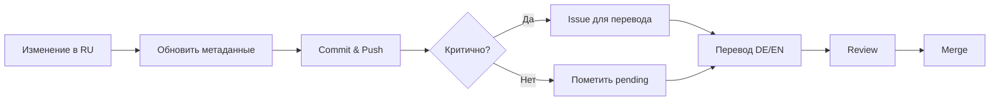

# План рефакторинга документации ERNI-KI (2025-11-24)

> **Полный аудит:**
> [comprehensive-documentation-audit-2025-11-24.md](../archive/audits/comprehensive-documentation-audit-2025-11-24.md)
> **Полный аудит:**
> [comprehensive-documentation-audit-2025-11-24.md](../archive/audits/comprehensive-documentation-audit-2025-11-24.md)
> [TOC]

## Краткое резюме аудита

**Оценка:** 7.5/10

**Статистика:**

- Всего файлов: 194 (161 активных + 33 архивных)
- Покрытие переводов (актуализация 2025-11-24): DE ≈41% (36 complete из 88 RU),
  EN ≈6% (5 complete из 88 RU)
- Проблем: 37 deprecated метаданных, 6 битых ссылок, 61 файл без TOC

**Критические проблемы:**

1. Низкое покрытие EN переводов (19.5%)
2. 37 файлов с deprecated полями метаданных
3. 61 длинный документ без оглавления
4. 0 изображений в документации

---

## Фазы рефакторинга

### Фаза 1: Быстрые исправления (1 день)

**Статус:** Ожидает начала

#### Задачи

- [ ] **Исправить deprecated метаданные** (2 часа)
- 19 файлов: `status` → `system_status`
- 18 файлов: `version` → `system_version`
- Скрипт: `python3 scripts/fix-deprecated-metadata.py`

- [ ] **Добавить frontmatter** (15 минут)
- `reference/status-snippet.md`
- `de/reference/status-snippet.md`

- [ ] **Исправить битые ссылки** (30 минут)
- 3 ссылки в `de/security/README.md`
- 2 ссылки в `de/getting-started/installation.md`
- 1 ссылка в `operations/monitoring/prometheus-alerts-guide.md`

- [ ] **Добавить TOC в топ-10 документов** (1 час)
- [architecture/architecture.md](../architecture/architecture.md) (4323 слов)
- [operations/monitoring/monitoring-guide.md](../operations/monitoring/monitoring-guide.md)
  (3531 слов)
- [security/log-audit.md](../security/log-audit.md) (2249 слов)
- [operations/diagnostics/erni-ki-diagnostic-methodology.md](../operations/diagnostics/erni-ki-diagnostic-methodology.md)
  (2057 слов)
- [de/architecture/architecture.md](../de/architecture/architecture.md) (2030
  слов)
- [reference/api-reference.md](api-reference.md) (2023 слов)
- [getting-started/installation.md](../getting-started/installation.md) (1881
  слов)
- [operations/maintenance/backup-restore-procedures.md](../operations/maintenance/backup-restore-procedures.md)
  (1879 слов)
- [de/operations/maintenance/backup-restore-procedures.md](../de/operations/maintenance/backup-restore-procedures.md)
  (1839 слов)
- [architecture/service-inventory.md](../architecture/service-inventory.md)
  (1742 слов)

- [ ] **Создать README для operations/**
- `operations/automation/README.md`
- `operations/core/README.md`
- `operations/maintenance/README.md`
- `operations/monitoring/README.md`
- `operations/troubleshooting/README.md`

**Результат:**

- 100% файлов с корректными метаданными
- 0 битых ссылок
- Топ-10 документов с TOC
- Все подразделы operations/ с README

---

### Фаза 2: Качество контента (1 неделя)

**Статус:** ⏳ Запланировано

#### Задачи

- [ ] **Исправить структуру заголовков** (3 часа)
- 59 файлов с проблемами
- Автоматизировать через pre-commit hook
- Приоритет: reference/, architecture/, security/

- [ ] **Расширить короткие файлы** (4 часа)
- 29 файлов <100 слов
- Фокус: EN/DE academy файлы
- Либо добавить контент, либо удалить и настроить redirect

- [ ] **Завершить TODO/FIXME** (2 часа)
- `security/security-policy.md`
- `en/security/security-policy.md`
- `de/security/security-policy.md`
- `operations/core/configuration-change-process.md`

- [ ] **Добавить TOC в остальные документы** (4 часа)
- 51 документ >500 слов без TOC
- Batch обработка через скрипт

- [ ] **Настроить MkDocs** (4 часа)
- Сгенерировать полноценный sitemap.xml
- Включить `git-revision-date-localized`
- Настроить `mike` для версионирования
- Настроить или удалить Google Analytics

- [ ] **Создать автоматические проверки** (4 часа)
- Pre-commit hooks для валидации
- GitHub Actions для CI
- Документация по процессам

**Результат:**

- 100% документов с правильной структурой заголовков
- 0 TODO/FIXME в production docs
- Все документы >500 слов с TOC
- Автоматическая валидация в CI
- Короткие документы остались только в DE-разделах и включены в Phase 3

### Автоматизация

- Добавлен `scripts/docs/content_lint.py` (fix headings, [TOC], отчёт по
  коротким файлам).
- npm-скрипты:
- `npm run docs:lint` — применяет фиксы (используется локально/pre-commit).
- `npm run docs:report` — выводит список коротких файлов для Phase 3.

---

### Фаза 3: Переводы (1-2 месяца)

**Статус:** ⏳ Запланировано

#### Приоритет 1: Английские переводы (40 часов)

**Критичные разделы:**

1. **Getting Started** (8 файлов, ~8 часов)

- [ ] configuration-guide.md
- [ ] dnsmasq-setup-instructions.md
- [ ] external-access-setup.md
- [ ] local-network-dns-setup.md
- [ ] port-forwarding-setup.md
- [ ] user-guide.md (уже частично есть)
- [ ] README.md

2. **Operations Core** (6 файлов, ~8 часов)

- [ ] operations-handbook.md
- [ ] runbooks-summary.md
- [ ] admin-guide.md
- [ ] status-page.md
- [ ] github-governance.md
- [ ] configuration-change-process.md

3. **Reference** (11 файлов, ~12 часов)

- [ ] api-reference.md
- [ ] development.md
- [ ] github-environments-setup.md
- [ ] mcpo-integration-guide.md
- [ ] pre-commit-hooks.md
- [ ] language-policy.md
- [ ] metadata-standards.md
- [ ] status-snippet.md
- [ ] CHANGELOG.md
- [ ] README.md

4. **Architecture** (4 файла, ~6 часов)

- [ ] services-overview.md
- [ ] nginx-configuration.md
- [ ] service-inventory.md
- [ ] README.md

5. **Security** (5 файлов, ~6 часов)

- [ ] authentication.md
- [ ] security-best-practices.md
- [ ] ssl-tls-setup.md
- [ ] log-audit.md
- [ ] README.md

#### Приоритет 2: Немецкие переводы (12 часов)

**Недостающие файлы:**

1. **Getting Started** (4 файла, ~4 часа)

- [ ] dnsmasq-setup-instructions.md
- [ ] external-access-setup.md
- [ ] local-network-dns-setup.md
- [ ] port-forwarding-setup.md

2. **Architecture** (2 файла, ~4 часа)

- [ ] service-inventory.md
- [ ] README.md

3. **Root** (2 файла, ~2 часа)

- [ ] GLOSSARY.md
- [ ] VERSION.md

4. **Reference** (5 файлов, ~4 часа)

- [ ] api-reference.md
- [ ] language-policy.md
- [ ] metadata-standards.md
- [ ] documentation-refactoring-plan.md
- [ ] README.md

**Результат:**

- EN покрытие >60% (с 19.5%)
- DE покрытие >95% (с 74.4%)
- Все критичные разделы переведены

---

### Фаза 4: Визуальный контент (постоянно)

**Статус:** ⏳ Запланировано

#### Диаграммы (Mermaid)

- [ ] **Архитектура системы**
- Общая схема компонентов
- Схема сервисов
- Network topology

- [ ] **Мониторинг**
- Потоки данных мониторинга
- Alert routing
- Dashboard структура

- [ ] **Security**
- Authentication flow
- Access control схема
- TLS/SSL setup

#### Скриншоты

- [ ] **Academy**
- OpenWebUI интерфейс
- Примеры промптов
- Настройки модели

- [ ] **Getting Started**
- Процесс установки
- Конфигурация
- Первый запуск

- [ ] **Operations**
- Grafana dashboards
- Prometheus alerts
- Admin панель

**Результат:**

- Минимум 1 диаграмма в каждом ключевом документе
- Скриншоты для всех UI-related инструкций

---

## Метрики успеха

### Целевые показатели (через 3 месяца)

| Метрика                          | Текущее | Цель | Прогресс |
| -------------------------------- | ------- | ---- | -------- |
| Файлов с корректными метаданными | 99%     | 100% | ⏳       |
| EN покрытие                      | 6%      | 60%  | ⏳       |
| DE покрытие                      | 41%     | 95%  | ⏳       |
| Документов с TOC (>500 слов)     | 0%      | 100% | ⏳       |
| Битых ссылок                     | 6       | 0    | ⏳       |
| Документов с изображениями       | 0       | 20+  | ⏳       |
| Средний размер EN документа      | 268     | 500+ | ⏳       |
| Файлов с TODO/FIXME              | 5       | 0    | ⏳       |
| Метрика                          | Текущее | Цель | Прогресс |
| -------------------------------- | ------- | ---- | -------- |
| Файлов с корректными метаданными | 99%     | 100% | ⏳       |
| EN покрытие                      | 19.5%   | 60%  | ⏳       |
| DE покрытие                      | 74.4%   | 95%  | ⏳       |
| Документов с TOC (>500 слов)     | 0%      | 100% | ⏳       |
| Битых ссылок                     | 6       | 0    | ⏳       |
| Документов с изображениями       | 0       | 20+  | ⏳       |
| Средний размер EN документа      | 268     | 500+ | ⏳       |
| Файлов с TODO/FIXME              | 5       | 0    | ⏳       |

---

## Процесс работы

### Workflow для изменений



### Команды

```bash
# Валидация метаданных
python3 scripts/validate-docs-metadata.py

# Проверка переводов
python3 scripts/check-translations.py

# Исправление deprecated полей
python3 scripts/fix-deprecated-metadata.py

# Проверка ссылок
markdown-link-check docs/**/*.md

# Сборка документации
mkdocs build --strict

# Локальный preview
mkdocs serve

# Генерация sitemap
mkdocs build && mv site/sitemap.xml docs/
```

---

## Автоматизация

### Pre-commit hooks

```yaml
# .pre-commit-config.yaml
repos:
 - repo: local
 hooks:
 - id: validate-docs-metadata
 name: Validate documentation metadata
 entry: python3 scripts/validate-docs-metadata.py
 language: system
 files: 'docs/.*\.md$'

 - id: check-deprecated-fields
 name: Check for deprecated metadata fields
 entry: python3 scripts/check-deprecated-fields.py
 language: system
 files: 'docs/.*\.md$'

 - id: validate-heading-structure
 name: Validate heading structure
 entry: python3 scripts/validate-headings.py
 language: system
 files: 'docs/.*\.md$'
```

## GitHub Actions

```yaml
# .github/workflows/docs.yml
name: Documentation

on: [push, pull_request]

jobs:
 validate:
 runs-on: ubuntu-latest
 steps:
 - uses: actions/checkout@v3
 - name: Validate metadata
 run: python3 scripts/validate-docs-metadata.py --all
 - name: Check links
 run: markdown-link-check docs/**/*.md
 - name: Build docs
 run: mkdocs build --strict
 - name: Translation coverage report
 run: python3 scripts/check-translations.py --report
```

---

## Ownership

| Раздел         | Владелец           | Ответственность      |
| -------------- | ------------------ | -------------------- |
| Overall        | Documentation Lead | Стратегия, стандарты |
| RU Content     | Content Team       | Канонический контент |
| DE Translation | DE Translator      | Немецкие переводы    |
| EN Translation | EN Translator      | Английские переводы  |
| Academy        | Technical Writers  | User-facing контент  |
| Operations     | DevOps Team        | Operational docs     |
| Architecture   | Architects         | Technical design     |
| Security       | Security Team      | Security policies    |
| Раздел         | Владелец           | Ответственность      |
| -------------- | ------------------ | -------------------- |
| Overall        | Documentation Lead | Стратегия, стандарты |
| RU Content     | Content Team       | Канонический контент |
| DE Translation | DE Translator      | Немецкие переводы    |
| EN Translation | EN Translator      | Английские переводы  |
| Academy        | Technical Writers  | User-facing контент  |
| Operations     | DevOps Team        | Operational docs     |
| Architecture   | Architects         | Technical design     |
| Security       | Security Team      | Security policies    |

---

## Следующие шаги

### Немедленно (сегодня)

1. Создать ветку `docs/refactoring-phase-1`
2. Исправить deprecated метаданные (2 часа)
3. Добавить frontmatter в 2 файла (15 мин)
4. Создать PR для review

### Эта неделя

1. Исправить битые ссылки
2. Добавить TOC в топ-10 документов
3. Создать README для operations/
4. Начать Фазу 2

### Этот месяц

1. Завершить Фазу 2 (качество контента)
2. Начать Фазу 3 (переводы)
3. Настроить автоматизацию
4. Первые диаграммы Mermaid

---

## Связанные документы

- [Полный аудит](../archive/audits/comprehensive-documentation-audit-2025-11-24.md)
- [Стандарты метаданных](metadata-standards.md)
- [Языковая политика](language-policy.md)
- [Версионирование](../VERSION.md)
- [Существующий план рефакторинга](documentation-refactoring-plan.md)

---

**План создан:** 2025-11-24 **Следующий пересмотр:** 2025-12-24 (через месяц)
**План создан:** 2025-11-24 **Следующий пересмотр:** 2025-12-24 (через месяц)
**Статус:** Фаза 1 ожидает начала
