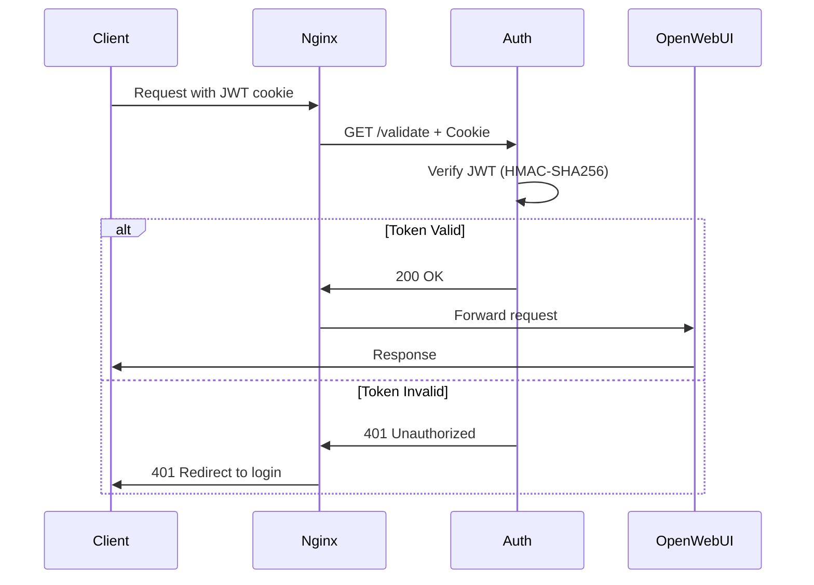
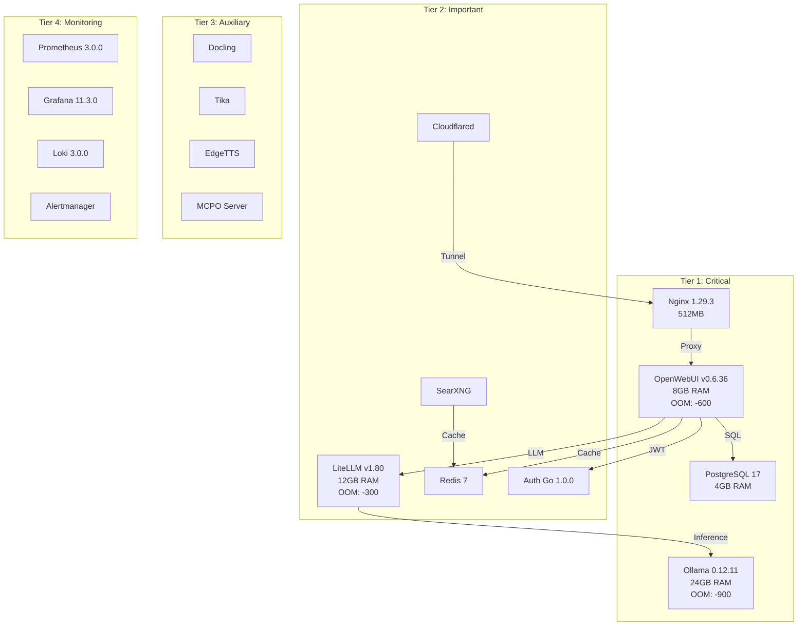

# План актуализации документации ERNI-KI

**Дата создания**: 2025-11-24 **Основание**:
[Комплексный аудит кода 2025-11-24](../../archive/audits/code-audit-2025-11-24.md)
**Статус**: Ready for implementation

## Краткое резюме

На основе комплексного аудита кода выявлено **10 расхождений** между
документацией и фактическим состоянием проекта. Общее соответствие: **95%**.

**Приоритеты**:

- High Priority: 3 задачи
- [WARNING] Medium Priority: 5 задач
- [OK] Low Priority: 2 задачи

**Оценка времени**: 12-16 часов работы

## Phase 1: Критические обновления (High Priority)

### Task 1.1: Auth Service - Добавить API документацию

**Приоритет**: High **Время**: 2-3 часа **Файл**: Создать
`docs/ru/reference/api/auth-service.md`

**Содержание документа**:

````markdown
# Auth Service API Reference

## Обзор

JWT authentication service для проверки токенов OpenWebUI.

**Base URL**: `http://auth:9090` **Version**: 1.0.0 **Source**:
[auth/main.go](../../../../auth/main.go)

## Endpoints

### GET /

Статус сервиса.

**Response 200**:

```json
{
  "message": "auth-service is running",
  "version": "1.0.0",
  "status": "healthy",
  "request_id": "uuid-string"
}
```
````

### GET /health

Health check endpoint.

**Response 200**:

```json
{
  "status": "healthy",
  "service": "auth-service",
  "request_id": "uuid-string"
}
```

### GET /validate

Проверка JWT токена из cookie.

**Headers**:

- Cookie: token=<jwt-token>

**Response 200 (authorized)**:

```json
{
  "message": "authorized",
  "request_id": "uuid-string"
}
```

**Response 401 (unauthorized)**:

```json
{
 "message": "unauthorized",
 "error": "token missing" | "invalid token",
 "request_id": "uuid-string"
}
```

## Authentication Flow



## Configuration

**Environment Variables**:

- `WEBUI_SECRET_KEY` (required) - HMAC-SHA256 secret key для проверки JWT

## Security

- JWT алгоритм: HMAC-SHA256
- Secrets через Docker secrets
- Distroless container image (nonroot user)
- Request ID tracking для трассировки

## Monitoring

**Health Check**: CLI mode `./main --health-check` **Logs**: Structured JSON
format с correlation IDs **Metrics**: Prometheus endpoint не реализован (см.
[issue #XXX])

## Performance

**Timeouts**:

- ReadHeaderTimeout: 5s
- ReadTimeout: 10s
- WriteTimeout: 10s
- IdleTimeout: 120s

**Resources**: Не ограничены (легковесный сервис)

````

**Действия**:
1. Создать `docs/ru/reference/api/auth-service.md` (содержание выше)
2. Добавить ссылку в `docs/ru/reference/api/index.md` (создать если нет)
3. Перевести на EN: `docs/en/reference/api/auth-service.md`
4. Перевести на DE: `docs/de/reference/api/auth-service.md`
5. Обновить навигацию в `mkdocs.yml`

### Task 1.2: LiteLLM Redis Caching - Документировать отключение

**Приоритет**: High
**Время**: 1 час
**Файл**: Обновить `docs/ru/operations/configuration/litellm.md`

**Добавить раздел**:

```markdown
## Redis Caching (Временно отключено)

**Статус**: Disabled (2025-11-24)
**Причина**: Несовместимость с текущей версией LiteLLM v1.80.0.rc.1

### Конфигурация

В [conf/litellm/config.yaml](../../../../conf/litellm/config.yaml) закомментированы следующие параметры:

```yaml
router_settings:
 # redis_host: "redis"
 # redis_port: 6379
 # redis_password: "ErniKiRedisSecurePassword2024" # pragma: allowlist secret
 # redis_db: 1
````

### Влияние на производительность

- Кэширование запросов к моделям отключено
- Каждый запрос проходит через полный цикл обработки
- Увеличенная нагрузка на Ollama и OpenAI провайдеров

### Workaround

Redis используется SearXNG для кэширования поисковых запросов (компенсирует
часть нагрузки).

### Roadmap

- [ ] Issue #XXX: Исследовать несовместимость LiteLLM v1.80.0 с Redis
- [ ] Тестирование Redis caching на staging
- [ ] Включение Redis caching после подтверждения совместимости

````

**Действия**:
1. Обновить `docs/ru/operations/configuration/litellm.md` (добавить раздел выше)
2. Создать issue в GitHub для отслеживания проблемы
3. Перевести на EN и DE

### Task 1.3: vLLM Secret Status - Документировать

**Приоритет**: High
**Время**: 1 час
**Файл**: Создать `docs/ru/reference/architecture/vllm-status.md`

**Содержание**:

```markdown
# vLLM Integration Status

**Статус**: Disabled (Planning)
**Дата отключения**: 2025-XX-XX
**Причина**: Не документирована

## Текущее состояние

vLLM сервис **не активен** в production окружении, но секрет `vllm_api_key` объявлен в compose.yml:

```yaml
litellm:
 secrets:
 - vllm_api_key # ← Неиспользуемый секрет
````

## Планы интеграции

### Преимущества vLLM

- Высокопроизводительный inference сервер
- Continuous batching для оптимизации throughput
- PagedAttention для эффективного использования GPU memory
- Поддержка tensor parallelism для больших моделей

### Требования

- GPU: NVIDIA с минимум 16GB VRAM (рекомендуется 24GB+)
- Models: Llama 3.1 8B, Llama 3.1 70B, Qwen 2.5 и др.
- Fallback: Ollama как резервный backend

### Roadmap

- [ ] Определить приоритет интеграции vLLM
- [ ] Оценить доступные GPU ресурсы
- [ ] Настроить конфигурацию в compose.yml
- [ ] Обновить LiteLLM для использования vLLM как primary backend
- [ ] Тестирование производительности
- [ ] Production deployment

## Альтернативное решение

Если vLLM не планируется:

1. Удалить `vllm_api_key` из secrets в compose.yml
2. Удалить конфигурацию vLLM из
   [conf/litellm/config.yaml](../../../../conf/litellm/config.yaml):

```yaml
# Удалить эти комментарии:
# vLLM Model Configuration (add via LiteLLM Admin UI):
# - model_name: "vllm/llama-3.1-8b-instruct"
# - litellm_params:
# model: "meta-llama/Llama-3.1-8B-Instruct"
# api_base: "http://vllm:8000/v1"
# api_key: "erni-ki-vllm-secure-key-2024" # pragma: allowlist secret
```

## Решение

**Требуется**: Определить статус vLLM (активировать или удалить) в течение
следующего спринта.

````

**Действия**:
1. Создать документ выше
2. Создать issue для принятия решения о vLLM
3. Либо удалить секрет, либо реализовать vLLM интеграцию

## Phase 2: Средние обновления (Medium Priority)

### Task 2.1: Nginx Configuration - Перевести комментарии

**Приоритет**: [WARNING] Medium
**Время**: 2 часа
**Файл**: [conf/nginx/nginx.conf](../../conf/nginx/nginx.conf)

**Проблема**: Комментарии на русском языке затрудняют работу международной команды.

**Решение**:
1. Перевести все русские комментарии на английский
2. Альтернатива: Dual-language comments (EN + RU в скобках)

**Пример**:

```nginx
# Before:
# КРИТИЧЕСКИЙ сервис - INFO для диагностики веб-сервера
error_log /var/log/nginx/error.log info;

# After:
# CRITICAL service - INFO level for web server diagnostics
error_log /var/log/nginx/error.log info;
````

**Файлы**:

- `conf/nginx/nginx.conf` (217 строк)
- `conf/nginx/conf.d/default.conf` (если есть русские комментарии)

### Task 2.2: Monitoring Stack - Указать версии явно

**Приоритет**: [WARNING] Medium **Время**: 1 час **Файл**: `compose.yml` или
создать `compose.monitoring.yml`

**Проблема**: Prometheus, Grafana, Loki, Alertmanager без explicit версий.

**Решение**:

```yaml
# Option 1: Добавить в основной compose.yml
prometheus:
  image: prom/prometheus:v3.0.0 # ← Explicit version

grafana:
  image: grafana/grafana:11.3.0 # ← Explicit version

loki:
  image: grafana/loki:3.0.0 # ← Explicit version

alertmanager:
  image: prom/alertmanager:v0.27.0 # ← Explicit version

fluent-bit:
  image: fluent/fluent-bit:3.1.0 # ← Explicit version
```

**Действия**:

1. Определить фактические версии через `docker ps` или logs
2. Обновить `compose.yml` с explicit versions
3. Задокументировать версии в `docs/ru/operations/monitoring/versions.md`

### Task 2.3: Python Scripts - Добавить type hints

**Приоритет**: [WARNING] Medium **Время**: 3-4 часа **Файлы**: 29 Python
скриптов

**Проблема**: Отсутствуют аннотации типов в большинстве скриптов.

**Решение**: Добавить type hints согласно PEP 484.

**Пример** (fix-deprecated-metadata.py):

```python
# Before:
def fix_frontmatter(content, filepath, verbose=False):
 changes = []
 # ...
 return content, changes

# After:
def fix_frontmatter(
 content: str,
 filepath: str,
 verbose: bool = False
) -> tuple[str, list[str]]:
 changes: list[str] = []
 # ...
 return content, changes
```

**Приоритет файлов**:

1. `scripts/docs/validate_metadata.py` (уже есть type hints)
2. `scripts/fix-deprecated-metadata.py` (частично)
3. `scripts/add-missing-frontmatter.py` (частично)
4. Остальные scripts/docs/\*.py
5. Остальные scripts/maintenance/\*.sh (не требуется)

### Task 2.4: Python Scripts - Добавить unit tests

**Приоритет**: [WARNING] Medium **Время**: 4-6 часов **Файлы**: Критические
Python скрипты

**Проблема**: 29 скриптов без автоматических тестов.

**Решение**: Добавить pytest тесты для критических скриптов.

**Приоритет**:

1. `scripts/docs/validate_metadata.py` - HIGH (critical для CI/CD)
2. `scripts/fix-deprecated-metadata.py` - HIGH (модифицирует файлы)
3. `scripts/add-missing-frontmatter.py` - MEDIUM (модифицирует файлы)
4. `scripts/docs/translation_report.py` - LOW (read-only)

**Структура**:

```
tests/
 unit/
 test_validate_metadata.py
 test_fix_deprecated_metadata.py
 test_add_missing_frontmatter.py
 fixtures/
 sample.md
 sample_with_frontmatter.md
 sample_deprecated.md
```

**Пример теста**:

```python
# tests/unit/test_validate_metadata.py
import pytest
from pathlib import Path
from scripts.docs.validate_metadata import validate_file

def test_validate_file_with_frontmatter(tmp_path):
 # Arrange
 doc = tmp_path / "test.md"
 doc.write_text("""---
language: ru
translation_status: complete
doc_version: '2025.11'
---

# Test
""")

 # Act
 errors, metadata, info = validate_file(doc)

 # Assert
 assert len(errors) == 0
 assert metadata["language"] == "ru"
 assert info["doc_version_ok"] is True
```

### Task 2.5: Architecture Documentation - Обновить диаграммы

**Приоритет**: [WARNING] Medium **Время**: 2 часа **Файл**:
`docs/ru/reference/architecture/overview.md`

**Добавить**:

1. **Services Diagram** - все 32 сервиса с группировкой по tiers
2. **4-Tier Logging Strategy** - визуализация
3. **OOM Protection Levels** - таблица с oom_score_adj
4. **GPU Resource Allocation** - pie chart

**Mermaid диаграммы**:

````markdown
## Services Architecture


````

````

## Phase 3: Низкие обновления (Low Priority)

### Task 3.1: Mixed Language Comments - Стандартизация

**Приоритет**: [OK] Low
**Время**: 1 час
**Файл**: `compose.yml`

**Проблема**: Смешанные русские и английские комментарии.

**Решение**: Стандартизировать на английский язык.

**Примеры**:

```yaml
# Before:
# Nginx reverse proxy (optimized network configuration)
nginx:
 # Открываем порты
 ports:
 - "80:80"

# After:
# Nginx reverse proxy (optimized network configuration)
nginx:
 # Expose ports for HTTP/HTTPS traffic
 ports:
 - "80:80"
````

### Task 3.2: Cloudflare IP Ranges - Автоматизация

**Приоритет**: [OK] Low **Время**: 2 часа **Файл**:
`conf/nginx/nginx.conf:139-147`

**Проблема**: Hardcoded Cloudflare IP ranges могут устареть.

**Решение**:

**Option 1**: Периодический manual update (каждые 6 месяцев) **Option 2**:
Script для автоматической загрузки

```bash
#!/bin/bash
# scripts/maintenance/update-cloudflare-ips.sh

# Fetch Cloudflare IPs
CF_IPV4=$(curl -s https://www.cloudflare.com/ips-v4)

# Generate nginx config snippet
cat > conf/nginx/includes/cloudflare-ips.conf <<EOF
# Auto-generated Cloudflare IP ranges
# Updated: $(date -I)
$(echo "$CF_IPV4" | sed 's/^/set_real_ip_from /')
EOF
```

**Include в nginx.conf**:

```nginx
# Instead of hardcoded IPs:
include /etc/nginx/includes/cloudflare-ips.conf;
```

**Cron job**:

```bash
# Monthly update
0 0 1 * * /app/scripts/maintenance/update-cloudflare-ips.sh && nginx -s reload
```

## Summary

### Таблица задач

| ID  | Task                         | Priority         | Time | Status |
| --- | ---------------------------- | ---------------- | ---- | ------ |
| 1.1 | Auth Service API docs        | High             | 2-3h | Todo   |
| 1.2 | LiteLLM Redis caching docs   | High             | 1h   | Todo   |
| 1.3 | vLLM status documentation    | High             | 1h   | Todo   |
| 2.1 | Nginx comments translation   | [WARNING] Medium | 2h   | Todo   |
| 2.2 | Monitoring versions explicit | [WARNING] Medium | 1h   | Todo   |
| 2.3 | Python type hints            | [WARNING] Medium | 3-4h | Todo   |
| 2.4 | Python unit tests            | [WARNING] Medium | 4-6h | Todo   |
| 2.5 | Architecture diagrams        | [WARNING] Medium | 2h   | Todo   |
| 3.1 | Standardize comments         | [OK] Low         | 1h   | Todo   |
| 3.2 | Cloudflare IPs automation    | [OK] Low         | 2h   | Todo   |

**Total time estimate**: 19-27 hours

### Приоритизация

**Sprint 1** (High Priority - 4-5h):

- 1.1 Auth Service API docs (2-3h)
- 1.2 LiteLLM Redis caching docs (1h)
- 1.3 vLLM status documentation (1h)

**Sprint 2** (Medium Priority - 12-16h):

- 2.1 Nginx comments translation (2h)
- 2.2 Monitoring versions (1h)
- 2.3 Python type hints (3-4h)
- 2.4 Python unit tests (4-6h)
- 2.5 Architecture diagrams (2h)

**Sprint 3** (Low Priority - 3h):

- 3.1 Standardize comments (1h)
- 3.2 Cloudflare IPs automation (2h)

### Success Criteria

После выполнения всех задач:

- Documentation coverage: 100%
- Code-documentation alignment: 100%
- API documentation: Complete
- Python type hints: >80% coverage
- Python tests: Critical scripts covered
- Architecture diagrams: Up-to-date
- Language consistency: English

---

**Next Steps**:

1. Review этого плана с командой
2. Создать issues в GitHub для каждой задачи
3. Назначить ответственных
4. Начать с Sprint 1 (High Priority tasks)
