# ERNI-KI Systemarchitektur

[TOC]

> **Dokumentversion:**12.1**Aktualisierungsdatum:**2025-11-23**Status:**
> Production Ready (compose.yml enthält 32 Services; 5/5 Grafana Dashboards
> provisioniert; 20 aktive Alarmregeln. LiteLLM v1.80.0.rc.1, Docling, MCP
> Server, Apache Tika, Watchtower monitor-only. Monitoring: Prometheus v3.0.0,
> Loki v3.0.0, Fluent Bit v3.1.0, Alertmanager v0.27.0.**Prometheus Targets:
> 32/32 UP (100%)**)

## Architektur-Überblick

ERNI-KI ist eine moderne Microservice-basierte AI-Plattform, die auf den
Prinzipien der Containerisierung, Sicherheit und Skalierbarkeit aufbaut. Das
System besteht aus**32 Microservices**: OpenWebUI v0.6.36, Ollama 0.12.11 (GPU),
LiteLLM v1.80.0.rc.1, MCP Server, Watchtower (monitor-only) und einem
Observability-Stack (Prometheus v3.0.0, Grafana v11.3.0, Alertmanager v0.27.0,
Loki v3.0.0, Fluent Bit v3.1.0, 8 Exporter + RAG Exporter). Externer Zugriff
über Cloudflare-Tunnel (5 Domains).

## Systemarchitektur (v0.61.3 – 2025-11-24)

```mermaid
graph TB
 subgraph " Externer Zugriff"
 CF[Cloudflare Tunnels 2024.10.0<br/>5 aktive Domains]
 NGINX[Nginx 1.28.0<br/>:80/:443/:8080<br/>SSL/TLS + WAF]
 end

 subgraph " AI & ML Services"
 WEBUI[OpenWebUI v0.6.36<br/>:8080 GPU<br/> Healthy]
 OLLAMA[Ollama 0.12.11<br/>:11434 GPU<br/>4GB VRAM Limit<br/> Healthy]
 LITELLM[LiteLLM v1.80.0.rc.1<br/>:4000<br/>12GB Memory<br/> Healthy]
 MCP[MCP Server<br/>:8000<br/>7 Tools<br/> Healthy]
 end

 subgraph " Dokumentenverarbeitung"
 DOCLING[Docling<br/>:5001 OCR CPU<br/> Healthy]
 TIKA[Apache Tika<br/>:9998<br/> Healthy]
 EDGETTS[EdgeTTS<br/>:5050<br/> Healthy]
 SEARXNG[SearXNG<br/>:8080<br/>6+ Quellen<br/> Healthy]
 end

 subgraph " Datenebene"
 POSTGRES[(PostgreSQL 17 + pgvector<br/>:5432 intern<br/> Healthy)]
 REDIS[(Redis 7-alpine<br/>:6379 intern<br/> Healthy)]
 BACKREST[Backrest v1.9.2<br/>:9898<br/> Healthy]
 end

 subgraph " Observability (32/32 Healthy)"
 PROMETHEUS[Prometheus v3.0.0<br/>:9091<br/>20 Alerts<br/>]
 GRAFANA[Grafana v11.3.0<br/>:3000<br/>5 Dashboards<br/>]
 ALERTMANAGER[Alertmanager v0.27.0<br/>:9093-9094<br/>]
 LOKI[Loki v3.0.0<br/>:3100<br/>TSDB v13<br/>]
 FLUENT_BIT[Fluent Bit v3.1.0<br/>:24224/:2020<br/>]
 WEBHOOK_REC[Webhook Receiver<br/>:9095<br/>]
 end

 subgraph " Exporter (8 + RAG + Proxy)"
 NODE_EXP[Node Exporter v1.9.1<br/>:9101]
 PG_EXP[PostgreSQL Exporter v0.15.0<br/>:9187]
 PG_PROXY[Socat Proxy<br/>:9188 IPv4→IPv6]
 REDIS_EXP[Redis Exporter v1.62.0<br/>:9121]
 NVIDIA_EXP[NVIDIA GPU Exporter<br/>:9445]
 BLACKBOX_EXP[Blackbox Exporter v0.27.0<br/>:9115]
 CADVISOR[cAdvisor v0.52.1<br/>:8081]
 OLLAMA_EXP[Ollama Exporter<br/>:9778]
 NGINX_EXP[Nginx Exporter v1.4.2<br/>:9113]
 RAG_EXP[RAG Exporter<br/>:9808<br/>SLA Metriken]
 end

 subgraph " Infrastruktur"
 WATCHTOWER[Watchtower 1.7.1<br/>:8091<br/>Monitor-only]
 AUTH[Auth Service<br/>:9092<br/>JWT]
 DOCKER[Docker + NVIDIA Runtime<br/>32/32 Healthy]
 end

 %% Extern
 USER --> CF
 CF --> NGINX

 %% Gateway
 NGINX --> AUTH
 NGINX --> WEBUI
 NGINX --> SEARXNG
 NGINX --> LITELLM

 %% AI/Data
 WEBUI --> OLLAMA
 WEBUI --> LITELLM
 LITELLM --> OLLAMA
 LITELLM --> REDIS
 WEBUI --> DOCLING
 WEBUI --> TIKA
 WEBUI --> EDGETTS
 WEBUI --> SEARXNG
 WEBUI --> POSTGRES

 %% Exporter → Observability
 NODE_EXP --> PROMETHEUS
 PG_EXP --> PROMETHEUS
 PG_PROXY --> PG_EXP
 REDIS_EXP --> PROMETHEUS
 NVIDIA_EXP --> PROMETHEUS
 BLACKBOX_EXP --> PROMETHEUS
 CADVISOR --> PROMETHEUS
 OLLAMA_EXP --> PROMETHEUS
 NGINX_EXP --> PROMETHEUS
 RAG_EXP --> PROMETHEUS
 FLUENT_BIT --> LOKI
 GRAFANA --> PROMETHEUS
 GRAFANA --> LOKI
 ALERTMANAGER --> PROMETHEUS
 ALERTMANAGER --> WEBHOOK_REC

 %% Watchtower
 WATCHTOWER -.-> WEBUI
 WATCHTOWER -.-> OLLAMA
 WATCHTOWER -.-> SEARXNG
```



### Neueste Updates (v12.0 - Oktober 2025)

### Monitoring-Update und Systemstabilisierung (02. Oktober 2025)

-**Monitoring auf neueste stabile Versionen aktualisiert**:

- Prometheus v2.47.2 → v3.0.1 (+30% Performance, -14% Speicher, 132
  Alert-Regeln)
- Loki v2.9.2 → v3.5.5 (TSDB v13, +40% Query-Geschwindigkeit, -9% Speicher)
- Fluent Bit v2.2.0 → v3.2.0 (neue Konfigurationssyntax, -10% Speicher)
- Alertmanager v0.26.0 → v0.28.0 (verbessertes UI, -9% Speicher)
- Grafana v10.2.0 → v11.6.6 (verbesserte Performance)

-**System vollständig stabilisiert**:

- 30/30 Container im Status Healthy (100% Verfügbarkeit)
- OpenWebUI v0.6.36 mit GPU-Beschleunigung (aktualisiert 2025-11-18)
- Ollama 0.12.11 mit optimiertem VRAM (4GB Limit)
- LiteLLM v1.80.0.rc.1 mit erhöhtem Speicher (12GB)
- Watchtower 1.7.1 mit selektiven Auto-Updates

### Kritische Verbesserungen (25. September 2025)

-**Systemstabilität**: Erreicht 96,4% Gesundheitsstatus

- 26 von 30 Containern im gesunden Zustand
- Alle kritischen Probleme behoben (nginx routing, SSL handshake, Cloudflare
  tunnels)
- GPU-Beschleunigung für Ollama und OpenWebUI aktiv

-**Neue Komponenten integriert**: -**LiteLLM v1.77.2**: Context Engineering
Gateway mit PostgreSQL Integration -**MCP Server**: Model Context Protocol für
erweiterte AI-Funktionen -**Apache Tika**: Metadaten-Extraktion für
Dokumente -**Fluent Bit**: Zentralisierte Log-Sammlung

-**Architektur-Updates**: Neue Mermaid-Diagramme mit allen 30 Services

- Content Security Policy für localhost-Unterstützung optimiert
- CORS-Header für Entwicklung und Production erweitert
- SSL-Konfiguration mit ssl_verify_client off korrigiert
- Kritische Skript-Ladefehler behoben

-**SearXNG API Wiederherstellung**: Vollständige Routing-Korrektur

- Problem mit $universal_request_id Variable behoben
- Funktionalität des /api/searxng/search Endpunkts wiederhergestellt
- API gibt korrekte JSON-Antworten mit Suchergebnissen zurück (31 Ergebnisse
  von 4500)
- Unterstützung für 4 Suchmaschinen: Google, Bing, DuckDuckGo, Brave
- Antwortzeit <2 Sekunden (entspricht SLA-Anforderungen)

### Vorherige Korrekturen (29. August 2025)

-**Cloudflare-Tunnel**: DNS-Resolution-Fehler behoben -**System-Diagnose**:
Umfassende Überprüfung von 29 Microservices -**Alle Services im Status
"Healthy"**(15+ Container)

### Architektur-Komponenten (aktualisiert 2025-10-02)

**AI & ML Services:**

-**OpenWebUI v0.6.36**: Haupt-AI-Interface mit CUDA-Unterstützung, GPU runtime
(aktualisiert 2025-11-04) -**Ollama 0.12.11**: Lokaler LLM-Server mit
GPU-Beschleunigung (4GB VRAM Limit) -**LiteLLM v1.80.0.rc.1**: Context
Engineering Gateway (12GB Memory Limit) -**MCP Server**: Model Context Protocol
für erweiterte AI-Funktionen -**Apache Tika**: Text- und Metadaten-Extraktion
aus Dokumenten -**EdgeTTS**: Sprachsynthese über OpenAI Edge TTS

**Data Layer:**

-**PostgreSQL 17 + pgvector**: Vektor-Datenbank (shared: OpenWebUI +
LiteLLM) -**Redis 7-alpine**: WebSocket-Manager, Caching, Active
Defragmentation -**Backrest v1.9.2**: Lokale Backups (7 Tage + 4 Wochen)

**Search & Processing:**

-**SearXNG**: RAG-Integration mit 6+ Suchquellen (Brave, Startpage, Bing,
Wikipedia)

**Gateway & Security:**

-**Nginx 1.28.0**: Reverse Proxy, SSL-Terminierung, WAF-Schutz -**Auth
Service**: JWT-Authentifizierung (Go-Service) -**Cloudflared 2025.9.1**:
Cloudflare Zero Trust Tunnel (5 Domains)

### Monitoring und Observability (aktualisiert 2025-11-23)

-**Prometheus v3.0.0**: Metriken-Sammlung mit 35+ Targets, 20 Alert-Regeln (+30%
Performance, -14% Speicher) -**Grafana v11.3.0**: Visualisierung und Dashboards
(5 Dashboards) -**Loki v3.0.0**: Zentralisierte Protokollierung über Fluent Bit
(TSDB v13) -**Fluent Bit v3.1.0**: Log-Sammlung -**Alertmanager v0.27.0**:
Event-Benachrichtigungen -**8 Exporter**: node, postgres, redis, nginx, ollama,
nvidia, cadvisor, blackbox -**RAG Exporter**: SLA-Metriken für RAG (Latenz,
Quellen) -**Watchtower 1.7.1**: monitor-only (keine Auto-Updates)

## Architektur-Prinzipien

### **Security First**

- JWT-Authentifizierung für alle API-Anfragen
- Rate Limiting und DDoS-Schutz
- SSL/TLS-Verschlüsselung des gesamten Traffics
- Service-Isolation über Docker Networks

### **Scalability & Performance**

- Horizontale Skalierung über Docker Compose
- GPU-Beschleunigung für AI-Berechnungen
- Caching über Redis
- Asynchrone Dokumentenverarbeitung

### **Reliability & Monitoring**

- Health Checks für alle Services
- Automatische Neustarts bei Ausfällen
- Zentralisiertes Logging
- Automatische Backups

## Systemarchitektur-Diagramm (v12.0 - aktualisiert 2025-10-02)

```mermaid
graph TB
 %% External Access Layer
 subgraph " External Access"
 CF[Cloudflare Tunnels 2025.9.1<br/>5 Domains aktiv]
 NGINX[Nginx 1.28.0<br/>:80, :443, :8080<br/>SSL/TLS + WAF]
 end

 %% AI & ML Services
 subgraph " AI & ML Services"
 WEBUI[OpenWebUI v0.6.36<br/>:8080 GPU<br/> Healthy]
 OLLAMA[Ollama 0.12.11<br/>:11434 GPU<br/>4GB VRAM Limit<br/> Healthy]
 LITELLM[LiteLLM v1.80.0.rc.1<br/>:4000<br/>12GB Memory<br/> Healthy]
 MCP[MCP Server<br/>:8000<br/>4 Tools<br/> Healthy]
 end

 %% Document Processing
 subgraph " Document Processing"
 TIKA[Apache Tika<br/>:9998<br/> Healthy]
 EDGETTS[EdgeTTS<br/>:5050<br/> Healthy]
 SEARXNG[SearXNG<br/>:8080<br/>6+ Quellen<br/> Healthy]
 end

 subgraph " Data Layer"
 POSTGRES[(PostgreSQL 17 + pgvector<br/>:5432 internal<br/>Shared DB<br/> Healthy)]
 REDIS[(Redis 7-alpine<br/>:6379 internal<br/>Active Defrag<br/> Healthy)]
 BACKREST[Backrest v1.9.2<br/>:9898<br/>7T + 4W<br/> Healthy]
 end

 subgraph " Monitoring & Observability (32/32 Healthy)"
 PROMETHEUS[Prometheus v3.0.0<br/>:9091<br/>20 Regeln<br/> Healthy]
 GRAFANA[Grafana v11.3.0<br/>:3000<br/>5 Dashboards<br/> Healthy]
 ALERTMANAGER[Alertmanager v0.27.0<br/>:9093-9094<br/> Healthy]
 LOKI[Loki v3.0.0<br/>:3100<br/>TSDB v13<br/> Healthy]
 FLUENT_BIT[Fluent Bit v3.1.0<br/>:24224, :2020<br/> Running]
 WEBHOOK_REC[Webhook Receiver<br/>:9095<br/> Healthy]
 end

 subgraph " Metrics Exporters (Alle Healthy)"
 NODE_EXP[ Node Exporter<br/> Port: 9101<br/> System-Metriken]
 PG_EXP[ PostgreSQL Exporter<br/> Port: 9187<br/> DB-Metriken]
 REDIS_EXP[ Redis Exporter<br/> Port: 9121<br/> Cache-Metriken]
 NVIDIA_EXP[ NVIDIA GPU Exporter<br/> Port: 9445<br/> GPU-Metriken]
 BLACKBOX_EXP[ Blackbox Exporter<br/> Port: 9115<br/> Endpoint-Tests]
 CADVISOR[ cAdvisor<br/> Port: 8081<br/> Container-Metriken]
 OLLAMA_EXP[ Ollama Exporter<br/> Port: 9778<br/> AI-Metriken]
 NGINX_EXP[ Nginx Exporter<br/> Port: 9113<br/> Web-Metriken]
 RAG_EXP[ RAG Exporter<br/> Port: 9808<br/> RAG-Metriken]
 end

 subgraph " Infrastructure Layer"
 WATCHTOWER[ Watchtower<br/> Port: 8091<br/> Selektive Updates]
 AUTH_SRV[ Auth Service<br/> Port: 8082<br/> JWT-Authentifizierung]
 EDGETTS[ EdgeTTS<br/> Port: 5500<br/> Text-zu-Sprache]
 end

 %% Connections
 CF --> NGINX
 NGINX --> WEBUI
 NGINX --> LITELLM
 NGINX --> SEARXNG

 WEBUI --> OLLAMA
 WEBUI --> LITELLM
 WEBUI --> TIKA
 WEBUI --> SEARXNG
 WEBUI --> POSTGRES
 WEBUI --> REDIS

 LITELLM --> OLLAMA
 LITELLM --> POSTGRES

 MCP --> WEBUI

 PROMETHEUS --> NODE_EXP
 PROMETHEUS --> PG_EXP
 PROMETHEUS --> REDIS_EXP
 PROMETHEUS --> NVIDIA_EXP
 PROMETHEUS --> BLACKBOX_EXP
 PROMETHEUS --> CADVISOR
 PROMETHEUS --> OLLAMA_EXP
 PROMETHEUS --> NGINX_EXP
 PROMETHEUS --> RAG_EXP

 GRAFANA --> PROMETHEUS
 ALERTMANAGER --> PROMETHEUS
 LOKI --> FLUENT_BIT

 BACKREST --> POSTGRES
 WATCHTOWER --> NGINX
 WATCHTOWER --> WEBUI
 WATCHTOWER --> OLLAMA
 end

 subgraph " Application Layer"
 OWUI[ Open WebUI]
 OLLAMA[ Ollama LLM Server]
 SEARXNG[ SearXNG Search]
 MCP[ MCP Servers]
 end

 subgraph " Processing Layer"
 TIKA[ Apache Tika]
 EDGETTS[ EdgeTTS Speech]
 end

 subgraph " Data Layer"
 POSTGRES[( PostgreSQL + pgvector)]
 REDIS[( Redis Cache)]
 BACKREST[ Backrest Backup]
 end

 subgraph " Monitoring Layer"
 PROMETHEUS[ Prometheus Metrics]
 GRAFANA[ Grafana Dashboards]
 ALERTMANAGER[ Alert Manager]
 WEBHOOK_REC[ Webhook Receiver]
 NODE_EXP[ Node Exporter]
 PG_EXP[ PostgreSQL Exporter]
 REDIS_EXP[ Redis Exporter]
 NVIDIA_EXP[ NVIDIA GPU Exporter]
 BLACKBOX_EXP[ Blackbox Exporter]
 CADVISOR[ cAdvisor Container Metrics]
 end

 subgraph " Infrastructure Layer"
 WATCHTOWER[ Watchtower Updates]
 DOCKER[ Docker Engine]
 end

 %% External connections
 USER --> CF
 CF --> TUNNEL
 TUNNEL --> NGINX

 %% Gateway layer
 NGINX --> AUTH
 NGINX --> OWUI

 %% Application connections
 OWUI --> OLLAMA
 OWUI --> SEARXNG
 OWUI --> MCP
 OWUI --> TIKA
 OWUI --> EDGETTS

 %% Data connections
 OWUI --> POSTGRES
 OWUI --> REDIS
 SEARXNG --> REDIS
 BACKREST --> POSTGRES
 BACKREST --> REDIS

 %% Infrastructure
 WATCHTOWER -.-> OWUI
 WATCHTOWER -.-> OLLAMA
 WATCHTOWER -.-> SEARXNG
```

## Detaillierte Service-Architektur

### **Gateway Layer (Gateway)**

### Nginx Reverse Proxy

-**Zweck**: Einheitlicher Eingangspunkt, Load Balancing,
SSL-Terminierung -**Ports**: 80 (HTTP), 443 (HTTPS), 8080
(Internal) -**Funktionen**:

- Rate Limiting (100 req/min für allgemeine Anfragen, 10 req/min für SearXNG)
- SSL/TLS-Terminierung mit modernen Cipher Suites
- WebSocket-Verbindungen proxying
- Statische Datei-Bereitstellung
- Caching von statischem Content

### Auth Service (JWT)

-**Technologie**: Go 1.24+ -**Port**: 9090 -**Funktionen**:

- JWT-Token-Generierung und -Validierung
- Integration mit nginx auth_request
- Benutzer-Session-Management
- Rate Limiting für Authentifizierung

### Cloudflared Tunnel

-**Zweck**: Sichere Verbindung zu Cloudflare Zero Trust -**Funktionen**:

- Verschlüsselte Tunnel ohne offene Ports
- Automatisches SSL-Zertifikat-Management
- DDoS-Schutz auf Cloudflare-Ebene
- Geografische Traffic-Verteilung

### **Application Layer (Anwendungen)**

### Open WebUI

-**Technologie**: Python FastAPI + Svelte -**Port**: 8080 -**GPU**: NVIDIA
CUDA-Unterstützung -**Funktionen**:

- Web-Interface für AI-Modelle
- RAG (Retrieval-Augmented Generation) Suche
- Chat- und Verlaufs-Management
- Integration mit externen Services
- Dokument-Upload und -Verarbeitung
- Sprach-Ein-/Ausgabe

### Ollama LLM Server

-**Technologie**: Go + CUDA -**Port**: 11434 -**GPU**: Vollständige NVIDIA
GPU-Unterstützung -**Funktionen**:

- Lokale Ausführung von Sprachmodellen
- Automatisches GPU-Speicher-Management
- OpenAI-kompatible API
- Multi-Modell-Unterstützung
- Streaming-Antworten

### SearXNG Search Engine

-**Technologie**: Python Flask -**Port**: 8080 (internal) -**Funktionen**:

- Meta-Suchmaschine (Google, Bing, DuckDuckGo)
- Private Suche ohne Tracking
- JSON API für RAG-Integration
- Ergebnis-Caching in Redis
- Rate Limiting und Blockierungs-Schutz

### MCP Servers

-**Technologie**: Model Context Protocol -**Port**: 8000 -**Funktionen**:

- AI-Funktionserweiterung durch Tools
- Integration mit externen APIs
- Code- und Befehlsausführung
- Datenbankzugriff

### **Processing Layer (Verarbeitung)**

-**Technologie**: Python + AI-Modelle -**Port**: 5001 -**Funktionen**:

- Textextraktion aus PDF, DOCX, PPTX
- OCR für gescannte Dokumente
- Strukturelle Dokumentenanalyse
- Tabellen- und Bildunterstützung

### Apache Tika

-**Technologie**: Java -**Port**: 9998 -**Funktionen**:

- Metadaten-Extraktion aus Dateien
- Unterstützung für 1000+ Dateiformate
- Dateityp-Erkennung
- Text- und Strukturextraktion

### EdgeTTS Speech Synthesis

-**Technologie**: Python + Microsoft Edge TTS -**Port**: 5050 -**Funktionen**:

- Hochqualitative Sprachsynthese
- Multi-Sprach- und Stimmen-Unterstützung
- Streaming-Audio
- Open WebUI-Integration

### **Data Layer (Daten)**

### PostgreSQL + pgvector

-**Version**: PostgreSQL 16 + pgvector Extension -**Port**:
5432 -**Funktionen**:

- Haupt-Anwendungsdatenbank
- Vektor-Speicher für RAG
- Volltext-Suche
- ACID-Transaktionen
- Replikation und Backups

### Redis Cache

-**Version**: Redis Stack (Redis + RedisInsight) -**Ports**: 6379 (Redis), 8001
(RedisInsight) -**Funktionen**:

- Suchanfragen-Caching
- Benutzer-Sessions
- Task-Queues
- Pub/Sub für Real-time-Benachrichtigungen

### Backrest Backup System

-**Technologie**: Go + Restic -**Port**: 9898 -**Funktionen**:

- Automatische inkrementelle Backups
- Datenverschlüsselung
- Deduplizierung
- Web-Management-Interface
- Point-in-Time-Recovery

### **Infrastructure Layer (Infrastruktur)**

### Watchtower Auto-updater

-**Funktionen**:

- Automatische Docker-Image-Updates
- Überwachung neuer Versionen
- Graceful Service-Neustarts
- Update-Benachrichtigungen

## Netzwerk-Architektur

### Ports und Protokolle

| Service    | Externer Port | Interner Port | Protokoll  | Zweck                |
| ---------- | ------------- | ------------- | ---------- | -------------------- |
| nginx      | 80, 443, 8080 | 80, 443, 8080 | HTTP/HTTPS | Web Gateway          |
| auth       | -             | 9090          | HTTP       | JWT-Validierung      |
| openwebui  | -             | 8080          | HTTP/WS    | AI-Interface         |
| ollama     | -             | 11434         | HTTP       | LLM API              |
| db         | -             | 5432          | PostgreSQL | Datenbank            |
| redis      | -             | 6379, 8001    | Redis/HTTP | Cache & UI           |
| searxng    | -             | 8080          | HTTP       | Such-API             |
| mcposerver | -             | 8000          | HTTP       | MCP-Protokoll        |
| tika       | -             | 9998          | HTTP       | Metadaten-Extraktion |
| edgetts    | -             | 5050          | HTTP       | Sprachsynthese       |
| backrest   | 9898          | 9898          | HTTP       | Backup-Management    |

### Docker Networks

-**erni-ki_default**: Haupt-Netzwerk für alle Services -**Isolation**: Jeder
Service nur über Container-Namen erreichbar -**DNS**: Automatische
Namensauflösung über Docker DNS

## Datenflüsse

### Benutzeranfrage

1.**Browser**→**Cloudflare**→**Cloudflared**→**Nginx**2.**Nginx**→**Auth
Service**(JWT-Validierung) 3.**Nginx**→**Open WebUI**(Haupt-Interface) 4.**Open
WebUI**→**Ollama**(Antwort-Generierung) 5.**Open
WebUI**→**PostgreSQL**(Verlaufs-Speicherung)

### RAG-Suche

1.**Open
WebUI**→**SearXNG**(Informationssuche) 2.**SearXNG**→**Redis**(Ergebnis-Caching) 3.**Open
WebUI**→**PostgreSQL/pgvector**(Vektor-Suche) 4.**Open
WebUI**→**Ollama**(Generierung mit Kontext)

### Dokumentenverarbeitung

1.**Open WebUI**→**PostgreSQL/pgvector**(Vektor-Speicherung) 2.**Open
WebUI**→**Ollama**(Inhalts-Analyse)

## Monitoring und Observability

### Health Checks

- Alle Services haben konfigurierte Health Checks
- Automatischer Neustart bei Ausfällen
- Überwachung über `docker compose ps`

### Logging

- Zentralisierte Logs über Docker Logging Driver
- Log-Rotation zur Festplatten-Überlauf-Vermeidung
- Strukturiertes Logging im JSON-Format

### Metriken

- Ressourcenverbrauch über `docker stats`
- GPU-Überwachung über nvidia-smi
- Datenbank-Performance-Monitoring

## Konfiguration und Deployment

### Umgebungsvariablen

- Jeder Service hat separate `.env`-Datei
- Automatische Generierung geheimer Schlüssel
- Konfiguration über Docker Compose

### Skalierung

- Horizontale Skalierung über Docker Compose scale
- Load Balancing über Nginx upstream
- Automatische Erkennung neuer Instanzen

### Sicherheit

- Minimale Berechtigungen für alle Container
- Netzwerk- und Dateisystem-Isolation
- Regelmäßige Sicherheitsupdates über Watchtower

## Ports & Endpoints (lokal)

- Nginx: 80, 443, 8080
- OpenWebUI: 8080
- LiteLLM: 4000 (`/health/liveliness`, `/health/readiness`)
- PostgreSQL Exporter: 9187 (`/metrics`)
- Redis Exporter: 9121 (`/metrics`)
- Node Exporter: 9101 (`/metrics`)
- cAdvisor: 8081 → Container 8080 (`/metrics`)
- NVIDIA GPU Exporter: 9445 (`/metrics`)
- Nginx Exporter: 9113 (`/metrics`)
- Blackbox Exporter: 9115 (`/probe`)
- Prometheus: 9091 (`/-/ready`, `/api/v1/targets`)
- Grafana: 3000 (`/api/health`)
- Alertmanager: 9093–9094 (`/-/healthy`, `/api/v2/status`)
- Loki: 3100 (`/ready`, Header `X-Scope-OrgID: erni-ki`)
- Fluent Bit Service: 2020 (`/api/v1/metrics`, Prometheus:
  `/api/v1/metrics/prometheus`)
- RAG Exporter: 9808 (`/metrics`)

---

**Hinweis**: Diese Architektur ist für den Produktionseinsatz optimiert mit
Fokus auf Sicherheit, Performance und Zuverlässigkeit.
