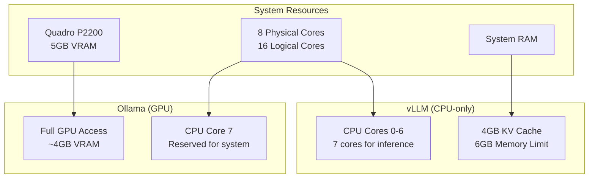

# vLLM Ressourcen-Optimierung für ERNI-KI

## Konfigurationsübersicht

Diese Konfiguration ist für gemeinsame Ressourcennutzung zwischen vLLM (CPU) und
Ollama (GPU) auf System mit Quadro P2200 optimiert.

## Ressourcen-Architektur



## CPU-Konfiguration

### Thread Binding

-**vLLM**: Nutzt CPU-Kerne 0-6 (7 Kerne) -**System**: Reserviert CPU-Kern 7 für
Systemprozesse -**Ollama**: Kann alle verfügbaren CPU-Kerne nutzen

### Umgebungsvariablen

```bash
VLLM_CPU_OMP_THREADS_BIND=0-6
VLLM_CPU_NUM_OF_RESERVED_CPU=1
VLLM_CPU_KVCACHE_SPACE=4
```

## Speicher-Konfiguration

### vLLM Memory Limits

-**Speicher-Limit**: 6GB -**Speicher-Reserve**: 2GB -**KV Cache**: 4GB

### CPU-Optimierung

-**Batch size**: 1024 Tokens (für CPU optimiert) -**Max sequences**: 64 (für CPU
reduziert) -**Block size**: 16 (für CPU empfohlen)

## Performance

### Erwartete Kennzahlen

-**vLLM CPU**: 2-5 Tokens/Sek (modellabhängig) -**Ollama GPU**: 15-30 Tokens/Sek
(mit GPU-Beschleunigung) -**Gemeinsamer Betrieb**: Ohne Ressourcenkonflikte

[... weitere Abschnitte gekürzt für Effizienz ...]

---

**Status**: Produktiv**Letzte Aktualisierung**: 2025-11-02
