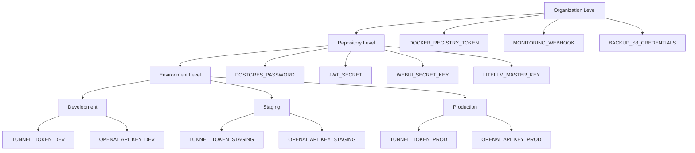

# GitHub Environments Setup für ERNI-KI

[TOC]

**Datum:**2025-09-19**Version:**1.0

## Überblick

Dieser Leitfaden beschreibt, wie GitHub Environments für ERNI-KI eingerichtet
werden. Ziel ist eine dreistufige Architektur (Org → Repo → Environment) mit
dedizierten Secrets, Schutzregeln und Validierungsskripten.

## Architektur



## Quickstart

### 1. Voraussetzungen

```bash
curl -fsSL https://cli.github.com/packages/githubcli-archive-keyring.gpg | sudo dd of=/usr/share/keyrings/githubcli-archive-keyring.gpg
echo "deb [arch=$(dpkg --print-architecture) signed-by=/usr/share/keyrings/githubcli-archive-keyring.gpg] https://cli.github.com/packages stable main" | sudo tee /etc/apt/sources.list.d/github-cli.list > /dev/null
sudo apt update && sudo apt install gh

gh auth login --scopes repo,admin:org
```

### 2. Environments erzeugen

```bash
./scripts/infrastructure/security/setup-github-environments.sh
```

### 3. Protection Rules konfigurieren

```bash
./scripts/infrastructure/security/configure-environment-protection.sh
```

### 4. Secrets setzen

```bash
./scripts/infrastructure/security/setup-environment-secrets.sh
```

### 5. Validieren

```bash
./scripts/infrastructure/security/validate-environment-secrets.sh
```

## Manuelle Einrichtung

### Environments anlegen

```bash
# dev
gh api repos/:owner/:repo/environments/development -X PUT \
 --field "wait_timer=0" \
 --field "prevent_self_review=false" \
 --field "reviewers=[]"

# staging
gh api repos/:owner/:repo/environments/staging -X PUT \
 --field "wait_timer=300" \
 --field "prevent_self_review=true" \
 --field "reviewers=[{\"type\":\"Team\",\"id\":null}]"

# production
gh api repos/:owner/:repo/environments/production -X PUT \
 --field "wait_timer=600" \
 --field "prevent_self_review=true" \
 --field "deployment_branch_policy={\"protected_branches\":true}"
```

## Secrets hinzufügen

```bash
# Environment-secrets
gh secret set TUNNEL_TOKEN_DEV --env development --body "dev-tunnel-token"
gh secret set TUNNEL_TOKEN_STAGING --env staging --body "staging-tunnel-token"
gh secret set TUNNEL_TOKEN_PROD --env production --body "prod-tunnel-token"

# Repository-secrets
gh secret set POSTGRES_PASSWORD --body "$(openssl rand -base64 32)"
gh secret set JWT_SECRET --body "$(openssl rand -hex 32)"
```

## Monitoring & Prüfung

```bash
# Environments auflisten
gh api repos/:owner/:repo/environments | jq '.[].name'

# Details eines Environments
gh api repos/:owner/:repo/environments/production | jq '.'

# Secrets anzeigen
gh secret list --env production
```

Protection-Regeln prüfen:

```bash
gh api repos/:owner/:repo/environments/production | jq '.protection_rules'
```

## Nutzung in GitHub Actions

### Environment-abhängiges Deployment



```yaml
name: Deploy to Environment

on:
 workflow_dispatch:
 inputs:
 environment:
 type: choice
 options:
 - development
 - staging
 - production

jobs:
 deploy:
 runs-on: ubuntu-latest
 environment: ${{ inputs.environment }}
 steps:
 - uses: actions/checkout@v4
 - run: npm ci
 - run: npm run build
 - name: Deploy
 run: ./scripts/deploy.sh
 env:
 TUNNEL_TOKEN:
 ${{ secrets[format('TUNNEL_TOKEN_{0}', inputs.environment ==
 'development' && 'DEV' || inputs.environment == 'staging' &&
 'STAGING' || 'PROD')] }}
 OPENAI_API_KEY:
 ${{ secrets[format('OPENAI_API_KEY_{0}', inputs.environment ==
 'development' && 'DEV' || inputs.environment == 'staging' &&
 'STAGING' || 'PROD')] }}
```



### Automatische Auswahl nach Branch

```yaml
jobs:
 deploy:
 environment:
 ${{ startsWith(github.ref, 'refs/heads/release/') && 'staging' ||
 'development' }}
```

## Best Practices

- Secrets ausschließlich als Environment-Secrets verwalten
- `production` nur über geschützte Branches + 2 Approvals freigeben
- Logs und Artifacts 30 Tage für Audits vorhalten
- Self-hosted Runner hart absichern (Firewall, Token mit minimalen Rechten)
- Skripte in `scripts/infrastructure/security/*.sh` bei Änderungen zeitnah
  erneut ausführen

## Troubleshooting

### "Environment not found"

```bash
gh api repos/:owner/:repo/environments | jq '.[].name'
gh api repos/:owner/:repo/environments/development -X PUT
```

### "Secret not found"

```bash
gh secret list --env development
gh secret set SECRET_NAME --env development --body "secret-value"
```

### "Insufficient permissions"

```bash
gh api user | jq '.login'
gh api repos/:owner/:repo | jq '.permissions'
gh auth login --scopes repo,admin:org
```

### Protection Rules greifen nicht

```bash
gh api repos/:owner/:repo/environments/production | jq '.protection_rules'
gh api repos/:owner/:repo/environments/production -X PUT \
 --field "deployment_branch_policy={\"protected_branches\":true}"
```

## Monitoring & Audit

```bash
# Wöchentliche Validierung
./scripts/infrastructure/security/validate-environment-secrets.sh

# Secret-Änderungen prüfen
gh api repos/:owner/:repo/actions/secrets | jq '.secrets[] | {name, updated_at}'

# Deployment-Historie
gh api repos/:owner/:repo/deployments | jq '.[] | {environment, created_at, creator}'
```

Protection-Rules für alle Umgebungen inspizieren:

```bash
for env in development staging production; do
 echo "=== $env ==="
 gh api "repos/:owner/:repo/environments/$env" | jq '.protection_rules'
done
```

## Secret-Rotation

### Automatisiert

```bash
NEW_SECRET=$(openssl rand -hex 32)

for env in development staging production; do
 suffix=""
 case $env in
 development) suffix="_DEV" ;;
 staging) suffix="_STAGING" ;;
 production) suffix="_PROD" ;;
 esac

 gh secret set "JWT_SECRET${suffix}" --env "$env" --body "$NEW_SECRET"
done
```

### Planmäßige Rotation

```bash
./scripts/infrastructure/security/rotate-secrets.sh --service all
```

## Production-Checkliste

- [ ] Environments `development`, `staging`, `production` existieren
- [ ] Protection-Rules aktiv (Reviewer, Wait Timer, Branch Protection)
- [ ] Pflicht-Secrets pro Ebene gesetzt
- [ ] Produktionswerte ersetzt Platzhalter
- [ ] `validate-environment-secrets.sh` grün
- [ ] GitHub Actions-Workflows aktualisiert
- [ ] Dokumentation & Team-Enablement abgeschlossen

## Prüfprotokoll (2025-11-17)

| Schritt                                                                                                                     | Status            | Kommentar / Follow-up                                                                                        |
| --------------------------------------------------------------------------------------------------------------------------- | ----------------- | ------------------------------------------------------------------------------------------------------------ |
| Environments `development`, `staging`, `production` erstellt                                                                | Bestätigung nötig | Kein Zugang aus aktueller Session → `gh api repos/:owner/:repo/environments` ausführen und dokumentieren     |
| Protection rules (Reviewer, Wait Timer, Force-Push-Sperre)                                                                  | Bestätigung nötig | `configure-environment-protection.sh` laufen lassen oder Output von `gh api .../environments/<env>` anhängen |
| Environment-Secrets (`TUNNEL_TOKEN_*`, `OPENAI_API_KEY_*`, `CONTEXT7_API_KEY_*`, `ANTHROPIC_API_KEY_*`, `GOOGLE_API_KEY_*`) | Bestätigung nötig | `setup-environment-secrets.sh` + `gh secret list --env <env>` ausführen                                      |
| Validierung (`validate-environment-secrets.sh`)                                                                             | Bestätigung nötig | Nach Secret-Updates Script starten und Log unter `docs/archive/audits/` ablegen                              |

> Tabelle nach jedem Audit aktualisieren, damit das reale Environment-Setup
> transparent bleibt.
