# Deployment Diagram

## Docker Compose Architecture

```mermaid
graph TB
    subgraph Tier1["Critical Services (Tier 1)"]
        OpenWebUI["openwebui | v0.6.40 | GPU: RTX 5000 | 8GB RAM"]
        Ollama["ollama | v0.12.11 | GPU: RTX 5000 | 24GB RAM"]
        PostgreSQL["db (PostgreSQL) | pgvector/pg17 | 4GB RAM"]
        Nginx["nginx | v1.29.3 | 512MB RAM"]
    end

    subgraph Tier2["Important Services (Tier 2)"]
        LiteLLM["litellm | v1.80.0.rc.1 | 12GB RAM"]
        Redis["redis | v7.0.15 | 1GB RAM"]
        SearXNG["searxng | latest | 1GB RAM"]
        Auth["auth | custom build"]
        Cloudflared["cloudflared | 2025.11.1"]
        Backrest["backrest | v1.9.2"]
    end

    subgraph Tier3["Auxiliary Services (Tier 3)"]
        Docling["docling | GPU: RTX 5000 | 12GB RAM"]
        EdgeTTS["edgetts | latest"]
        Tika["tika | latest"]
        MCP["mcposerver | git-91e8f94"]
    end

    subgraph Tier4["Monitoring (Tier 4)"]
        Prometheus["prometheus | v3.0.0"]
        Grafana["grafana | v11.3.0"]
        Loki["loki | v3.0.0"]
        Alertmanager["alertmanager | v0.27.0"]
        UptimeKuma["uptime-kuma | v2.0.2"]
        NodeExporter["node-exporter | v1.8.2"]
        PostgresExporter["postgres-exporter | v0.16.0"]
        RedisExporter["redis-exporter | v1.67.0"]
    end

    subgraph Infra["Infrastructure"]
        Watchtower["watchtower | v1.7.1"]
        FluentBit["fluent-bit | v3.2.2"]
    end

    OpenWebUI --> PostgreSQL
    OpenWebUI --> Redis
    OpenWebUI --> LiteLLM
    OpenWebUI --> Docling
    OpenWebUI --> SearXNG
    OpenWebUI --> Tika
    OpenWebUI --> MCP
    OpenWebUI --> EdgeTTS

    LiteLLM --> Ollama
    LiteLLM --> PostgreSQL

    Docling --> Ollama
    Docling --> Redis

    SearXNG --> Redis

    Nginx --> Auth
    Nginx --> OpenWebUI

    Cloudflared --> Nginx

    Backrest --> PostgreSQL
    Backrest --> Redis

    Prometheus --> NodeExporter
    Prometheus --> PostgresExporter
    Prometheus --> RedisExporter
    Prometheus --> Alertmanager

    Grafana --> Prometheus
    Grafana --> Loki

    FluentBit --> Loki
```

## Resources and Limits

### GPU Services (NVIDIA RTX 5000, 16GB VRAM)

- **Ollama**: 24GB RAM, 12 CPU cores, OOM score: -900
- **OpenWebUI**: 8GB RAM, 4 CPU cores, OOM score: -600
- **Docling**: 12GB RAM, 8 CPU cores, OOM score: -500

### Critical Services

- **PostgreSQL**: 4GB RAM, 2 CPU cores
- **Nginx**: 512MB RAM, 1 CPU core
- **LiteLLM**: 12GB RAM, 1 CPU core, OOM score: -300

### Logging Strategy (4-tier)

- **Tier 1 (Critical)**: Dual logging (json-file + fluentd backup)
- **Tier 2 (Important)**: Fluentd with buffering
- **Tier 3 (Auxiliary)**: Fluentd with separate tags
- **Tier 4 (Monitoring)**: Minimal logging

## Auto-update Policy

### Disabled (monitor-only)

- Ollama (GPU-critical)
- PostgreSQL (database)
- Nginx (proxy)
- OpenWebUI (web interface)
- LiteLLM (gateway)
- Docling (GPU service)

### Enabled

- Redis, SearXNG, Auth
- Cloudflared, Backrest
- All monitoring services
- Tika, EdgeTTS, MCP
