# Network Topology

## Network Architecture and Ports

```mermaid
graph TB
    subgraph External["External Network"]
        Internet["Internet"]
        ExternalUser["External | user"]
    end

    subgraph Local["Local Network (192.168.62.0/24)"]
        LocalUser["Local | user"]
        Router["LANCOM Router | 192.168.62.1"]
        Server["ERNI-KI Server | 192.168.62.153"]
    end

    subgraph Public["Public Ports (Server)"]
        Port80["80/tcp | HTTP"]
        Port443["443/tcp | HTTPS"]
        Port8080["8080/tcp | HTTP Alt"]
        Port3001["3001/tcp | Uptime Kuma"]
    end

    subgraph Localhost["Localhost-only Ports"]
        Port4000["127.0.0.1:4000 | LiteLLM API"]
        Port11434["127.0.0.1:11434 | Ollama"]
        Port9091["127.0.0.1:9091 | Prometheus"]
        Port3000["127.0.0.1:3000 | Grafana"]
        Port3100["127.0.0.1:3100 | Loki"]
        Port9093["127.0.0.1:9093 | Alertmanager"]
        Port9092["127.0.0.1:9092 | Auth"]
        Port9898["127.0.0.1:9898 | Backrest"]
        Port5050["127.0.0.1:5050 | EdgeTTS"]
        Port9998["127.0.0.1:9998 | Tika"]
        Port8000["127.0.0.1:8000 | MCP"]
        Port8091["127.0.0.1:8091 | Watchtower API"]
    end

    subgraph Docker["Docker Bridge Network"]
        DockerBridge["docker0 | 172.17.0.0/16"]
    end

    Internet --> ExternalUser
    ExternalUser --> |"Cloudflare Tunnel"| Server

    LocalUser --> Router
    Router --> Server

    Server --> Port80
    Server --> Port443
    Server --> Port8080
    Server --> Port3001

    Server --> Port4000
    Server --> Port11434
    Server --> Port9091
    Server --> Port3000
    Server --> Port3100
    Server --> Port9093
    Server --> Port9092
    Server --> Port9898
    Server --> Port5050
    Server --> Port9998
    Server --> Port8000
    Server --> Port8091

    Port80 --> DockerBridge
    Port443 --> DockerBridge
    Port8080 --> DockerBridge
```

## Port Table

### Public Ports (accessible from local network)

| Port | Service     | Protocol | Description            |
| ---- | ----------- | -------- | ---------------------- |
| 80   | Nginx       | HTTP     | HTTP redirect to HTTPS |
| 443  | Nginx       | HTTPS    | Main HTTPS access      |
| 8080 | Nginx       | HTTP     | Alternative HTTP       |
| 3001 | Uptime Kuma | HTTP     | Status page            |

### Localhost-only Ports (accessible only from server)

| Port  | Service      | Protocol | Description       |
| ----- | ------------ | -------- | ----------------- |
| 4000  | LiteLLM      | HTTP     | LiteLLM Proxy API |
| 11434 | Ollama       | HTTP     | Ollama API        |
| 9091  | Prometheus   | HTTP     | Prometheus UI     |
| 3000  | Grafana      | HTTP     | Grafana UI        |
| 3100  | Loki         | HTTP     | Loki API          |
| 9093  | Alertmanager | HTTP     | Alertmanager UI   |
| 9092  | Auth         | HTTP     | JWT Auth Service  |
| 9898  | Backrest     | HTTP     | Backrest UI       |
| 5050  | EdgeTTS      | HTTP     | EdgeTTS API       |
| 9998  | Tika         | HTTP     | Tika API          |
| 8000  | MCP          | HTTP     | MCP Server API    |
| 8091  | Watchtower   | HTTP     | Watchtower API    |

### Internal Ports (Docker network)

| Port | Service             | Description    |
| ---- | ------------------- | -------------- |
| 5432 | PostgreSQL          | Database       |
| 6379 | Redis               | Cache & Queues |
| 8080 | SearXNG             | Search Engine  |
| 8080 | OpenWebUI           | Web Interface  |
| 5001 | Docling             | OCR Service    |
| 9100 | Node Exporter       | System metrics |
| 9187 | PostgreSQL Exporter | DB metrics     |
| 9121 | Redis Exporter      | Redis metrics  |

## Network Security

### Firewall Rules

- Public ports: 80, 443, 8080, 3001
- Localhost-only: all other services
- Docker bridge: isolated network for containers

### SSL/TLS

- Let's Encrypt certificate for `ki.erni-gruppe.ch`
- Nginx SSL termination
- Internal connections via HTTP (Docker network)

### Cloudflare Tunnel

- Secure external access without port forwarding
- DDoS protection
- Automatic SSL
