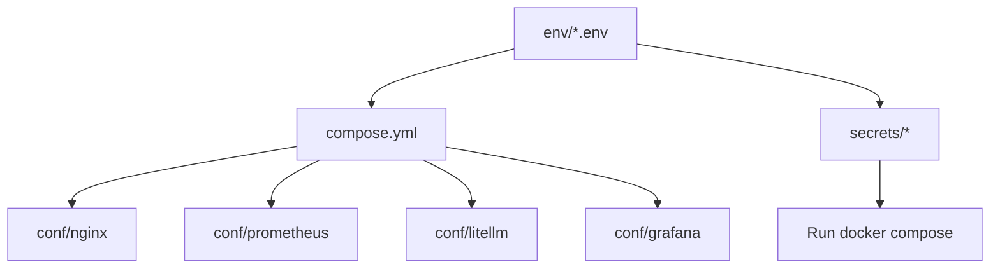

# ERNI-KI Configuration Guide

> **Version:**11.0**Updated:**2025-09-25**Status:**Production Ready [TOC]

This guide contains production-ready configurations for all ERNI-KI system
components with comments for key settings.

## Configuration Overview

The ERNI-KI system uses a modular configuration structure:

```
env/ # Environment variables for each service
 openwebui.env # Main AI interface
 ollama.env # LLM server with GPU
 litellm.env # Context Engineering Gateway
 mcposerver.env # Model Context Protocol
 searxng.env # Search engine
 tika.env # Metadata extraction
 ...

conf/ # Configuration files
 nginx/ # Reverse proxy configuration
 prometheus/ # Metrics monitoring
 grafana/ # Dashboards and visualization
 litellm/ # LLM Gateway settings
 ...
```

## Visualization: Configuration Artifacts



## AI & ML Services

### OpenWebUI Configuration

**File:**`env/openwebui.env`

```bash
# === MAIN SETTINGS ===
WEBUI_NAME="ERNI-KI AI Platform"
WEBUI_URL="https://ki.erni-gruppe.ch"

# === SECURITY ===
WEBUI_SECRET_KEY="your-secret-key-here" # CRITICAL: Replace with unique key # pragma: allowlist secret
ENABLE_SIGNUP=false # Disable signup in production
DEFAULT_USER_ROLE="user" # Default role for new users
CORS_ALLOW_ORIGIN="https://diz.zone;https://webui.diz.zone;https://ki.erni-gruppe.ch;https://192.168.62.153;http://192.168.62.153:8080" # Separate origins with ';'

# === GPU ACCELERATION ===
NVIDIA_VISIBLE_DEVICES=all # Access to all GPUs
NVIDIA_DRIVER_CAPABILITIES=compute,utility # Required driver capabilities

# === INTEGRATIONS ===
OLLAMA_BASE_URL="http://ollama:11434" # Connect to Ollama
LITELLM_BASE_URL="http://litellm:4000" # LiteLLM Gateway
SEARXNG_QUERY_URL="http://nginx:8080/api/searxng/search?q=<query>&format=json"

# === DOCUMENT PROCESSING ===
TIKA_BASE_URL="http://tika:9998" # Apache Tika for metadata

# === PERFORMANCE ===
WEBUI_SESSION_COOKIE_SAME_SITE="lax" # Compatibility with iframe
WEBUI_SESSION_COOKIE_SECURE=true # HTTPS only cookies
```

### Ollama Configuration

**File:**`env/ollama.env`

```bash
# === GPU SETTINGS ===
NVIDIA_VISIBLE_DEVICES=all # Use all available GPUs
OLLAMA_GPU_LAYERS=35 # Number of layers on GPU (optimal)
OLLAMA_NUM_PARALLEL=4 # Parallel requests

# === MEMORY AND PERFORMANCE ===
OLLAMA_MAX_LOADED_MODELS=3 # Max models in memory
OLLAMA_FLASH_ATTENTION=true # Attention optimization
OLLAMA_KV_CACHE_TYPE="f16" # Key-value cache type

# === NETWORK SETTINGS ===
OLLAMA_HOST="0.0.0.0:11434" # Listen on all interfaces
OLLAMA_ORIGINS="*" # CORS for all origins

# === LOGGING ===
OLLAMA_DEBUG=false # Disable debug in production
OLLAMA_VERBOSE=false # Minimal logging
```

### LiteLLM Configuration

**File:**`env/litellm.env`

```bash
# === MAIN SETTINGS ===
LITELLM_PORT=4000
LITELLM_HOST="0.0.0.0"

# === DATABASE ===
DATABASE_URL="postgresql://erni_ki:password@db:5432/erni_ki" # pragma: allowlist secret

# === SECURITY ===
LITELLM_MASTER_KEY="sk-your-master-key-here" # CRITICAL: Unique master key # pragma: allowlist secret
LITELLM_SALT_KEY="your-salt-key-here" # Salt for hashing

# === INTEGRATIONS ===
OLLAMA_BASE_URL="http://ollama:11434" # Local Ollama
OPENAI_API_KEY="your-openai-key" # OpenAI API (optional) # pragma: allowlist secret

# === PERFORMANCE ===
LITELLM_REQUEST_TIMEOUT=600 # Request timeout (10 minutes)
LITELLM_MAX_BUDGET=1000 # Max monthly budget
```

**File:**`conf/litellm/config.yaml`

```yaml
# === MODEL CONFIGURATION ===
model_list:
 # Local models via Ollama
 - model_name: 'llama3.2'
 litellm_params:
 model: 'ollama/llama3.2'
 api_base: 'http://ollama:11434'

 - model_name: 'qwen2.5-coder'
 litellm_params:
 model: 'ollama/qwen2.5-coder:1.5b'
 api_base: 'http://ollama:11434'

# === GENERAL SETTINGS ===
general_settings:
 master_key: 'sk-your-master-key-here' # Must match env
 database_url: 'postgresql://erni_ki:password@db:5432/erni_ki' # pragma: allowlist secret

 # === SECURITY ===
 enforce_user_param: true # Mandatory user parameter
 max_budget: 1000 # Max budget
 budget_duration: '30d' # Budget period

 # === PERFORMANCE ===
 request_timeout: 600 # Request timeout
 max_parallel_requests: 10 # Max parallel requests

 # === LOGGING ===
 set_verbose: false # Minimal logging in production
```

## Document Processing

### Apache Tika Configuration

**File:**`env/tika.env`

```bash
# === MAIN SETTINGS ===
TIKA_PORT=9998
TIKA_HOST="0.0.0.0"

# === SECURITY ===
TIKA_CONFIG_FILE="/opt/tika/tika-config.xml" # Configuration file
TIKA_MAX_FILE_SIZE=104857600 # 100MB max size

# === PERFORMANCE ===
TIKA_REQUEST_TIMEOUT=300000 # 5 minutes timeout
TIKA_TASK_TIMEOUT=120000 # 2 minutes per task
TIKA_MAX_FORK_COUNT=4 # Max processes

# === JVM SETTINGS ===
JAVA_OPTS="-Xmx2g -Xms1g -XX:+UseG1GC" # Memory optimization
```

## Search & RAG

### SearXNG Configuration

**File:**`env/searxng.env`

```bash
# === MAIN SETTINGS ===
SEARXNG_PORT=8080
SEARXNG_BASE_URL="http://searxng:8080"

# === SECURITY ===
SEARXNG_SECRET_KEY="your-searxng-secret-key" # CRITICAL: Unique key # pragma: allowlist secret
SEARXNG_BIND_ADDRESS="0.0.0.0:8080"

# === PERFORMANCE ===
SEARXNG_DEFAULT_HTTP_TIMEOUT=3.0 # HTTP request timeout
SEARXNG_POOL_CONNECTIONS=100 # Connection pool
SEARXNG_POOL_MAXSIZE=20 # Max connections in pool

# === SEARCH ENGINES ===
SEARXNG_ENGINES_BRAVE_DISABLED=false # Enable Brave Search
SEARXNG_ENGINES_STARTPAGE_DISABLED=false # Enable Startpage
SEARXNG_ENGINES_WIKIPEDIA_TIMEOUT=5.0 # Increased timeout for Wikipedia
```

## Data Layer

### PostgreSQL Configuration

**File:**`env/postgres.env`

```bash
# === MAIN SETTINGS ===
POSTGRES_DB=erni_ki
POSTGRES_USER=erni_ki
POSTGRES_PASSWORD=your-secure-password # CRITICAL: Strong password

# === PERFORMANCE ===
POSTGRES_SHARED_BUFFERS=256MB # Shared memory buffers
POSTGRES_MAX_CONNECTIONS=200 # Max connections
POSTGRES_WORK_MEM=4MB # Work memory per operation

# === SECURITY ===
POSTGRES_HOST_AUTH_METHOD=md5 # Password authentication
POSTGRES_INITDB_ARGS="--auth-host=md5" # Init with MD5

# === EXTENSIONS ===
POSTGRES_EXTENSIONS="pgvector,pg_stat_statements" # Required extensions
```

### Redis Configuration

**File:**`env/redis.env`

```bash
# === MAIN SETTINGS ===
REDIS_PORT=6379
REDIS_BIND="0.0.0.0"

# === SECURITY ===
REDIS_PASSWORD="your-redis-password" # CRITICAL: Strong password # pragma: allowlist secret
REDIS_PROTECTED_MODE=yes # Protected mode

# === MEMORY ===
REDIS_MAXMEMORY=2gb # Max memory
REDIS_MAXMEMORY_POLICY=allkeys-lru # Eviction policy

# === PERFORMANCE ===
REDIS_SAVE="900 1 300 10 60 10000" # Save settings
REDIS_TCP_KEEPALIVE=300 # Keep-alive connections
```

## Network & Security

### Nginx Configuration

**Main File:**`conf/nginx/conf.d/default.conf`

```nginx
# === MAIN SERVER BLOCK ===
server {
 listen 443 ssl http2;
 listen [::]:443 ssl http2;

 # === DOMAINS ===
 server_name ki.erni-gruppe.ch diz.zone localhost nginx;

 # === SSL SETTINGS ===
 ssl_certificate /etc/nginx/ssl/nginx-fullchain.crt;
 ssl_certificate_key /etc/nginx/ssl/nginx.key;
 ssl_protocols TLSv1.2 TLSv1.3;
 ssl_ciphers ECDHE-ECDSA-AES128-GCM-SHA256:ECDHE-RSA-AES128-GCM-SHA256;
 ssl_prefer_server_ciphers off;
 ssl_session_cache shared:SSL:100m;
 ssl_session_timeout 8h;

 # === SECURITY ===
 add_header X-Frame-Options "SAMEORIGIN" always;
 add_header X-XSS-Protection "1; mode=block" always;
 add_header X-Content-Type-Options "nosniff" always;
 add_header Strict-Transport-Security "max-age=31536000; includeSubDomains" always;

 # === PERFORMANCE ===
 gzip on;
 gzip_vary on;
 gzip_min_length 1024;
 gzip_types text/plain text/css application/json application/javascript;

 # === PROXY TO OPENWEBUI ===
 location / {
 include /etc/nginx/includes/openwebui-common.conf;
 proxy_pass http://openwebuiUpstream;
 }

 # === API ROUTES ===
 location /api/searxng/ {
 include /etc/nginx/includes/searxng-api-common.conf;
 proxy_pass http://searxngUpstream;
 }

}
```

## Monitoring Configuration

### Prometheus Configuration

**File:**`conf/prometheus/prometheus.yml`

```yaml
# === GLOBAL SETTINGS ===
global:
 scrape_interval: 15s # Scrape interval
 evaluation_interval: 15s # Rule evaluation interval
 external_labels:
 cluster: 'erni-ki' # Cluster label
 environment: 'production' # Environment

# === ALERT RULES ===
rule_files:
 - 'rules/*.yml' # Rule files

# === ALERTMANAGER ===
alerting:
 alertmanagers:
 - static_configs:
 - targets:
 - alertmanager:9093

# === SCRAPE CONFIGS ===
scrape_configs:
 # Core services
 - job_name: 'prometheus'
 static_configs:
 - targets: ['localhost:9090']

 - job_name: 'node-exporter'
 static_configs:
 - targets: ['node-exporter:9100']

 - job_name: 'ollama-exporter'
 static_configs:
 - targets: ['ollama-exporter:9778']

 - job_name: 'postgres-exporter'
 static_configs:
 - targets: ['postgres-exporter:9187']

 # Blackbox monitoring HTTPS endpoints
 - job_name: 'blackbox-https'
 metrics_path: /probe
 params:
 module: [https_2xx]
 static_configs:
 - targets:
 - https://ki.erni-gruppe.ch
 - https://diz.zone
 - https://webui.diz.zone
 - https://lite.diz.zone
 relabel_configs:
 - source_labels: [__address__]
 target_label: __param_target
 - source_labels: [__param_target]
 target_label: instance
 - target_label: __address__ replacement: blackbox-exporter:9115
```

## Security Best Practices

### 1. Environment Variables

```bash
# === CRITICAL VARIABLES ===
# Always use strong, unique values:

WEBUI_SECRET_KEY="$(openssl rand -hex 32)"
LITELLM_MASTER_KEY="sk-$(openssl rand -hex 32)"
POSTGRES_PASSWORD="$(openssl rand -base64 32)"
REDIS_PASSWORD="$(openssl rand -base64 32)"
SEARXNG_SECRET_KEY="$(openssl rand -hex 16)"
```

### 2. SSL/TLS Settings

```nginx
# === MODERN SSL SETTINGS ===
ssl_protocols TLSv1.2 TLSv1.3;
ssl_ciphers ECDHE-ECDSA-AES128-GCM-SHA256:ECDHE-RSA-AES128-GCM-SHA256:ECDHE-ECDSA-AES256-GCM-SHA384:ECDHE-RSA-AES256-GCM-SHA384;
ssl_prefer_server_ciphers off;
ssl_session_cache shared:SSL:100m;
ssl_session_timeout 8h;

# === HSTS ===
add_header Strict-Transport-Security "max-age=31536000; includeSubDomains" always;
```

### 3. File Permissions

```bash
# === SECURE PERMISSIONS ===
chmod 600 env/*.env # Only owner can read env files
chmod 644 conf/nginx/*.conf # Nginx configs
chmod 600 conf/nginx/ssl/* # SSL certs and keys
```

## Production Deployment

### 1. Configuration Check

```bash
# Check nginx syntax
docker exec erni-ki-nginx-1 nginx -t

# Check Prometheus config
docker exec erni-ki-prometheus promtool check config /etc/prometheus/prometheus.yml

# Check database connection
docker exec erni-ki-db-1 pg_isready -U erni_ki
```

### 2. Configuration Monitoring

```bash
# Check status of all services
docker-compose ps

# Check logs of critical services
docker-compose logs --tail=50 openwebui ollama litellm nginx postgres
```

### 3. Configuration Backup

```bash
# Create backup
tar -czf erni-ki-config-$(date +%Y%m%d).tar.gz env/ conf/

# Restore from backup
tar -xzf erni-ki-config-YYYYMMDD.tar.gz
```

---

> **Important:**Always test configuration changes in a test environment before
> applying to production. Create backups before making changes.
