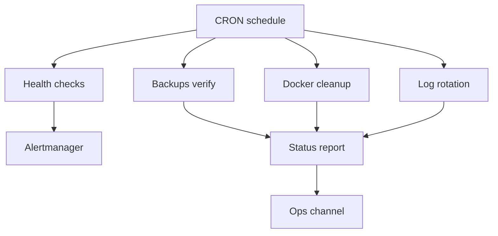

# Automated Maintenance Guide - ERNI-KI

**Version:** 1.0 **Last Updated:** 2025-10-24 **Status:** Production Ready

---

## 1. Introduction

ERNI-KI implements comprehensive automated maintenance to ensure optimal
performance, reliability and resource usage. This guide describes configured
automatic processes, their schedule and manual execution methods.

### Automation components

| Component             | Schedule    | Purpose               | Status |
| :-------------------- | :---------- | :-------------------- | :----- |
| **PostgreSQL VACUUM** | Sunday 3:00 | Database optimization | Active |
| **Docker Cleanup**    | Sunday 4:00 | Resource cleanup      | Active |
| **Log Rotation**      | Daily 3:00  | Log management        | Active |
| **System Monitoring** | Hourly      | Health checks         | Active |
| **Backrest Backups**  | Daily 1:30  | Data protection       | Active |

## 2. Prerequisites

For managing and checking automation requires:

- **Server access:** SSH access with root or sudo privileges. - **Docker:**
  Installed and running Docker Engine. - **Scripts:** Presence of scripts in
  `scripts/` directory (or `/tmp/` for some legacy tasks). - **Utilities:**
  `crontab`, `grep`, `tail`.

## 3. Maintenance instructions

### 3.1 PostgreSQL VACUUM

Automatic database cleanup to free space and update statistics.

**Configuration:**

- **Schedule:** Every Sunday at 3:00 - **Script:** `/tmp/pg_vacuum.sh` -
  **Log:** `/tmp/pg_vacuum.log`

**Manual execution:**

```bash
/tmp/pg_vacuum.sh
tail -f /tmp/pg_vacuum.log
```

### 3.2 Docker Cleanup

Automatic cleanup of unused Docker resources (images, volumes, cache).

**Configuration:**

- **Schedule:** Every Sunday at 4:00 - **Script:** `/tmp/docker-cleanup.sh` -
  **Log:** `/tmp/docker-cleanup.log`

**Manual execution:**

```bash
/tmp/docker-cleanup.sh
tail -f /tmp/docker-cleanup.log
```

### 3.3 Log Rotation

Automatic log rotation to prevent disk overflow.

**Configuration:**

- **Docker Logging:** `json-file`, max-size 10m, max-file 3. - **Cleanup
  script:** `scripts/rotate-logs.sh` (daily at 3:00).

**Manual execution:**

```bash
./scripts/rotate-logs.sh
```

### 3.4 System Monitoring & Backups

- **Health Monitor:** Runs hourly (`scripts/health-monitor.sh`). - **Backrest
  Backups:** Daily at 1:30. Configuration and data backups.

## 4. Verification

Use following methods to check automation functionality.

### Script execution check

```bash
# PostgreSQL VACUUM
grep "completed successfully" /tmp/pg_vacuum.log | tail -n 5

# Docker Cleanup
grep "cleanup completed" /tmp/docker-cleanup.log | tail -n 5

# Health Monitor
tail -n 20 .config-backup/monitoring/cron.log
```

## Cron Jobs check

```bash
# Check cron service status
systemctl status cron

# View cron logs
journalctl -u cron --since "1 day ago"
```

## Success criteria

| Metric                  | Target    | Current | Status |
| :---------------------- | :-------- | :------ | :----- |
| **PostgreSQL VACUUM**   | Weekly    | Active  |        |
| **Docker Cleanup**      | Weekly    | Active  |        |
| **Log Rotation**        | Automatic | Active  |        |
| **Disk Usage**          | <60%      | 60%     |        |
| **Backup Success Rate** | >99%      | 100%    |        |

## Visualization: auto-maintenance



## 5. Related documentation

- [Admin Guide](../../../ru/operations/core/admin-guide.md) - System
  administration (RU)
- [Monitoring Guide](../monitoring/monitoring-guide.md) - Monitoring and alerts
- [Docker Cleanup Guide](../../../ru/operations/automation/docker-cleanup-guide.md) -
  Detailed cleanup procedures (RU)
- [Docker Log Rotation](docker-log-rotation.md) - Log management
