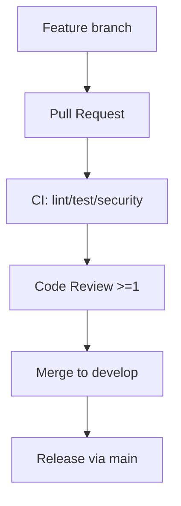

# GitHub Governance Checklist

_Updated: 2025-11-17_

## Visualization: PR workflow



## 1. Branch Structure

-**Main branch:**`main` -**Working branch:**`develop` (formerly `dev`). Need to
rename remote branch and reconfigure branch protection via GitHub UI/CLI:

```bash
git push origin develop:develop
git push origin :dev
gh api repos/:owner/:repo/branches/develop/protection -X PUT --input protect-develop.json
```

## 2. Branch protection (recommended settings)

| Branch    | Requirements                                                                                                                                                      |
| --------- | ----------------------------------------------------------------------------------------------------------------------------------------------------------------- |
| `main`    | Required pull request reviews ≥ 1, dismiss stale reviews, block direct pushes, block merge on failing checks (`lint`, `test-go`, `test-js`, `security`, `deploy`) |
| `develop` | Required pull request reviews ≥ 1, block direct pushes, required checks `lint`, `test-go`, `test-js`                                                              |

> Configure via GitHub UI or
> `gh api repos/:owner/:repo/branches/<branch>/protection`. Attach configuration
> snapshot to documentation.

## 3. GitHub Actions

- Workflows: `ci.yml`, `security.yml`, `deploy-environments.yml`
- Permissions already minimal (`contents:read`, `security-events:write`,
  `packages:write`)
- Ensure `develop` is present in branch list in each workflow (updated in code)

## 3.1 Branch Hygiene

- Enable auto-delete of merged branches in repository settings.
- Regularly clean local references to remote branches:

```bash
git fetch --prune
git branch -r --merged origin/main   # verify no extra active branches
```

- Allowed branch types: `feature/*`, `fix/*`, `docs/*`, `ci/*`, `hotfix/*`.
- Branch lifespan ≤ 4 weeks; extension requires approval in PR.
- Merge history: `squash` by default; `rebase` allowed for minor fixes.

## 4. Secrets & Environments

See `docs/reference/github-environments-setup.md`. Execute scripts:

```bash
./scripts/infrastructure/security/setup-github-environments.sh
./scripts/infrastructure/security/configure-environment-protection.sh
./scripts/infrastructure/security/setup-environment-secrets.sh
./scripts/infrastructure/security/validate-environment-secrets.sh
```

Document verification results in log table.

## 5. Templates and Responsibility

- CODEOWNERS configured for CI/security.
- Issue/PR templates and Dependabot enabled (see `.github/`).

## 6. Open Actions

1. Rename remote branch `dev` → `develop` and update protection rules.
2. Confirm GitHub Environments and secrets status, fill log.
3. Add required status checks for `main`/`develop` per list in
   `docs/archive/audits/ci-health.md`.
4. Maintain branch cleanliness (last cleanup: 2025-12-04, removed outdated
   `audit/*`, `chore/*`, `fix/*`, `dependabot/*` and `update`).
