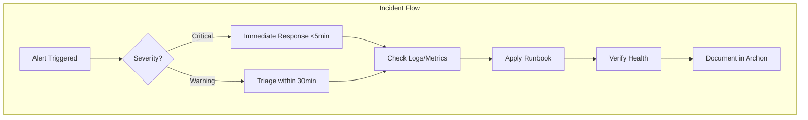

# ERNI-KI Operations Handbook

[TOC]

A compact guide for DevOps/SRE managing observability, SLA, and incident
response.

## 1. Goal

- Keep 32 production services Healthy (see `README.md`).
- Align versions (OpenWebUI v0.6.40, Prometheus v3.0.0, Grafana v11.3.0).
- Meet response targets for 20 active alert rules and daily cron scripts.

## 2. Alerts & Monitoring

- All rules are documented in `conf/prometheus/alerts.yml` (Critical,
  Performance, Database, GPU, Nginx). More details in
  `docs/operations/monitoring/monitoring-guide.md` (“Prometheus Alerts
  Configuration”).
- SLA: critical alerts — respond <5 min, fixes and triage within 30 min.
- Alertmanager v0.27.0 documents channels (Slack/Teams) and throttling; teams
  include owner (SRE) and backup (Platform Lead).
- Logging flows via Fluent Bit → Loki, plus `json-file` for critical services
  (OpenWebUI, Ollama, PostgreSQL, Nginx).

## 3. Incident Response Process

1. Check `docker compose ps` → `docker compose logs <service>` → `curl` metrics.
2. Compare with Grafana dashboards (GPU/LLM/DB). Healthcheck patterns for
   exporters (TCP, wget, Python) are in `../monitoring/monitoring-guide.md`.
3. If alert is critical: notify via Alertmanager and open a ticket in Archon
   (tasks/report). Record status, tokens, teams (SRE Primary, Platform Backup).
4. For non-critical “sensor” alerts: follow
   `../maintenance/service-restart-procedures.md` or
   `../troubleshooting/troubleshooting-guide.md`.

## 4. Maintenance Automation

- All VACUUM and Docker cleanup scripts are described in
  `docs/operations/automation/automated-maintenance-guide.md`. Cron schedule:
  VACUUM 03:00, cleanup 04:00, log rotation daily, Backrest backups 01:30.
- Validate results with: `pg_isready`, `docker image prune`,
  `docker builder prune`, `docker volume prune`.
- On script failures — follow the [Backup Guide](../backup-guide.md) for
  recovery and record any config migrations in change logs. -**New
  November tasks:**
  - `scripts/maintenance/docling-shared-cleanup.sh` — cleans Docling shared
    volume and restores permissions (cron job**docling_shared_cleanup**).
  - `scripts/maintenance/redis-fragmentation-watchdog.sh` — watches
    `redis_memory_fragmentation_ratio`; if >4, enables `activedefrag` and may
    restart the container.
  - `scripts/monitoring/alertmanager-queue-watch.sh` — inspects Alertmanager
    queue (`alertmanager_cluster_messages_queued`) and performs protective
    restart, logging to `logs/alertmanager-queue.log`.
  - `scripts/infrastructure/security/monitor-certificates.sh` — tracks
    TLS/Cloudflare certificate expiry and restarts nginx/watchtower when needed.

## 5. Runbooks & Playbooks

- `../maintenance/service-restart-procedures.md` — safe restarts, pre/post
  healthchecks.
- `../troubleshooting/troubleshooting-guide.md` — common issues (GPU, RAG,
  Redis) and commands: `docker logs`, `nvidia-smi`, `curl`.
- `../maintenance/docling-shared-volume.md` — special steps for cleaning Docling
  shared volume and Fluent Bit.

## 6. Healthchecks & Metrics

- Exporter metrics: `../monitoring/monitoring-guide.md` — node-exporter, Redis,
  PostgreSQL (IPv4/IPv6 proxy), Nvidia, Blackbox, Ollama, Nginx, RAG.
- Use `curl -s http://localhost:PORT/metrics | head` to spot-check, plus
  `docker inspect ... State.Health`.
- Use `docker compose top` and `docker stats` for process/resource view.

## 7. Data & Storage Docs

-**DB plans & optimizations:**
`docs/operations/database/database-monitoring-plan.md`,
`docs/operations/database/database-production-optimizations.md`,
`docs/operations/database/database-troubleshooting.md`. -**Redis:**`docs/operations/database/redis-monitoring-grafana.md`,
`docs/operations/database/redis-operations-guide.md`. -**vLLM / LiteLLM
resources:**`docs/operations/database/vllm-resource-optimization.md` + scripts
`scripts/monitor-litellm-memory.sh`,
`scripts/redis-performance-optimization.sh`.

- In runbooks, cross-link the relevant Data docs when doing maintenance
  (pgvector VACUUM, Redis defrag, Backrest restore).

## 8. References & Sources

- Architecture → `docs/architecture/architecture.md`.
- Monitoring → `docs/operations/monitoring/monitoring-guide.md`,
  `conf/prometheus`, `conf/grafana`.
- Automation → `docs/operations/automation/automated-maintenance-guide.md`,
  `scripts/maintenance`.
- Runbooks → `docs/operations/*.md`.
- Archon — keep short status notes and checklists for each incident (see task
  `a0169e05…`).

## 9. LiteLLM Context & RAG Control

- LiteLLM v1.80.0-stable.1 serves Context Engineering and Context7 (Thinking
  tokens, `/lite/api/v1/think`). Ensure gateway at
  `http://localhost:4000/health/liveliness`.
- `scripts/monitor-litellm-memory.sh` — cron/ad-hoc check of LiteLLM memory with
  webhooks/Slack when threshold (80% default) is exceeded.
- `scripts/infrastructure/monitoring/test-network-performance.sh` — RTT check
  between nginx ↔ LiteLLM ↔ Ollama/PostgreSQL/Redis; if latency degrades,
  record in Archon.
- For Context7 incidents, use `docs/reference/api-reference.md` and
  `docs/reference/mcpo-integration-guide.md` (section “Context7 & LiteLLM
  routing”) and sync status with `docs/reference/status.yml`.

## 10. Archives & Reporting

- Overview: `docs/archive/README.md` (links to audits/diagnostics/incidents).
- Compliance & docs: `docs/archive/audits/README.md`.
- Diagnostics: `docs/archive/diagnostics/README.md` (use for RCA).
- Incidents & remediation: `docs/archive/incidents/README.md`.
- Cron/monitoring logs and configs:
  `docs/archive/config-backup/monitoring-report-2025-10-02.md`,
  `update-analysis-2025-10-02.md`, `update-execution-report-2025-10-02.md`. When
  updating scripts, record changes in these reports or create new files in
  config-backup.

## 11. CI/CD & Security

-**Secret scanning:**add gitleaks or trufflehog as a CI job for PRs. Block
pipeline on findings; handle exceptions via baseline. -**Dependency
scanning:**`npm audit --omit=dev` or Snyk OSS in CI with fail on critical CVEs;
keep `gosec` + Trivy filesystem scan for Go. -**Container scanning:**Trivy image
scan with explicit allowlist/ignorefile for false positives; fail on other
criticals. -**Policy:**real secrets only in secret managers/CI secrets; git
holds `.example` plus generation instructions (README/handbook).
