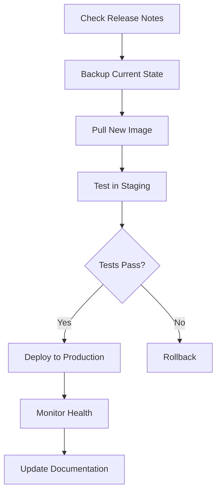

# Image Upgrade Checklist (EN placeholder)

Use `docs/ru/operations/maintenance/image-upgrade-checklist.md` as the current
source. This placeholder will be replaced once an English version is authored.

## Upgrade Process

## Quick Steps

1. Review changelog for breaking changes
2. Backup volumes: `./scripts/maintenance/backup.sh`
3. Pull image: `docker compose pull <service>`
4. Restart: `docker compose up -d <service>`
5. Verify healthchecks
