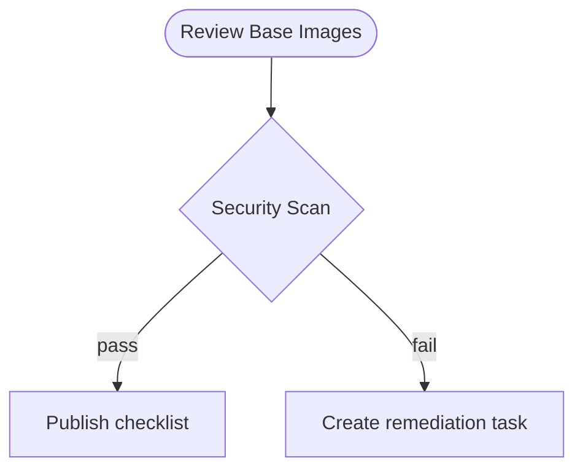

# Image Upgrade Checklist (Placeholder)

## Purpose

Content intentionally removed during audit cleanup. Restore the original
procedure or rewrite the checklist before publishing.

## Process Overview

