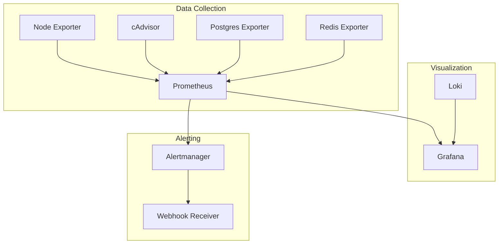

# Monitoring Guide (EN placeholder)

The authoritative monitoring guide lives in
`docs/ru/operations/monitoring/monitoring-guide.md`. This placeholder will be
replaced when the EN version is ready.

## Monitoring Stack Overview

## Quick Links

- Prometheus: `http://localhost:9091`
- Grafana: `http://localhost:3000`
- Alertmanager: `http://localhost:9093`
