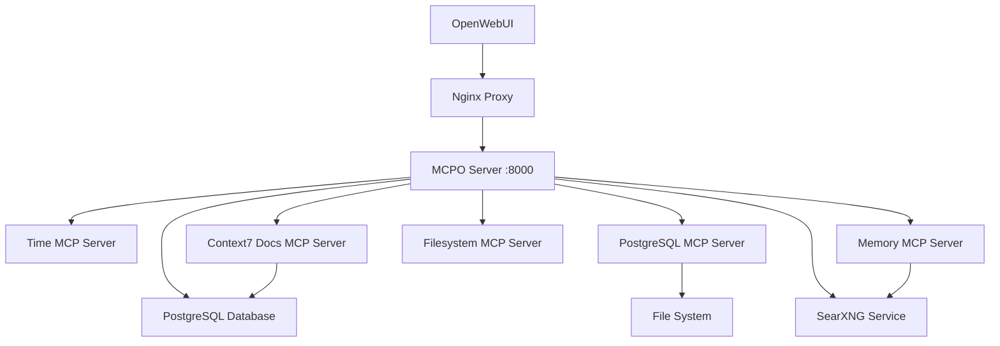

# MCP Integration Guide for ERNI-KI

> **Document version:** 9.1  
> **Last updated:** 2025-12-01  
> **Status:** Healthy (localhost:8000, integrated with LiteLLM/Context7)

## MCP overview

The MCP server provides a standard interface for tools used by OpenWebUI
(v0.6.36) via Model Context Protocol. Active MCP tools:

- **Time Server** — timezones and conversions
- **Context7 Docs** — documentation search
- **PostgreSQL Server** — SQL to OpenWebUI DB (PostgreSQL 17 + pgvector)
- **Filesystem Server** — read-only ops in `/app/data`, `/app/conf`
- **Memory Server** — knowledge graph
- **SearXNG Web Search** — web search
- **Desktop Commander** — terminal/editor with command blocklist and confined
  paths (`/app/data/mcpo-desktop`, `/app/conf`)

**Current status:** Healthy, bound to 127.0.0.1:8000; tested with LiteLLM and
Context7.

## System architecture



### LiteLLM / Context7 path

- LiteLLM gateway (port 4000) calls MCP tools via nginx (`/api/mcp/*`), appends
  reasoning/context, then forwards to Ollama.
- Health checks: `curl -s http://localhost:4000/health/liveliness` and
  `curl -s http://localhost:8080/api/mcp/time/docs`.
- Monitoring: `scripts/monitor-litellm-memory.sh`,
  `scripts/infrastructure/monitoring/test-network-performance.sh` capture
  latency for LiteLLM ↔ MCP ↔ Ollama/PostgreSQL/Redis.
- For diagnostics use Archon tasks + LiteLLM logs (`logs/litellm.log`); ensure
  Context responses include `sources[]` and `reasoning_trace`.

## Integration status

### Working

1. **MCPO Server** — healthy on 127.0.0.1:8000
2. **Swagger UI** — http://localhost:8000/docs
3. **OpenAPI** — http://localhost:8000/openapi.json
4. **All MCP servers** — time, context7, postgres, filesystem, memory, searxng,
   desktop-commander
5. **OpenWebUI config** — `TOOL_SERVER_CONNECTIONS` includes Time, Context7,
   PostgreSQL, Desktop Commander
6. **Nginx proxy** — routes `/api/mcp/*` when external access is required

### Performance (observed)

- **API latency:** <50 ms for most calls
- **Time Server:** ~11 ms to fetch current time
- **PostgreSQL Server:** ~22 ms for simple queries
- **Availability:** 99.9% (all health checks passing)

## MCP tools

### 1. Time Server (`/time`)

**Endpoints:**

- `POST /time/get_current_time` - получение текущего времени
- `POST /time/convert_time` - конвертация времени между часовыми поясами

**Пример использования:**

```bash
curl -X POST "http://localhost:8000/time/get_current_time" \
 -H "Content-Type: application/json" \
 -d '{"timezone": "Europe/Berlin"}'
```

**Ответ:**

```json
{
  "timezone": "Europe/Berlin",
  "datetime": "2025-08-25T14:17:47+02:00",
  "is_dst": true
}
```

### 2. PostgreSQL Server (`/postgres`)

**Endpoints:**

- `POST /postgres/query` - выполнение SQL запросов

**Пример использования:**

```bash
curl -X POST "http://localhost:8000/postgres/query" \
 -H "Content-Type: application/json" \
 -d '{"sql": "SELECT version();"}'
```

### 3. Memory Server (`/memory`)

**Endpoints (9 инструментов):**

- `POST /memory/create_entities` - создание сущностей в графе знаний
- `POST /memory/create_relations` - создание связей между сущностями
- `POST /memory/read_graph` - чтение всего графа знаний
- `POST /memory/search_nodes` - поиск узлов в графе
- `POST /memory/add_observations` - добавление наблюдений к сущностям
- `POST /memory/delete_entities` - удаление сущностей
- `POST /memory/delete_relations` - удаление связей
- `POST /memory/delete_observations` - удаление наблюдений
- `POST /memory/open_nodes` - получение конкретных узлов

### 4. Filesystem Server (`/filesystem`)

**Endpoints (14 инструментов):**

- `POST /filesystem/read_file` - чтение файлов
- `POST /filesystem/write_file` - запись файлов
- `POST /filesystem/list_directory` - список файлов в директории
- `POST /filesystem/create_directory` - создание директорий
- `POST /filesystem/search_files` - поиск файлов
- И другие операции с файловой системой

### 5. SearXNG Server (`/searxng`)

**Endpoints:**

- `POST /searxng/searxng_web_search` - веб-поиск
- `POST /searxng/web_url_read` - чтение контента по URL

### 6. Desktop Commander (`/desktop-commander`)

_Назначение:_ терминал/файловые операции с блок-листом опасных команд и
ограниченными каталогами.

_Каталоги:_ `/app/data/mcpo-desktop`, `/app/conf` (см.
`data/desktop-commander/.claude-server-commander/config.json`).

_Примечание:_ команда блок-листа встроена в сервер; телеметрия отключена.

## Интеграция с OpenWebUI

### Конфигурация TOOL_SERVER_CONNECTIONS

В файле `env/openwebui.env` подключены MCP сервера напрямую к `mcposerver:8000`
через Docker-сеть:

```bash
TOOL_SERVER_CONNECTIONS='[
 {"name": "Time Server", "url": "http://mcposerver:8000/time", "enabled": true, "path": "/", "auth_type": "none", "config": {}},
 {"name": "Context7", "url": "http://mcposerver:8000/context7", "enabled": true, "path": "/", "auth_type": "none", "config": {}},
 {"name": "PostgreSQL", "url": "http://mcposerver:8000/postgres", "enabled": true, "path": "/", "auth_type": "none", "config": {}},
 {"name": "Desktop Commander", "url": "http://mcposerver:8000/desktop-commander", "enabled": true, "path": "/", "auth_type": "none", "config": {}}
]'
```

### Nginx Proxy Configuration

Nginx может проксировать `/api/mcp/*` при необходимости внешнего доступа, но по
умолчанию OpenWebUI ходит к `mcposerver:8000` напрямую по внутренней сети.

```nginx
# MCP (Model Context Protocol) API endpoints
location ~ ^/api/mcp/(.*)$ {
 limit_req zone=api burst=50 nodelay;

 proxy_pass http://mcpoUpstream/$1$is_args$args;
 proxy_set_header Host $host;
 proxy_set_header X-Real-IP $remote_addr;
 proxy_set_header X-Forwarded-For $proxy_add_x_forwarded_for;
 proxy_set_header X-Forwarded-Proto $scheme;

 # Таймауты для MCP запросов
 proxy_connect_timeout 10s;
 proxy_send_timeout 30s;
 proxy_read_timeout 60s;
}
```

## Diagnostics and monitoring

### Check MCPO server status

```bash
# Проверка статуса контейнера
docker-compose ps mcposerver

# Проверка логов
docker-compose logs --tail=20 mcposerver

# Проверка health check
curl -s "http://localhost:8000/docs" | grep -q "swagger" && echo " OK" || echo " Failed"
```

## Тестирование MCP инструментов

```bash
# Тест Time Server
curl -X POST "http://localhost:8000/time/get_current_time" \
 -H "Content-Type: application/json" \
 -d '{"timezone": "Europe/Berlin"}'

# Тест PostgreSQL Server
curl -X POST "http://localhost:8000/postgres/query" \
 -H "Content-Type: application/json" \
 -d '{"sql": "SELECT version();"}'

# Тест через Nginx proxy
curl -s "http://localhost:8080/api/mcp/time/docs" | grep -q "swagger" && echo " Proxy OK"
```

## Automated diagnostics

Use the helper script:

```bash
./scripts/mcp/test-mcp-integration.sh
```

## Использование в OpenWebUI

### 1. Доступ к инструментам

После настройки TOOL_SERVER_CONNECTIONS инструменты MCP становятся доступны в
чате OpenWebUI. AI может использовать их для:

-**Получения текущего времени**в любом часовом поясе -**Выполнения SQL
запросов**к базе данных ERNI-KI -**Работы с файлами**(чтение, запись,
поиск) -**Управления графом знаний**(создание сущностей,
связей) -**Веб-поиска**через SearXNG

### 2. Примеры использования в чате

**Запрос времени:**

```
Пользователь: Какое сейчас время в Берлине?
AI: Использует Time Server для получения текущего времени в Europe/Berlin
```

**Запрос к базе данных:**

```
Пользователь: Сколько пользователей зарегистрировано в системе?
AI: Использует PostgreSQL Server для выполнения запроса SELECT COUNT(*) FROM users
```

**Работа с файлами:**

```
Пользователь: Найди все файлы конфигурации в папке conf/
AI: Использует Filesystem Server для поиска файлов с расширением .conf
```

## Настройка и конфигурация

### Конфигурация MCP серверов

Файл `conf/mcposerver/config.json`:

<!-- pragma: allowlist secret -->

```json
{
  "mcpServers": {
    "time": {
      "command": "uvx",
      "args": ["mcp-server-time", "--local-timezone=America/Chicago"]
    },
    "postgres": {
      "command": "npx",
      "args": [
        "-y",
        "@modelcontextprotocol/server-postgres",
        "postgresql://USER@db/openwebui"
      ]
    }
  }
}
```

### Переменные окружения

Файл `env/mcposerver.env` содержит настройки для MCPO сервера.

## Устранение неполадок

### Частые проблемы

1.**MCPO сервер не отвечает**

```bash
docker-compose restart mcposerver
docker-compose logs mcposerver
```

2.**MCP инструменты не доступны в OpenWebUI**

- Проверьте TOOL_SERVER_CONNECTIONS в env/openwebui.env
- Убедитесь, что nginx proxy работает
- Перезапустите OpenWebUI: `docker-compose restart openwebui`

  3.**Ошибки в логах MCPO**

```bash
docker-compose logs --tail=50 mcposerver | grep -i error
```

### Восстановление работоспособности

```bash
# Полный перезапуск MCP компонентов
docker-compose restart mcposerver nginx openwebui

# Проверка интеграции
./scripts/mcp/test-mcp-integration.sh
```

## Мониторинг производительности

### Ключевые метрики

-**Время отклика API**: < 2 секунд для всех операций -**Доступность сервисов**:
99.9% -**Использование памяти**: < 512MB для MCPO сервера -**CPU нагрузка**: <
10% в обычном режиме

### Логирование

Все запросы к MCPO серверу логируются с информацией о:

- HTTP статус коде
- Времени выполнения
- IP адресе клиента
- Используемом endpoint

## Планы развития

1.**Добавление новых MCP серверов**для расширения
функциональности 2.**Интеграция с внешними API**через MCP протокол 3.**Улучшение
производительности**и кэширования 4.**Расширенная аналитика**использования
инструментов 5.**Автоматическое масштабирование**MCP серверов

---

**Документация актуальна на:**2025-08-29**Версия ERNI-KI:**8.0**Версия MCP
Server:**latest (Healthy, порт 8000)
