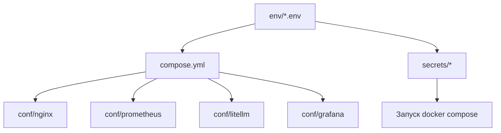

# Руководство по конфигурации ERNI-KI

> **Версия:** 11.0 **Дата обновления:** 2025-09-25 **Статус:** Production Ready
> [TOC]

Данное руководство содержит production-ready конфигурации для всех компонентов
системы ERNI-KI с русскими комментариями для ключевых настроек.

## Обзор конфигурации

Система ERNI-KI использует модульную структуру конфигурации:

```
env/ # Переменные окружения для каждого сервиса
 openwebui.env # Основной AI интерфейс
 ollama.env # LLM сервер с GPU
 litellm.env # Context Engineering Gateway
 mcposerver.env # Model Context Protocol
 searxng.env # Поисковый движок
 tika.env # Извлечение метаданных
 ...

conf/ # Конфигурационные файлы
 nginx/ # Reverse proxy конфигурация
 prometheus/ # Мониторинг метрик
 grafana/ # Дашборды и визуализация
 litellm/ # LLM Gateway настройки
 ...
```

## Визуализация: конфигурационные артефакты



## AI & ML Services

### OpenWebUI Configuration

**Файл:** `env/openwebui.env`

```bash
# === ОСНОВНЫЕ НАСТРОЙКИ ===
WEBUI_NAME="ERNI-KI AI Platform"
WEBUI_URL="https://ki.erni-gruppe.ch"

# === БЕЗОПАСНОСТЬ ===
WEBUI_SECRET_KEY="your-secret-key-here" # КРИТИЧНО: Замените на уникальный ключ # pragma: allowlist secret
ENABLE_SIGNUP=false # Отключить регистрацию в продакшене
DEFAULT_USER_ROLE="user" # Роль по умолчанию для новых пользователей
CORS_ALLOW_ORIGIN="https://diz.zone;https://webui.diz.zone;https://ki.erni-gruppe.ch;https://192.168.62.153;http://192.168.62.153:8080" # Разделяйте origin знаком ';'

# === GPU УСКОРЕНИЕ ===
NVIDIA_VISIBLE_DEVICES=all # Доступ ко всем GPU
NVIDIA_DRIVER_CAPABILITIES=compute,utility # Необходимые возможности драйвера

# === ИНТЕГРАЦИИ ===
OLLAMA_BASE_URL="http://ollama:11434" # Подключение к Ollama
LITELLM_BASE_URL="http://litellm:4000" # LiteLLM Gateway
SEARXNG_QUERY_URL="http://nginx:8080/api/searxng/search?q=<query>&format=json"

# === ОБРАБОТКА ДОКУМЕНТОВ ===
TIKA_BASE_URL="http://tika:9998" # Apache Tika для метаданных

# === ПРОИЗВОДИТЕЛЬНОСТЬ ===
WEBUI_SESSION_COOKIE_SAME_SITE="lax" # Совместимость с iframe
WEBUI_SESSION_COOKIE_SECURE=true # HTTPS only cookies
```

## Ollama Configuration

**Файл:** `env/ollama.env`

```bash
# === GPU НАСТРОЙКИ ===
NVIDIA_VISIBLE_DEVICES=all # Использовать все доступные GPU
OLLAMA_GPU_LAYERS=35 # Количество слоев на GPU (оптимально)
OLLAMA_NUM_PARALLEL=4 # Параллельные запросы

# === ПАМЯТЬ И ПРОИЗВОДИТЕЛЬНОСТЬ ===
OLLAMA_MAX_LOADED_MODELS=3 # Максимум моделей в памяти
OLLAMA_FLASH_ATTENTION=true # Оптимизация внимания
OLLAMA_KV_CACHE_TYPE="f16" # Тип кэша ключ-значение

# === СЕТЕВЫЕ НАСТРОЙКИ ===
OLLAMA_HOST="0.0.0.0:11434" # Слушать на всех интерфейсах
OLLAMA_ORIGINS="*" # CORS для всех источников

# === ЛОГИРОВАНИЕ ===
OLLAMA_DEBUG=false # Отключить debug в продакшене
OLLAMA_VERBOSE=false # Минимальное логирование
```

## LiteLLM Configuration

**Файл:** `env/litellm.env`

```bash
# === ОСНОВНЫЕ НАСТРОЙКИ ===
LITELLM_PORT=4000
LITELLM_HOST="0.0.0.0"

# === БАЗА ДАННЫХ ===
DATABASE_URL="postgresql://erni_ki:password@db:5432/erni_ki" # pragma: allowlist secret

# === БЕЗОПАСНОСТЬ ===
LITELLM_MASTER_KEY="sk-your-master-key-here" # КРИТИЧНО: Уникальный мастер-ключ # pragma: allowlist secret
LITELLM_SALT_KEY="your-salt-key-here" # Соль для хеширования

# === ИНТЕГРАЦИИ ===
OLLAMA_BASE_URL="http://ollama:11434" # Локальный Ollama
OPENAI_API_KEY="your-openai-key" # OpenAI API (опционально) # pragma: allowlist secret

# === ПРОИЗВОДИТЕЛЬНОСТЬ ===
LITELLM_REQUEST_TIMEOUT=600 # Таймаут запросов (10 минут)
LITELLM_MAX_BUDGET=1000 # Максимальный бюджет в месяц
```

**Файл:** `conf/litellm/config.yaml`

```yaml
# === КОНФИГУРАЦИЯ МОДЕЛЕЙ ===
model_list:
 # Локальные модели через Ollama
 - model_name: 'llama3.2'
 litellm_params:
 model: 'ollama/llama3.2'
 api_base: 'http://ollama:11434'

 - model_name: 'qwen2.5-coder'
 litellm_params:
 model: 'ollama/qwen2.5-coder:1.5b'
 api_base: 'http://ollama:11434'

# === ОБЩИЕ НАСТРОЙКИ ===
general_settings:
 master_key: 'sk-your-master-key-here' # Должен совпадать с env
 database_url: 'postgresql://erni_ki:password@db:5432/erni_ki' # pragma: allowlist secret

 # === БЕЗОПАСНОСТЬ ===
 enforce_user_param: true # Обязательный параметр пользователя
 max_budget: 1000 # Максимальный бюджет
 budget_duration: '30d' # Период бюджета

 # === ПРОИЗВОДИТЕЛЬНОСТЬ ===
 request_timeout: 600 # Таймаут запросов
 max_parallel_requests: 10 # Максимум параллельных запросов

 # === ЛОГИРОВАНИЕ ===
 set_verbose: false # Минимальное логирование в продакшене
```

## Document Processing

### Apache Tika Configuration

**Файл:** `env/tika.env`

```bash
# === ОСНОВНЫЕ НАСТРОЙКИ ===
TIKA_PORT=9998
TIKA_HOST="0.0.0.0"

# === БЕЗОПАСНОСТЬ ===
TIKA_CONFIG_FILE="/opt/tika/tika-config.xml" # Конфигурационный файл
TIKA_MAX_FILE_SIZE=104857600 # 100MB максимальный размер

# === ПРОИЗВОДИТЕЛЬНОСТЬ ===
TIKA_REQUEST_TIMEOUT=300000 # 5 минут таймаут
TIKA_TASK_TIMEOUT=120000 # 2 минуты на задачу
TIKA_MAX_FORK_COUNT=4 # Максимум процессов

# === JVM НАСТРОЙКИ ===
JAVA_OPTS="-Xmx2g -Xms1g -XX:+UseG1GC" # Оптимизация памяти
```

## Search & RAG

### SearXNG Configuration

**Файл:** `env/searxng.env`

```bash
# === ОСНОВНЫЕ НАСТРОЙКИ ===
SEARXNG_PORT=8080
SEARXNG_BASE_URL="http://searxng:8080"

# === БЕЗОПАСНОСТЬ ===
SEARXNG_SECRET_KEY="your-searxng-secret-key" # КРИТИЧНО: Уникальный ключ # pragma: allowlist secret
SEARXNG_BIND_ADDRESS="0.0.0.0:8080"

# === ПРОИЗВОДИТЕЛЬНОСТЬ ===
SEARXNG_DEFAULT_HTTP_TIMEOUT=3.0 # Таймаут HTTP запросов
SEARXNG_POOL_CONNECTIONS=100 # Пул соединений
SEARXNG_POOL_MAXSIZE=20 # Максимум соединений в пуле

# === ПОИСКОВЫЕ ДВИЖКИ ===
SEARXNG_ENGINES_BRAVE_DISABLED=false # Включить Brave Search
SEARXNG_ENGINES_STARTPAGE_DISABLED=false # Включить Startpage
SEARXNG_ENGINES_WIKIPEDIA_TIMEOUT=5.0 # Увеличенный таймаут для Wikipedia
```

## Data Layer

### PostgreSQL Configuration

**Файл:** `env/postgres.env`

```bash
# === ОСНОВНЫЕ НАСТРОЙКИ ===
POSTGRES_DB=erni_ki
POSTGRES_USER=erni_ki
POSTGRES_PASSWORD=your-secure-password # КРИТИЧНО: Сильный пароль

# === ПРОИЗВОДИТЕЛЬНОСТЬ ===
POSTGRES_SHARED_BUFFERS=256MB # Буферы разделяемой памяти
POSTGRES_MAX_CONNECTIONS=200 # Максимум подключений
POSTGRES_WORK_MEM=4MB # Рабочая память на операцию

# === БЕЗОПАСНОСТЬ ===
POSTGRES_HOST_AUTH_METHOD=md5 # Аутентификация по паролю
POSTGRES_INITDB_ARGS="--auth-host=md5" # Инициализация с MD5

# === РАСШИРЕНИЯ ===
POSTGRES_EXTENSIONS="pgvector,pg_stat_statements" # Необходимые расширения
```

## Redis Configuration

**Файл:** `env/redis.env`

```bash
# === ОСНОВНЫЕ НАСТРОЙКИ ===
REDIS_PORT=6379
REDIS_BIND="0.0.0.0"

# === БЕЗОПАСНОСТЬ ===
REDIS_PASSWORD="your-redis-password" # КРИТИЧНО: Сильный пароль # pragma: allowlist secret
REDIS_PROTECTED_MODE=yes # Защищенный режим

# === ПАМЯТЬ ===
REDIS_MAXMEMORY=2gb # Максимум памяти
REDIS_MAXMEMORY_POLICY=allkeys-lru # Политика вытеснения

# === ПРОИЗВОДИТЕЛЬНОСТЬ ===
REDIS_SAVE="900 1 300 10 60 10000" # Настройки сохранения
REDIS_TCP_KEEPALIVE=300 # Keep-alive соединений
```

## Network & Security

### Nginx Configuration

**Основной файл:** `conf/nginx/conf.d/default.conf`

```nginx
# === ОСНОВНОЙ СЕРВЕР БЛОК ===
server {
 listen 443 ssl http2;
 listen [::]:443 ssl http2;

 # === ДОМЕНЫ ===
 server_name ki.erni-gruppe.ch diz.zone localhost nginx;

 # === SSL НАСТРОЙКИ ===
 ssl_certificate /etc/nginx/ssl/nginx-fullchain.crt;
 ssl_certificate_key /etc/nginx/ssl/nginx.key;
 ssl_protocols TLSv1.2 TLSv1.3;
 ssl_ciphers ECDHE-ECDSA-AES128-GCM-SHA256:ECDHE-RSA-AES128-GCM-SHA256;
 ssl_prefer_server_ciphers off;
 ssl_session_cache shared:SSL:100m;
 ssl_session_timeout 8h;

 # === БЕЗОПАСНОСТЬ ===
 add_header X-Frame-Options "SAMEORIGIN" always;
 add_header X-XSS-Protection "1; mode=block" always;
 add_header X-Content-Type-Options "nosniff" always;
 add_header Strict-Transport-Security "max-age=31536000; includeSubDomains" always;

 # === ПРОИЗВОДИТЕЛЬНОСТЬ ===
 gzip on;
 gzip_vary on;
 gzip_min_length 1024;
 gzip_types text/plain text/css application/json application/javascript;

 # === ПРОКСИРОВАНИЕ К OPENWEBUI ===
 location / {
 include /etc/nginx/includes/openwebui-common.conf;
 proxy_pass http://openwebuiUpstream;
 }

 # === API МАРШРУТЫ ===
 location /api/searxng/ {
 include /etc/nginx/includes/searxng-api-common.conf;
 proxy_pass http://searxngUpstream;
 }

}
```

## Monitoring Configuration

### Prometheus Configuration

**Файл:** `conf/prometheus/prometheus.yml`

```yaml
# === ГЛОБАЛЬНЫЕ НАСТРОЙКИ ===
global:
 scrape_interval: 15s # Интервал сбора метрик
 evaluation_interval: 15s # Интервал оценки правил
 external_labels:
 cluster: 'erni-ki' # Метка кластера
 environment: 'production' # Окружение

# === ПРАВИЛА АЛЕРТОВ ===
rule_files:
 - 'rules/*.yml' # Файлы с правилами

# === ALERTMANAGER ===
alerting:
 alertmanagers:
 - static_configs:
 - targets:
 - alertmanager:9093

# === ЗАДАНИЯ СБОРА МЕТРИК ===
scrape_configs:
 # Основные сервисы
 - job_name: 'prometheus'
 static_configs:
 - targets: ['localhost:9090']

 - job_name: 'node-exporter'
 static_configs:
 - targets: ['node-exporter:9100']

 - job_name: 'ollama-exporter'
 static_configs:
 - targets: ['ollama-exporter:9778']

 - job_name: 'postgres-exporter'
 static_configs:
 - targets: ['postgres-exporter:9187']

 # Blackbox мониторинг HTTPS endpoints
 - job_name: 'blackbox-https'
 metrics_path: /probe
 params:
 module: [https_2xx]
 static_configs:
 - targets:
 - https://ki.erni-gruppe.ch
 - https://diz.zone
 - https://webui.diz.zone
 - https://lite.diz.zone
 relabel_configs:
 - source_labels: [__address__]
 target_label: __param_target
 - source_labels: [__param_target]
 target_label: instance
 - target_label: __address__
 replacement: blackbox-exporter:9115
```

## Security Best Practices

### 1. Переменные окружения

```bash
# === КРИТИЧНЫЕ ПЕРЕМЕННЫЕ ===
# Всегда используйте сильные, уникальные значения:

WEBUI_SECRET_KEY="$(openssl rand -hex 32)"
LITELLM_MASTER_KEY="sk-$(openssl rand -hex 32)"
POSTGRES_PASSWORD="$(openssl rand -base64 32)"
REDIS_PASSWORD="$(openssl rand -base64 32)"
SEARXNG_SECRET_KEY="$(openssl rand -hex 16)"
```

## 2. SSL/TLS Настройки

```nginx
# === СОВРЕМЕННЫЕ SSL НАСТРОЙКИ ===
ssl_protocols TLSv1.2 TLSv1.3;
ssl_ciphers ECDHE-ECDSA-AES128-GCM-SHA256:ECDHE-RSA-AES128-GCM-SHA256:ECDHE-ECDSA-AES256-GCM-SHA384:ECDHE-RSA-AES256-GCM-SHA384;
ssl_prefer_server_ciphers off;
ssl_session_cache shared:SSL:100m;
ssl_session_timeout 8h;

# === HSTS ===
add_header Strict-Transport-Security "max-age=31536000; includeSubDomains" always;
```

## 3. Файловые разрешения

```bash
# === БЕЗОПАСНЫЕ РАЗРЕШЕНИЯ ===
chmod 600 env/*.env # Только владелец может читать env файлы
chmod 644 conf/nginx/*.conf # Конфигурации nginx
chmod 600 conf/nginx/ssl/* # SSL сертификаты и ключи
```

## Production Deployment

### 1. Проверка конфигурации

```bash
# Проверка синтаксиса nginx
docker exec erni-ki-nginx-1 nginx -t

# Проверка конфигурации Prometheus
docker exec erni-ki-prometheus promtool check config /etc/prometheus/prometheus.yml

# Проверка подключения к базе данных
docker exec erni-ki-db-1 pg_isready -U erni_ki
```

## 2. Мониторинг конфигурации

```bash
# Проверка статуса всех сервисов
docker-compose ps

# Проверка логов критичных сервисов
docker-compose logs --tail=50 openwebui ollama litellm nginx postgres
```

## 3. Резервное копирование конфигурации

```bash
# Создание резервной копии
tar -czf erni-ki-config-$(date +%Y%m%d).tar.gz env/ conf/

# Восстановление из резервной копии
tar -xzf erni-ki-config-YYYYMMDD.tar.gz
```

---

> ** Важно:** Всегда тестируйте изменения конфигурации в тестовой среде перед
> применением в продакшене. Создавайте резервные копии перед внесением
> изменений.
