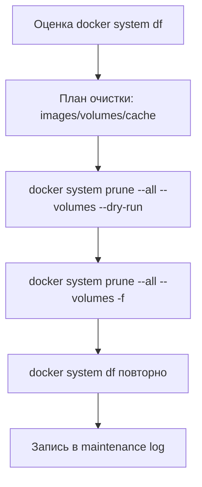

# Руководство по очистке неиспользуемых Docker ресурсов

[TOC]

## Обзор

На основе анализа Docker системы выявлены следующие неиспользуемые ресурсы:

| Категория                  | Количество  | Потенциальная экономия |
| -------------------------- | ----------- | ---------------------- |
| **Неиспользуемые images**  | 23          | ~21.78 GB              |
| **Неиспользуемые volumes** | 101+        | ~16.36 GB              |
| **Build cache**            | 0 (очищен)  | 0 GB                   |
| **Dangling images**        | 0 (очищены) | 0 GB                   |

**Общая потенциальная экономия: ~38 GB**

---

## Визуализация: cleanup-пайплайн



## Неиспользуемые Docker Images

### Список неиспользуемых образов (без контейнеров)

```
erni-foto-agency-dev-frontend:2024.05 1.17 GB
erni-foto-agency-erni-app:2024.05 582 MB
erni-foto-agency-dev-backend:2024.05 559 MB
erni-foto-agency-frontend:2024.05 1.14 GB
erni-foto-agency-backend:2024.05 559 MB
alpine:2024.05 8.32 MB
erni-foto-agency-erni-frontend:2024.05 3.3 GB
erni-foto-agency-erni-ag-ui-bridge:2024.05 167 MB
erni-foto-copilot:2024.05 1.22 GB
jaegertracing/all-in-one:2024.05 85.6 MB
ghcr.io/open-webui/open-webui:2024.05 4.83 GB (старая версия)
ghcr.io/open-webui/open-webui:v0.6.31 4.83 GB (старая версия)
erni-foto-agency-app:2024.05 2.14 GB
fluent/fluent-bit:2024.05 106 MB
postgres:15-alpine 279 MB
grafana/grafana:2024.05 733 MB
ghcr.io/berriai/litellm:v1.77.2.rc.1 2.2 GB (старая версия)
fluent/fluent-bit:3.1.0 88.2 MB
mysql:8.0.39 573 MB
elasticsearch:8.11.3 1.41 GB
```

**Общий размер: ~21.78 GB**

---

## Команды для очистки

### 1. Безопасная очистка (рекомендуется)

#### Удаление конкретных неиспользуемых образов

```bash
# Удалить старые версии OpenWebUI
docker rmi ghcr.io/open-webui/open-webui:2024.05
docker rmi ghcr.io/open-webui/open-webui:v0.6.31

# Удалить старые версии LiteLLM
docker rmi ghcr.io/berriai/litellm:v1.77.2.rc.1

# Удалить неиспользуемые образы ERNI-FOTO проектов
docker rmi erni-foto-agency-dev-frontend:2024.05
docker rmi erni-foto-agency-dev-backend:2024.05
docker rmi erni-foto-agency-erni-app:2024.05
docker rmi erni-foto-agency-frontend:2024.05
docker rmi erni-foto-agency-backend:2024.05
docker rmi erni-foto-agency-erni-frontend:2024.05
docker rmi erni-foto-agency-erni-ag-ui-bridge:2024.05
docker rmi erni-foto-copilot:2024.05
docker rmi erni-foto-agency-app:2024.05

# Удалить неиспользуемые служебные образы
docker rmi jaegertracing/all-in-one:2024.05
docker rmi fluent/fluent-bit:2024.05
docker rmi fluent/fluent-bit:3.1.0
docker rmi postgres:15-alpine
docker rmi grafana/grafana:2024.05
docker rmi mysql:8.0.39
docker rmi elasticsearch:8.11.3
docker rmi alpine:2024.05
```

**Ожидаемая экономия: ~21.78 GB**

## 2. Автоматическая очистка всех неиспользуемых образов



```bash
# ВНИМАНИЕ: Удалит ВСЕ образы без контейнеров!
# Рекомендуется только если уверены, что образы не понадобятся

# Просмотр списка перед удалением
docker images --filter "dangling=false" --format "table {{.Repository}}:{{.Tag}}\t{{.Size}}\t{{.CreatedAt}}" | \
 grep -v "$(docker ps -a --format '{{.Image}}' | sort -u | tr '\n' '|' | sed 's/|$//')"

# Удаление образов старше 30 дней без контейнеров
docker image prune -a --filter "until=720h"
```



---

## Неиспользуемые Docker Volumes

### Проверка содержимого перед удалением



```bash
# Список всех неиспользуемых volumes
docker volume ls -qf dangling=true

# Проверка содержимого каждого volume (первые 10)
for vol in $(docker volume ls -qf dangling=true | head -10); do
 echo "=== Volume: $vol ==="
 docker run --rm -v $vol:/data alpine ls -lah /data 2>/dev/null | head -10
 echo ""
done
```



## Удаление неиспользуемых volumes

```bash
# ОЧЕНЬ ОСТОРОЖНО: Может удалить важные данные!

# Вариант 1: Удалить все неиспользуемые volumes
docker volume prune -f

# Вариант 2: Удалить конкретные volumes после проверки
# docker volume rm <volume_id>
```

**Ожидаемая экономия: ~16.36 GB**

---

## Комплексная очистка Docker системы

### Полная очистка (ОПАСНО!)

```bash
# Удалить ВСЁ неиспользуемое: images, containers, volumes, networks
docker system prune -a --volumes -f

# С подтверждением
docker system prune -a --volumes
```

## Безопасная комплексная очистка



```bash
# 1. Удалить остановленные контейнеры
docker container prune -f

# 2. Удалить неиспользуемые сети
docker network prune -f

# 3. Удалить dangling images (уже выполнено)
docker image prune -f

# 4. Удалить build cache (уже выполнено)
docker builder prune -af

# 5. Проверить статистику
docker system df
```



---

## Автоматизация очистки

### Создать скрипт еженедельной очистки

```bash
cat > scripts/cleanup-docker.sh << 'EOF'
# !/bin/bash
# Автоматическая очистка Docker ресурсов ERNI-KI
# Запускается еженедельно в субботу в 4:00 через cron

PROJECT_DIR="/home/konstantin/Documents/augment-projects/erni-ki"
LOG_FILE="$PROJECT_DIR/logs/docker-cleanup.log"

echo "$(date '+%Y-%m-%d %H:%M:%S') - Начало очистки Docker" >> "$LOG_FILE"

# Статистика до очистки
BEFORE=$(docker system df --format "{{.Type}}\t{{.TotalCount}}\t{{.Size}}\t{{.Reclaimable}}")
echo "$(date '+%Y-%m-%d %H:%M:%S') - До очистки:" >> "$LOG_FILE"
echo "$BEFORE" >> "$LOG_FILE"

# Удаление остановленных контейнеров
CONTAINERS=$(docker container prune -f 2>&1 | grep "Total reclaimed space" | awk '{print $4}')
echo "$(date '+%Y-%m-%d %H:%M:%S') - Удалены контейнеры: $CONTAINERS" >> "$LOG_FILE"

# Удаление неиспользуемых сетей
NETWORKS=$(docker network prune -f 2>&1 | grep "Deleted Networks" | wc -l)
echo "$(date '+%Y-%m-%d %H:%M:%S') - Удалены сети: $NETWORKS" >> "$LOG_FILE"

# Удаление dangling images
IMAGES=$(docker image prune -f 2>&1 | grep "Total reclaimed space" | awk '{print $4}')
echo "$(date '+%Y-%m-%d %H:%M:%S') - Удалены dangling images: $IMAGES" >> "$LOG_FILE"

# Удаление build cache
CACHE=$(docker builder prune -af 2>&1 | grep "Total reclaimed space" | awk '{print $4}')
echo "$(date '+%Y-%m-%d %H:%M:%S') - Очищен build cache: $CACHE" >> "$LOG_FILE"

# Статистика после очистки
AFTER=$(docker system df --format "{{.Type}}\t{{.TotalCount}}\t{{.Size}}\t{{.Reclaimable}}")
echo "$(date '+%Y-%m-%d %H:%M:%S') - После очистки:" >> "$LOG_FILE"
echo "$AFTER" >> "$LOG_FILE"

echo "$(date '+%Y-%m-%d %H:%M:%S') - Очистка Docker завершена" >> "$LOG_FILE"
echo "---" >> "$LOG_FILE"
EOF

chmod +x scripts/cleanup-docker.sh
```

## Добавить в crontab

```bash
# Очистка Docker (каждую субботу в 4:00)
0 4 * * 6 /home/konstantin/Documents/augment-projects/erni-ki/scripts/cleanup-docker.sh
```

---

## Мониторинг Docker ресурсов

### Команды для проверки



```bash
# Общая статистика
docker system df

# Детальная статистика
docker system df -v

# Размер логов контейнеров
sudo du -sh /var/lib/docker/containers/

# Размер volumes
sudo du -sh /var/lib/docker/volumes/

# Размер images
sudo du -sh /var/lib/docker/overlay2/

# Топ-10 самых больших images
docker images --format "table {{.Repository}}:{{.Tag}}\t{{.Size}}" | sort -k2 -h | tail -10

# Топ-10 самых больших volumes
docker volume ls --format "{{.Name}}" | xargs -I {} sh -c 'echo "{}:$(docker volume inspect {} --format "{{.Mountpoint}}" | xargs sudo du -sh 2>/dev/null | awk "{print \$1}")"' | sort -t: -k2 -h | tail -10
```



---

## Рекомендации

### Немедленно (безопасно)

1.**Удалить старые версии OpenWebUI**(v0.6.31, v0.6.34) - освободит ~9.66
GB 2.**Удалить старые версии LiteLLM**(v1.77.2.rc.1) - освободит ~2.2
GB 3.**Удалить неиспользуемые ERNI-FOTO образы**- освободит ~9.92 GB

**Общая экономия: ~21.78 GB**

### С осторожностью (требует проверки)

1.**Проверить неиспользуемые volumes**- потенциально ~16.36 GB

- Сначала проверить содержимое каждого volume
- Убедиться, что нет важных данных
- Удалить только после подтверждения

  2.**Удалить старые служебные образы**(elasticsearch, mysql, fluent-bit)

- Только если уверены, что не понадобятся

### Долгосрочно

1.**Настроить автоматическую очистку**через cron (еженедельно) 2.**Мониторить
размер Docker**через `monitor-disk-space.sh` 3.**Регулярно
проверять**неиспользуемые ресурсы: `docker system df -v`

---

## Восстановление удалённых образов

Если случайно удалили нужный образ:

```bash
# Для официальных образов
docker pull <image_name>:<tag>

# Для локальных образов (нужно пересобрать)
cd <project_directory>
docker compose build <service_name>
```

---

## Проверка после очистки

```bash
# Проверить, что все сервисы работают
docker compose ps

# Проверить логи на ошибки
docker compose logs --tail=50

# Проверить освобождённое место
df -h /
docker system df
```

---

**Статус:**Документация создана**Рекомендуемое действие:**Выполнить безопасную
очистку неиспользуемых images (~21.78 GB)**Приоритет:**Средний (можно выполнить
в течение недели)
