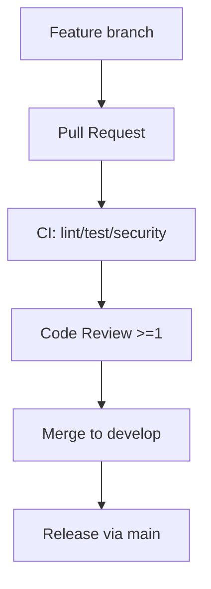

# GitHub Governance Checklist

_Обновлено: 2025-11-17_

## Визуализация: поток работы с PR



## 1. Структура веток

- **Основная ветка:** `main`
- **Рабочая ветка:** `develop` (ранее `dev`). Требуется переименовать удалённую
  ветку и перенастроить branch protection через GitHub UI/CLI:

```bash
git push origin develop:develop
git push origin :dev
gh api repos/:owner/:repo/branches/develop/protection -X PUT --input protect-develop.json
```

## 2. Branch protection (рекомендуемые настройки)

| Ветка     | Требования                                                                                                                                                              |
| --------- | ----------------------------------------------------------------------------------------------------------------------------------------------------------------------- |
| `main`    | Required pull request reviews ≥ 1, dismiss stale reviews, блокировка прямых пушей, запрет merge при failing checks (`lint`, `test-go`, `test-js`, `security`, `deploy`) |
| `develop` | Required pull request reviews ≥ 1, запрет прямых пушей, обязательные проверки `lint`, `test-go`, `test-js`                                                              |

> Настройте через GitHub UI или
> `gh api repos/:owner/:repo/branches/<branch>/protection`. Снимок конфигурации
> приложить к документации.

## 3. GitHub Actions

- Workflows: `ci.yml`, `security.yml`, `deploy-environments.yml`
- Permissions уже минимальны (`contents:read`, `security-events:write`,
  `packages:write`)
- Следите, чтобы `develop` присутствовала в списке веток в каждом workflow
  (обновлено в коде)

## 4. Secrets & Environments

См. `docs/reference/github-environments-setup.md`. Выполнить скрипты:

```bash
./scripts/infrastructure/security/setup-github-environments.sh
./scripts/infrastructure/security/configure-environment-protection.sh
./scripts/infrastructure/security/setup-environment-secrets.sh
./scripts/infrastructure/security/validate-environment-secrets.sh
```

Результаты проверки фиксируйте в таблице журнала.

## 5. Шаблоны и ответственность

- CODEOWNERS настроен для CI/безопасности.
- Issue/PR templates и Dependabot включены (см. `.github/`).

## 6. Открытые действия

1. Переименовать удалённую ветку `dev` → `develop` и обновить protection rules.
2. Подтвердить статус GitHub Environments и секретов, заполнить журнал.
3. Добавить required status checks для `main`/`develop` согласно списку в
   `docs/archive/audits/ci-health.md`.
