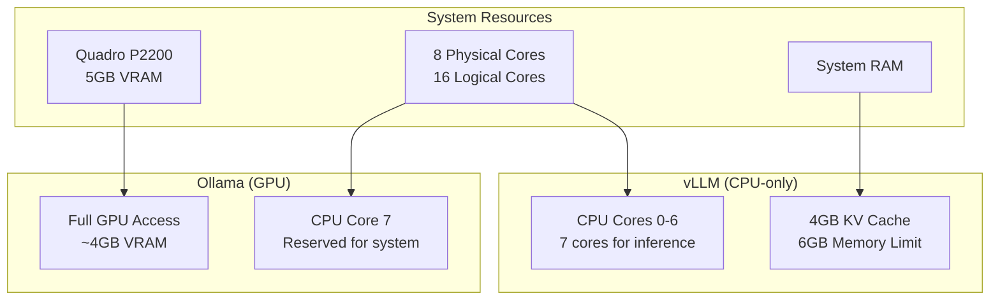

# vLLM Resource Optimization for ERNI-KI

## Configuration Overview

This configuration is optimized for shared resource usage between vLLM (CPU) and
Ollama (GPU) on a system with Quadro P2200.

## Resource Architecture



## CPU Configuration

### Thread Binding

- **vLLM**: Uses CPU cores 0-6 (7 cores)
- **System**: Reserves CPU core 7 for system processes
- **Ollama**: Can use any available CPU cores

### Environment Variables

```bash
VLLM_CPU_OMP_THREADS_BIND=0-6
VLLM_CPU_NUM_OF_RESERVED_CPU=1
VLLM_CPU_KVCACHE_SPACE=4
```

## Memory Configuration

### vLLM Memory Limits

- **Memory limit**: 6GB
- **Memory reservation**: 2GB
- **KV Cache**: 4GB

### CPU Optimization

- **Batch size**: 1024 tokens (optimized for CPU)
- **Max sequences**: 64 (reduced for CPU)
- **Block size**: 16 (recommended for CPU)

## Performance

### Expected Metrics

- **vLLM CPU**: 2-5 tokens/sec (depends on model)
- **Ollama GPU**: 15-30 tokens/sec (with GPU acceleration)
- **Combined operation**: No resource conflicts

### Monitoring

```bash
# Check CPU usage
htop

# Check GPU usage
nvidia-smi

# Check vLLM memory
docker stats vllm
```

## Usage Recommendations

### When to Use vLLM (CPU)

- Simple text generation tasks
- Batch processing (offline)
- When Ollama is busy with GPU-intensive tasks

### When to Use Ollama (GPU)

- Interactive chats
- Large models (>7B parameters)
- Tasks requiring low latency

## Troubleshooting

### Issue: vLLM won't start

```bash
# Check environment variables
docker-compose exec vllm env | grep VLLM

# Check logs
docker-compose logs vllm --tail=50
```

## Issue: Low Performance

```bash
# Check CPU binding
docker-compose exec vllm cat /proc/self/status | grep Cpus_allowed_list

# Optimize KV cache
export VLLM_CPU_KVCACHE_SPACE=6
```

## Issue: Conflict with Ollama

```bash
# Ensure vLLM uses CPU only
docker-compose exec vllm nvidia-smi  # Should error

# Check Ollama has GPU access
docker-compose exec ollama nvidia-smi
```

## Scaling

### Increasing vLLM Performance

1. Increase `VLLM_CPU_KVCACHE_SPACE` to 6-8GB
2. Use more CPU cores (0-7)
3. Optimize model (quantization)

### Load Balancing

- Use nginx to distribute requests
- Configure health checks for automatic failover
- Monitor performance of both services

## Security

### Resource Isolation

- vLLM isolated from GPU via Docker
- CPU cores separated between services
- Separate memory limits for each service

### Resource Monitoring

- Automatic alerts on limit exceeded
- Resource usage logging
- Health checks for both services
