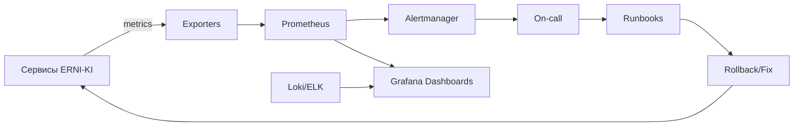

# ERNI-KI Monitoring Guide

[TOC] Comprehensive guide for monitoring ERNI-KI system with 8 specialized
exporters, standardized healthchecks, and production-ready observability stack.

## 1. Введение

Система мониторинга ERNI-KI обеспечивает полную наблюдаемость (observability) за
состоянием инфраструктуры, сервисов AI и баз данных.

### Основные компоненты

- **8 Specialized Exporters** - оптимизированы и стандартизированы.
- **Prometheus v3.0.0** - сбор и хранение метрик.
- **20 Alert Rules** - проактивный мониторинг.
- **Grafana v11.3.0** - визуализация и дашборды.
- **Loki v3.0.0 + Fluent Bit v3.1.0** - централизованное логирование.
- **AlertManager v0.27.0** - уведомления и алертинг.

## 2. Предварительные требования

Для работы с системой мониторинга необходимо:

- **Доступ к Grafana:** Учетная запись с правами Viewer или Editor.
- **Доступ к Prometheus:** Прямой доступ к UI (если требуется отладка запросов).
- **CLI инструменты:** `curl`, `jq` для проверки эндпоинтов вручную.
- **Сетевой доступ:** Доступ к портам мониторинга (см. Architecture).

## 3. Архитектура и Обновления

### Architecture Snapshot

- Основная схема мониторинга доступна в `docs/architecture/architecture.md`.
- Инвентаризация сервисов: `docs/architecture/service-inventory.md`.

### Обновления ноября 2025

- **Alertmanager queue watchdog** — контроль очереди уведомлений.
- **Fluent Bit Phase 0-2** — оптимизированные фильтры и маскирование токенов.
- **Loki object storage** — хранение логов в S3/MinIO с 30-дневным retention.
- **Correlation IDs** — сквозная трассировка запросов (X-Request-ID).
- **Мультиканальное уведомление** — Slack + PagerDuty для критических алертов.

## Alert Delivery & Runbooks

### Архитектура после аудита (N+1 шаги)

- **Prometheus / Alertmanager / Loki** — текущая топология односерверная. План
  работ по HA/remote storage отслеживается задачами:

1.  `19d577bc` — удалённое хранилище и кластер Alertmanager.
2.  `e84d2098` — покрытие / synthetic checks.
3.  `00130fda` — TLS и доставка логов (выполнено в коммите 6185b74).

- **Инструкции по миграции**: см. новый раздел " Secure Logging Pipeline" и
  `docs/monitoring-logging-audit-2025-11-14.md`.

### Чек-лист готовности (обновлять перед релизами)

1. [ ] Prometheus targets все `UP`.
2. [ ] Alertmanager HA сконфигурирован (после выполнения `19d577bc`).
3. [ ] Blackbox/Synthetic проверки (`e84d2098`) активны.
4. [ ] TLS сертификаты обновлены (запустить
       `scripts/security/prepare-logging-tls.sh`).
5. [ ] Loki backups/retention (выполнить после включения object storage).

### Runbook ссылок

- **Audit notes**: `docs/monitoring-logging-audit-2025-11-14.md`.
- **TLS refresh**: `scripts/security/prepare-logging-tls.sh`, далее
  `docker compose restart fluent-bit loki`.
- **Loki delivery errors**: см. алерт `FluentBitLokiDeliveryErrors` и runbook по
  ссылке в Alertmanager.

## SLO Dashboards

- **System Overview / “Platform SRE Overview”**
  (`conf/grafana/dashboards/system-overview/platform-sre-overview.json`). Этот
  борд агрегирует доступность `up{job}` по всем сервисам, CPU/Memory pressure по
  узлам и p95 латентность OpenWebUI ingress. В нижней части добавлен logs-панел
  из Loki, чтобы быстро увидеть свежие critical события. Используйте переменную
  `service`, чтобы сфокусироваться на конкретных job.
- **Infrastructure / “Core Infrastructure Observability”**
  (`conf/grafana/dashboards/infrastructure/core-infrastructure-observability.json`).
  Показывает активные/максимальные коннекты PostgreSQL, Redis throughput,
  файловые системы и сетевой трафик. Таблица “Resource Limits vs Usage” строится
  из Docker metrics, поэтому её удобно использовать при планировании capacity.
- **Monitoring Stack / “Observability Control Plane”**
  (`conf/grafana/dashboards/monitoring-stack/observability-control-plane.json`).
  Следит за Prometheus/Loki/Alertmanager, отображает нагрузку на Fluent Bit и
  выводит поток ошибок Grafana. Именно здесь находится зона ответственности за
  доставку алертов и качество логов.
- **AI Services / “AI Stack Operations”**
  (`conf/grafana/dashboards/ai-services/ai-stack-operations.json`). Фокусируется
  на LiteLLM, OpenWebUI, Ollama и Docling: показывает throughput, p95 latency,
  GPU utilization и Docling pipeline quantiles. Таблица “Slow Requests”
  подтягивает соответствующие записи из Loki.
- **Security & Performance / “SLA & Error Budgets”**
  (`conf/grafana/dashboards/security-performance/sla-error-budgets.json`).
  Главный борд по SLO: показывает долю выполненных запросов, burn-rate (считаем
  относительно целевого 0.5% бюджета), ленты Alertmanager и поток security
  логов.

- **Cron Evidence Panel** — на любой из новых бордов можно добавить отдельную
  панель с `erni_cron_job_age_seconds{job=~".*"}` и бинарной метрикой
  `erni_cron_job_success`. Это остаётся обязательным требованием для недельных
  отчетов.
- При изменении SLO формул обновляйте подписи в этом разделе и экспортируйте
  JSON в `conf/grafana/dashboards/`.

- Секреты для каналов хранятся в Docker secrets:
- `./secrets/slack_alert_webhook.txt` — Slack Incoming Webhook URL.
- `./secrets/pagerduty_routing_key.txt` — Events API v2 routing key. Скопируйте
  `.example` файлы и заполните перед деплоем.
- `conf/alertmanager/alertmanager.yml` содержит Slack и PagerDuty конфиги для
  критических и warning алертов. Сервисные маршруты (`gpu`, `ai`, `database`,
  `logging`) помечены `continue: true`, чтобы алерты всегда попадали в
  severity-политику.
- Для проверки доставки используйте:

```bash
./scripts/monitoring/test-alert-delivery.sh critical ops
```

Алерт появится в Slack и PagerDuty с пометкой `SmokeTestAlert`. Не забудьте
закрыть его вручную.

### Alert testing {#alert-testing}

1. Подготовить переменные окружения для теста доставки:

- `PROMETHEUS_URL` указывает на Prometheus, который должен принимать метрики
  тестового алерта.
- `ALERTMANAGER_URL` указывает на Alertmanager, куда отправится событие.

2. Запустить синтетический алерт из CLI:

```bash
./scripts/monitoring/test-alert-delivery.sh critical ops
```

Скрипт публикует тестовое событие `SmokeTestAlert` и проверяет доставку в Slack
и PagerDuty.

3. После успешной проверки закройте алерт вручную в Alertmanager, чтобы не
   оставлять тестовые записи в очереди.

### Alertmanager Queue Runbook {#alertmanagerQueue}

1. Проверить Slack/PagerDuty — скрипт `alertmanager-queue-watch.sh`
   автоматически логирует превышение лимита и завершает cron с кодом 2.
2. Изучить метрику `alertmanager_cluster_messages_queued` в Grafana и посмотреть
   состояние `alertmanager` пода (`docker compose logs alertmanager`).
3. Разгрузить очередь: временно снизить шумные алерты, проверить состояние
   webhook receiver. При создании временных silences добавляйте в комментарий
   тег `[auto-cleanup]`, чтобы их можно было снять автоматически.
4. Для автоматической разборки используйте скрипт
   `scripts/monitoring/alertmanager-queue-cleanup.sh` — он проверяет метрику,
   снимает silences с тегом `[auto-cleanup]` и при необходимости перезапускает
   Alertmanager. Скрипт подходит для cron/systemd timer.
5. Только после согласования с on-call выполняйте ручной
   `docker compose restart alertmanager`.

> **Важно:** скрипт cleanup работает только с silences, в комментариях которых
> есть тег `[auto-cleanup]`. Для долгоживущих suppress записывайте уникальные
> комментарии и снимайте их вручную командой
> `docker compose exec alertmanager amtool silence expire <id>` после
> стабилизации. Рекомендуется добавить systemd timer/cron, который запускает
> `alertmanager-queue-cleanup.sh` каждые 5 минут:

```bash
*/5 * * * * PROMETHEUS_URL=http://localhost:9091 \
 ALERTMANAGER_URL=http://localhost:9093 \
 ALERTMANAGER_AUTO_SILENCE_TAG="[auto-cleanup]" \
 ALERTMANAGER_QUEUE_HARD_LIMIT=500 \
 /home/erni/scripts/monitoring/alertmanager-queue-cleanup.sh
```

> Timer должен логировать вывод в `.config-backup/logs/alertmanager-queue.log` и
> отправлять уведомление ответственному, если cleanup перезапускает AM.

### Alert Response Cheat Sheet {#alert-response}

- Все инфраструктурные алерты имеют `owner=ops` и указывают runbook в
  аннотациях; критические автоматически эскалируют через PagerDuty.
- Сервисы безопасности (`auth`) маркируются `owner=security` и routed в
  PagerDuty + Slack.
- Контейнерные предупреждения остаются в Slack, критические — в PagerDuty.

## Cron Evidence Pipeline {#cron-evidence}

- **Как это работает**: каждый cron/watchdog (ежедневный/еженедельный отчёт,
  redis fragmentation watchdog, монитор очереди Alertmanager) вызывает
  `scripts/monitoring/record-cron-status.sh <job> <success|failure> <msg>`.
  Состояния сохраняются в `data/cron-status`. Отдельный cron
  (`update-cron-metrics`) каждые 5 минут преобразует их в Prometheus метрики
  `erni_cron_job_*` (через node_exporter textfile collector).
- **Метрики**:
- `erni_cron_job_success{job}` — 1 при последнем успешном выполнении.
- `erni_cron_job_age_seconds{job}` — сколько секунд прошло с последнего запуска
  (используется для SLA).
- `erni_cron_job_sla_seconds{job}` — допустимый интервал между запуском.
- `erni_cron_job_last_run_timestamp{job}` — UNIX time последнего запуска.
- **Алерты**: в `conf/prometheus/alert_rules.yml` добавлены правила
  `CronJobStale` и `CronJobFailures`, отправляющие оповещения при нарушении SLA
  или статусе failure. По умолчанию владельцы — команда Ops.
- **Добавить новый cron**:

1.  В cron-скрипте перед exit вызвать
    `scripts/monitoring/record-cron-status.sh <job> success "комментарий"`. В
    trap on ERR записывать failure.
2.  Прописать SLA в `scripts/monitoring/update-cron-metrics.sh` (массив `SLA`).
3.  Выполнить bootstrap:
    `./scripts/monitoring/record-cron-status.sh <job> success "bootstrap"`.
4.  Перезапустить `update-cron-metrics` (или дождаться cron).

- **Проверка**:

```bash
# ручной прогон для проверки
./scripts/monitoring/update-cron-metrics.sh
cat data/node-exporter-textfile/cron_watchdogs.prom

# smoke-test фальшивого сбоя
./scripts/monitoring/record-cron-status.sh logging_reports_daily failure "manual test"
./scripts/monitoring/update-cron-metrics.sh
```

- **Grafana**: добавьте панель `erni_cron_job_age_seconds` (group by job) и
  отображайте линии SLA (`erni_cron_job_sla_seconds`) для быстрого обзора.
- **Loki + Fluent Bit hardening** — Loki теперь требует заголовок
  `X-Scope-OrgID: erni-ki`, Grafana datasource и скрипты обновлены. Fluent Bit
  использует SSD-том `erni-ki-fluent-db` с дисковым буфером 15 ГБ для
  переживания длительных сбоев сети.

## Аудит и соответствие

- Счетчик несоответствий из
  `docs/archive/reports/documentation-audit-2025-10-24.md` больше не включает
  мониторинг: 20 активных правил и Prometheus v3.0.0 задокументированы и
  отражены в разделе «Prometheus Alerts Configuration».
- Все 18 новых системных предупреждений сгруппированы по критичности (Critical,
  Performance, Database, GPU, Nginx) и сопровождаются списоком индикаций, что
  позволяет быстро проверять состояние после аудита.
- Раздел «Monitoring Guide» теперь связывается с `prometheus-alerts-guide.md`
  (специальный справочник) и c Runbook’ами
  `operations/core/operations-handbook.md`, `automated-maintenance-guide.md`,
  чтобы DevOps видел консистентность и регламенты ответов.

## Exporters Configuration

### Node Exporter (Port 9101)

**Purpose:** System-level metrics (CPU, memory, disk, network)

```yaml
# Configuration in compose.yml
node-exporter:
 image: prom/node-exporter:v1.8.2
 ports:
 - '9101:9100'
 healthcheck:
 test:
 [
 'CMD-SHELL',
 'wget --no-verbose --tries=1 --spider http://localhost:9100/metrics ||
 exit 1',
 ]
 interval: 30s
 timeout: 10s
 retries: 3
```

**Key Metrics:**

- `node_cpu_seconds_total` - CPU usage by mode
- `node_memory_MemAvailable_bytes` - available memory
- `node_filesystem_avail_bytes` - disk space available
- `node_load1` - 1-minute load average

**Health Check:**

```bash
curl -s http://localhost:9101/metrics | grep node_up
```

## PostgreSQL Exporter (Port 9188 via IPv4 proxy)

**Purpose:** Database performance and health metrics

> ℹ Доступ к БД осуществляется через Docker secret `postgres_exporter_dsn.txt`
> (монтируется как `/etc/postgres_exporter_dsn.txt` и читается в entrypoint).

```yaml
# Configuration in compose.yml
postgres-exporter:
 image: prometheuscommunity/postgres-exporter:v0.15.0
 entrypoint: ['/entrypoint/postgres-exporter.sh']
 volumes:
 - ./scripts/infrastructure/postgres-exporter-entrypoint.sh:/entrypoint/postgres-exporter.sh:ro
 - ./secrets/postgres_exporter_dsn.txt:/etc/postgres_exporter_dsn.txt:ro
 ports:
 - '127.0.0.1:9188:9188'
 healthcheck:
 test:
 [
 'CMD-SHELL',
 'wget --no-verbose --tries=1 --spider http://localhost:9187/metrics ||
 exit 1',
 ]
```

**Key Metrics:**

- `pg_up` - PostgreSQL availability
- `pg_stat_activity_count` - active connections
- `pg_stat_database_blks_hit` / `pg_stat_database_blks_read` - cache hit ratio
- `pg_locks_count` - database locks

**Health Check:**

```bash
curl -s http://localhost:9188/metrics | grep pg_up
```

## Redis Exporter (Port 9121) - Fixed 19.09.2025

**Purpose:** Redis cache performance and health metrics

```yaml
# Configuration in compose.yml (FIXED)
redis-exporter:
  image: oliver006/redis_exporter:v1.62.0
  ports:
    - '127.0.0.1:9121:9121'
  environment:
    - REDIS_EXPORTER_INCL_SYSTEM_METRICS=true
    - REDIS_EXPORTER_LOG_FORMAT=txt
    - REDIS_EXPORTER_DEBUG=true
    - REDIS_ADDR=redis://redis:6379
    - REDIS_PASSWORD_FILE=/run/secrets/redis_exporter_url
  secrets:
    - redis_exporter_url
  healthcheck: {} # monitoring via Prometheus scrape
```

**Status:** Running | HTTP 200 | Auth works via `REDIS_PASSWORD_FILE`

> `redis_exporter_url` secret теперь содержит JSON вида
> `{"redis://redis:6379":"<password>"}` — это позволяет `redis_exporter`
> автоматически подобрать пароль по адресу.

**Key Metrics:**

- `redis_up` - Redis availability (now reflects actual status)
- `redis_memory_used_bytes` - memory usage
- `redis_connected_clients` - connected clients
- `redis_keyspace_hits_total` / `redis_keyspace_misses_total` - hit ratio

**Health Check:**

```bash
# HTTP endpoint works (returns metrics)
curl -s http://localhost:9121/metrics | head -5

# TCP healthcheck
timeout 5 sh -c '</dev/tcp/localhost/9121' && echo "Redis Exporter available"

# Direct Redis check (with password)
docker exec erni-ki-redis-1 redis-cli -a ErniKiRedisSecurePassword2024 ping
```

## NVIDIA GPU Exporter (Port 9445) - Improved 19.09.2025

**Purpose:** GPU utilization and performance metrics

```yaml
# Configuration in compose.yml (IMPROVED)
nvidia-exporter:
  image: mindprince/nvidia_gpu_prometheus_exporter:0.1
  ports:
    - '9445:9445'
  healthcheck:
  test: ['CMD-SHELL', "timeout 5 sh -c '</dev/tcp/localhost/9445' || exit 1"] # IMPROVED: TCP check
  interval: 30s
  timeout: 10s
  retries: 3
  start_period: 15s
```

**Status:** Healthy | HTTP 200 | TCP healthcheck (improved from pgrep)

**Key Metrics:**

- `nvidia_gpu_utilization_gpu` - GPU utilization percentage
- `nvidia_gpu_memory_used_bytes` - GPU memory usage
- `nvidia_gpu_temperature_celsius` - GPU temperature
- `nvidia_gpu_power_draw_watts` - power consumption

**Health Check:**

```bash
curl -s http://localhost:9445/metrics | grep nvidia_gpu_utilization
```

## Blackbox Exporter (Port 9115)

**Purpose:** External service availability monitoring

```yaml
# Configuration in compose.yml
blackbox-exporter:
 image: prom/blackbox-exporter:v0.25.0
 ports:
 - '9115:9115'
 healthcheck:
 test:
 [
 'CMD-SHELL',
 'wget --no-verbose --tries=1 --spider http://localhost:9115/metrics ||
 exit 1',
 ]
```

**Status:** Healthy | HTTP 200 | wget healthcheck

**Key Metrics:**

- `probe_success` - probe success status
- `probe_duration_seconds` - probe duration
- `probe_http_status_code` - HTTP response code

**Health Check:**

```bash
curl -s http://localhost:9115/metrics | grep probe_success
```

## Ollama AI Exporter (Port 9778) - Standardized 19.09.2025

**Purpose:** AI model performance and availability metrics

```yaml
# Configuration in compose.yml (STANDARDIZED)
ollama-exporter:
  build:
  context: ./monitoring
  dockerfile: Dockerfile.ollama-exporter
  ports:
    - '127.0.0.1:9778:9778'
  environment:
    - OLLAMA_URL=http://ollama:11434
    - EXPORTER_PORT=9778
```

**Status:** Healthy | HTTP 200 | wget healthcheck (standardized from 127.0.0.1)

**Key Metrics:**

- `ollama_models_total` - total number of models
- `ollama_model_size_bytes{model="model_name"}` - model sizes
- `ollama_info{version="x.x.x"}` - Ollama version
- GPU usage for AI workloads

**Health Check:**

```bash
curl -s http://localhost:9778/metrics | grep ollama_models_total
```

## Nginx Web Exporter (Port 9113) - Fixed 19.09.2025

**Purpose:** Web server performance and traffic metrics

```yaml
# Configuration in compose.yml (FIXED)
nginx-exporter:
  image: nginx/nginx-prometheus-exporter:1.1.0
  ports:
    - '9113:9113'
  command:
    - '--nginx.scrape-uri=http://nginx:80/nginx_status'
    - '--web.listen-address=:9113'
  healthcheck:
  test: ['CMD-SHELL', "timeout 5 sh -c '</dev/tcp/localhost/9113' || exit 1"] # FIXED: TCP check
  interval: 30s
  timeout: 10s
  retries: 3
  start_period: 10s
```

**Status:** Running | HTTP 200 | TCP healthcheck (fixed from wget)

**Key Metrics:**

- `nginx_connections_active` - active connections
- `nginx_connections_accepted` - accepted connections
- `nginx_http_requests_total` - total HTTP requests
- `nginx_connections_handled` - handled connections

**Health Check:**

```bash
# HTTP endpoint works
curl -s http://localhost:9113/metrics | grep nginx_connections_active

# TCP healthcheck
timeout 5 sh -c '</dev/tcp/localhost/9113' && echo "Nginx Exporter available"
```

## RAG SLA Exporter (Port 9808)

**Purpose:** RAG (Retrieval-Augmented Generation) performance metrics

```yaml
# Configuration in compose.yml
rag-exporter:
 build: ./monitoring/rag-exporter
 ports:
 - '9808:8000'
 environment:
 - RAG_TEST_URL=http://openwebui:8080
 - RAG_TEST_INTERVAL=30
 healthcheck:
 test:
 [
 'CMD-SHELL',
 'python -c "import requests;
 requests.get(''http://localhost:8000/metrics'')"',
 ]
```

**Status:** Healthy | HTTP 200 | Python healthcheck

**Key Metrics:**

- `erni_ki_rag_response_latency_seconds` - RAG response latency histogram
- `erni_ki_rag_sources_count` - number of sources in response
- RAG availability and performance SLA tracking

**Health Check:**

```bash
curl -s http://localhost:9808/metrics | grep erni_ki_rag_response_latency
```

## Healthcheck Standardization

### Problems and Solutions (September 19, 2025)

| Exporter            | Problem                        | Solution                             | Status       |
| ------------------- | ------------------------------ | ------------------------------------ | ------------ |
| **Redis Exporter**  | wget unavailable in container  | TCP check `</dev/tcp/localhost/9121` | Fixed        |
| **Nginx Exporter**  | wget unavailable in container  | TCP check `</dev/tcp/localhost/9113` | Fixed        |
| **NVIDIA Exporter** | pgrep process inefficient      | TCP check `</dev/tcp/localhost/9445` | Improved     |
| **Ollama Exporter** | 127.0.0.1 instead of localhost | wget localhost standardized          | Standardized |

### Standard Healthcheck Methods

```yaml
# TCP check (for minimal containers without wget/curl)
healthcheck:
 test: ["CMD-SHELL", "timeout 5 sh -c '</dev/tcp/localhost/PORT' || exit 1"]
 interval: 30s
 timeout: 10s
 retries: 3
 start_period: 10s

# HTTP check (for containers with wget)
healthcheck:
 test: ["CMD-SHELL", "wget --no-verbose --tries=1 --spider http://localhost:PORT/metrics || exit 1"]
 interval: 30s
 timeout: 10s
 retries: 3
 start_period: 10s

# Custom check (for specialized containers)
healthcheck:
 test: ["CMD-SHELL", "python -c \"import requests; requests.get('http://localhost:PORT/metrics')\""]
 interval: 30s
 timeout: 10s
 retries: 3
 start_period: 10s
```

## 8. Верификация

### All Exporters Status Check

```bash
# Check all exporters HTTP status
for port in 9101 9188 9121 9445 9115 9778 9113 9808; do
 echo "Port $port: $(curl -s -o /dev/null -w "%{http_code}" http://localhost:$port/metrics)"
done

# Expected output: All ports should return 200
```

## Docker Health Status

```bash
# Check Docker health status
docker ps --format "table {{.Names}}\t{{.Status}}" | grep exporter

# Check specific healthcheck details
docker inspect erni-ki-Redis мониторинг через Grafana --format='{{.State.Health.Status}}'
```

## Troubleshooting Guide

### Common Issues and Solutions

#### 1. Exporter Returns HTTP 200 but Docker Shows No Health Status

**Problem:** Healthcheck configuration uses unavailable tools (wget/curl)
**Solution:** Use TCP check for minimal containers

```bash
# Diagnosis
docker inspect CONTAINER_NAME --format='{{.State.Health}}'

# If returns <nil>, healthcheck is not working
# Fix: Update compose.yml with TCP check
healthcheck:
 test: ["CMD-SHELL", "timeout 5 sh -c '</dev/tcp/localhost/PORT' || exit 1"]
```

## 2. Redis Exporter Shows redis_up = 0

**Problem:** Authentication issue with Redis **Solution:** Verify Redis
connection string and password

```bash
# Test Redis connection directly
docker exec erni-ki-redis-1 redis-cli -a ErniKiRedisSecurePassword2024 ping

# Check Redis Exporter logs
docker logs erni-ki-Redis мониторинг через Grafana --tail 20
```

## 3. NVIDIA Exporter Not Showing GPU Metrics

**Problem:** GPU not accessible or NVIDIA runtime not configured **Solution:**
Verify GPU access and runtime

```bash
# Check GPU availability
nvidia-smi

# Check container GPU access
docker exec erni-ki-nvidia-exporter nvidia-smi

# Verify runtime in compose.yml
runtime: nvidia
```

## 4. Metrics Endpoint Returns 404

**Problem:** Incorrect endpoint path or port configuration **Solution:** Verify
exporter configuration

```bash
# Check container logs
docker logs EXPORTER_CONTAINER --tail 20

# Verify port mapping
docker port EXPORTER_CONTAINER

# Test different endpoints
curl -s http://localhost:PORT/
curl -s http://localhost:PORT/metrics
```

## Prometheus Alerts Configuration

### Overview

ERNI-KI uses **20 active alert rules** for proactive monitoring (per
`conf/prometheus/alerts.yml` and `conf/prometheus/alert_rules.yml`):

### Alert Groups

#### 1. Critical Alerts (erni-ki-critical-alerts)

**Disk Space Alerts:**

- `DiskSpaceCritical` - Triggers when disk usage >85% (severity: critical,
  ignores `tmpfs`/`vfat` and `/boot/efi`)
- `DiskSpaceWarning` - Triggers when disk usage >75% (severity: warning, ignores
  `tmpfs`/`vfat` and `/boot/efi`)

**Memory Alerts:**

- `MemoryCritical` - Triggers when available memory <5% (severity: critical)
- `MemoryWarning` - Triggers when available memory <15% (severity: warning)

**CPU Alerts:**

- `HighCPUUsage` - Triggers when CPU usage >80% for 5 minutes (severity:
  warning)

**Container Alerts:**

- `ContainerDown` - Triggers when container is down (severity: critical)
- `ContainerRestarting` - Triggers when a non-infrastructure container restarts
  2+ times в пределах 15 минут (рассчитывается по
  `container_start_time_seconds`, severity: warning)

**Database Alerts:**

- `PostgreSQLDown` - Triggers when PostgreSQL is unavailable (severity:
  critical)
- `PostgreSQLHighConnections` - Triggers when connections >80 (severity:
  warning)
- `RedisDown` - Triggers when Redis is unavailable (severity: critical)
- `RedisHighMemory` - Triggers when Redis memory >1GB (severity: warning)

**GPU Alerts:**

- `OllamaGPUDown` - Triggers when Ollama GPU is unavailable (severity: critical)
- `OllamaHighVRAM` - Triggers when VRAM usage >80% (severity: warning)

**Nginx Alerts:**

- `NginxDown` - Triggers when Nginx is unavailable (severity: critical)
- `NginxHighErrorRate` - Triggers when 5xx errors >10/min (severity: warning)

#### 2. Performance Alerts (erni-ki-performance-alerts)

- `OpenWebUISlowResponse` - Triggers when response time >5s (severity: warning)
- `SearXNGSlowSearch` - Triggers when search time >3s (severity: warning)
- `DockerStoragePoolAlmostFull` - Triggers when Docker storage >85% (severity:
  warning)

### Alert Configuration

**File:** `conf/prometheus/alerts.yml`

```yaml
groups:
 - name: erni-ki-critical-alerts
 interval: 30s
 rules:
 - alert: DiskSpaceCritical
 expr:
 (node_filesystem_avail_bytes{mountpoint="/"} /
 node_filesystem_size_bytes{mountpoint="/"}) * 100 < 15
 for: 5m
 labels:
 severity: critical
 component: system
 annotations:
 summary: 'Critical: Disk space below 15%'
 description: 'Disk usage is {{ $value }}% on {{ $labels.instance }}'
```

### Viewing Active Alerts

**Prometheus UI:**

```bash
# Open in browser
http://localhost:9091/alerts
```

**API Query:**

```bash
# Get all active alerts
curl -s http://localhost:9091/api/v1/rules | jq '.data.groups[] | select(.name | contains("erni-ki"))'

# Count alerts by severity
curl -s http://localhost:9091/api/v1/rules | jq '.data.groups[].rules[] | select(.labels.severity) | .labels.severity' | sort | uniq -c
```

## Alert Testing

**Trigger test alert:**

```bash
# Test disk space alert (create large file)
dd if=/dev/zero of=/tmp/test-alert.img bs=1G count=10

# Monitor alert status
watch -n 5 'curl -s http://localhost:9091/api/v1/alerts | jq ".data.alerts[] | select(.labels.alertname==\"DiskSpaceCritical\")"'

# Cleanup
rm /tmp/test-alert.img
```

## Monitoring Alertmanager Queue & Disk Alerts

- **Alertmanager queue:** Grafana dashboard `Observability / Alertmanager` →
  панель _Queue Depth_ (метрика `alertmanager_cluster_messages_queued`). После
  изменения правила `ContainerRestarting` значение должно оставаться <500.
- **Disk utilization sanity:** панель _Disk Usage by Mount_ использует
  обновлённые выражения (исключая `fstype="vfat"` и `mountpoint="/boot/efi"`). В
  alert списке `HighDiskUtilization` теперь появляется только для `/` и `/data`.
- Для ручной проверки выполните:

```bash
curl -s http://localhost:9091/api/v1/query \
 --data-urlencode 'query=alertmanager_cluster_messages_queued'

curl -s http://localhost:9091/api/v1/query \
 --data-urlencode 'query=(1 - (node_filesystem_avail_bytes{fstype!~"tmpfs|vfat",mountpoint!="/boot/efi"} / node_filesystem_size_bytes{fstype!~"tmpfs|vfat",mountpoint!="/boot/efi"})) * 100'
```

### Alert Maintenance

**Reload configuration:**

```bash
# Reload Prometheus configuration
docker compose exec prometheus kill -HUP 1

# Verify alerts loaded
curl -s http://localhost:9091/api/v1/rules | jq '.data.groups[] | .name'
```

**Disable specific alert:**

```yaml
# In conf/prometheus/alerts.yml, comment out the rule
# - alert: AlertName
# expr: ...
```

## Related Documentation

- [Prometheus Alerts Guide](prometheus-alerts-guide.md) - Detailed alert
  documentation
- [Admin Guide](../core/admin-guide.md) - Alert management procedures

## Performance Optimization

### Metrics Collection Optimization

1. **Scrape Intervals:** Adjust based on metric importance

- Critical metrics: 15s interval
- Standard metrics: 30s interval
- Historical metrics: 60s interval

2. **Retention Policies:** Configure appropriate data retention

- High-resolution: 7 days
- Medium-resolution: 30 days
- Low-resolution: 1 year

3. **Resource Allocation:** Monitor exporter resource usage

```bash
# Check exporter resource usage
docker stats --format "table {{.Container}}\t{{.CPUPerc}}\t{{.MemUsage}}" | grep exporter
```

## Secure Logging Pipeline (2025-11)

### TLS / mTLS

- Используйте скрипт `scripts/security/prepare-logging-tls.sh` после
  клонирования/ротации, чтобы выпустить CA + серверные/клиентские сертификаты.
  Скрипт заполняет `conf/fluent-bit/certs` и `conf/loki/tls` и автоматически
  перезаписывает истёкшие материалы.
- Все сервисы Docker используют fluentd driver с параметрами `fluentd-ssl-*`
  (см. `compose.yml` anchors) и подключаются к Fluent Bit по TLS.
- Fluent Bit публикует HTTPS запросы в Loki; сама Loki слушает только TLS порт
  3100 (`conf/loki/loki-config.yaml: server.http_tls_config`). Для ручных
  проверок используйте `curl --cacert conf/loki/tls/logging-ca.crt`.

### Мониторинг доставки логов

- Prometheus job `fluent-bit` читает `/metrics` на `fluent-bit:2021`, а алерт
  `FluentBitLokiDeliveryErrors` срабатывает при росте
  `fluentbit_output_errors_total{output="loki.0"}`.
- Runbook (сокращённо):

1.  Проверить `docker compose logs fluent-bit loki` на TLS ошибки.
2.  Убедиться, что сертификаты не истекли (перезапустить скрипт подготовки).
3.  Перезапустить Fluent Bit и Loki (`docker compose restart fluent-bit loki`).

### Диагностика

```bash
# Проверка Forward TLS
openssl s_client -connect localhost:24224 \
 -cert conf/fluent-bit/certs/logging-client.crt \
 -key conf/fluent-bit/certs/logging-client.key \
 -CAfile conf/fluent-bit/certs/logging-ca.crt -brief

# Проверка Loki readiness (с верификацией сертификата)
curl -H 'X-Scope-OrgID: erni-ki' \
 --cacert conf/loki/tls/logging-ca.crt \
 https://localhost:3100/ready
```

## Success Criteria

### System Health Indicators

- **All 8 exporters return HTTP 200** on /metrics endpoint
- **Docker healthcheck status** shows healthy or running
- **Prometheus targets** show all exporters as UP
- **Grafana dashboards** display current metrics
- **AlertManager** receives and processes alerts

### Performance Targets

- **Response Time:** <2s for all metrics endpoints
- **Availability:** >99.9% uptime for critical exporters
- **Resource Usage:** <5% CPU, <500MB RAM per exporter
- **Data Freshness:** <30s lag for real-time metrics

## Визуализация: контур мониторинга



## Related Documentation

- [Admin Guide](../core/admin-guide.md) - System administration
- [Architecture](../../architecture/architecture.md) - System architecture
- [Installation Guide](../../getting-started/installation.md) - Setup
  instructions
- [Troubleshooting](../database/database-troubleshooting.md) - Problem
  resolution
