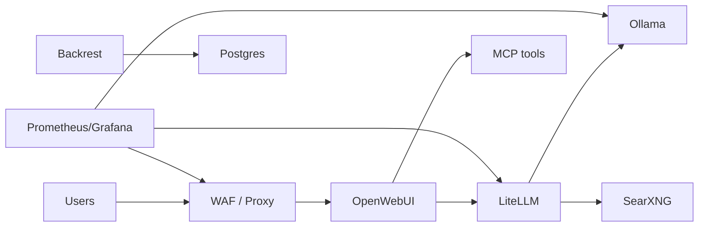

# ERNI-KI — Профессиональная сводка проекта

<!-- STATUS_SNIPPET_START -->

> **Статус системы (2025-11-23) — Production Ready v0.61.3**
>
> - Контейнеры: 34/34 services healthy
> - Графана: 5/5 Grafana dashboards (provisioned)
> - Алерты: 20 Prometheus alert rules active
> - AI/GPU: Ollama 0.12.11 + OpenWebUI v0.6.36 (GPU)
> - Context & RAG: LiteLLM v1.80.0.rc.1 + Context7, Docling, Tika, EdgeTTS
> - Мониторинг: Prometheus v3.0.0, Grafana v11.3.0, Loki v3.0.0, Fluent Bit
>   v3.1.0, Alertmanager v0.27.0
> - Автоматизация: Cron: PostgreSQL VACUUM 03:00, Docker cleanup 04:00, Backrest
>   01:30, Watchtower selective updates
> - Примечание: Versions and dashboard/alert counts synced with compose.yml

<!-- STATUS_SNIPPET_END -->

## 1. Назначение и ценность

ERNI-KI — корпоративная AI-платформа на базе OpenWebUI, Ollama и LiteLLM,
окружённая полным стеком безопасности и наблюдаемости. Платформа предоставляет:

## Визуализация: контур платформы

-**Единую точку доступа к LLM**с GPU-ускорением и Context Engineering (LiteLLM
v1.80.0.rc.1, MCP Server). -**Надёжную поддержку документных и мультимедийных
сценариев**(Docling OCR, Apache Tika, EdgeTTS). -**Enterprise-grade
эксплуатацию**: централизованный мониторинг, бэкапы, автоматизированное
обслуживание и Zero Trust доступ.

Платформа применяется как внутри ERNI, так и в партнёрских командах для
прототипирования и продакшн-нагрузок без аутсорсинга чувствительных данных.

## 2. Текущее состояние системы

| Область                     | Показатель                                                                                                                  |
| --------------------------- | --------------------------------------------------------------------------------------------------------------------------- |
| **Здоровье сервисов**       | 34/34 контейнеров healthy (см. README.md в корне репозитория и [`services-overview.md`](architecture/services-overview.md)) |
| **Мониторинг**              | Prometheus v3.0.0, Grafana v11.3.0, Alertmanager v0.27.0, Loki v3.0.0, Fluent Bit v3.1.0                                    |
| **GPU & AI стэк**           | OpenWebUI v0.6.40, Ollama 0.13.0, LiteLLM v1.80.0-stable.1, MCP Server (7 инструментов), RAG через SearXNG (latest)         |
| **Автоматизация**           | Cron: PostgreSQL VACUUM (вс. 03:00), Docker cleanup (вс. 04:00), Backrest бэкапы (ежедневно 01:30)                          |
| **Безопасность**            | JWT Auth сервис, Nginx WAF (rate limiting + security headers), Cloudflare Zero Trust (5 доменов)                            |
| **Документация & процессы** | Обновлённые гайды по архитектуре, операциям, мониторингу, runbook’и и security policy                                       |

## 3. Архитектура и ключевые компоненты

> Детализация: [`architecture.md`](architecture/architecture.md),
> [`service-inventory.md`](architecture/service-inventory.md)

### 3.1 AI & ML слой

-**OpenWebUI v0.6.36**— основной UI, CUDA runtime, интеграция с MCP. -**Ollama
0.12.11**— LLM-сервер с ограничением 4GB VRAM (GPU активен). -**LiteLLM
v1.80.0.rc.1**— Context Engineering gateway (`conf/litellm/config.yaml`),
поддержка thinking tokens и Context7. -**MCP Server**— 7 активных инструментов
(Time, Context7 Docs, PostgreSQL, Filesystem, Memory, SearXNG Web Search,
Desktop Commander) на порту 8000 (binding 127.0.0.1). -**Docling + Apache Tika +
EdgeTTS**— pipeline обработки документов и синтеза речи.

### 3.2 Data & Storage

-**PostgreSQL 17 + pgvector**(порт 5432, shared DB, auto-update off). -**Redis
7-alpine**— кэш/WS менеджер с auth и Active Defragmentation. -**Backrest
v1.9.2**— ежедневные бэкапы (7 дневных + 4 недельных retention).

### 3.3 Gateway & Security

-**Nginx 1.28.0**— reverse proxy, SSL/TLS терминация, WAF, WebSocket
support. -**Auth (Go)**— JWT сервис (порт 9092) с
health-checkами. -**Cloudflared туннели**— 5 доменов (ki.erni-gruppe.ch и др.) +
rate limiting.

### 3.4 Observability & Automation

-**Prometheus**(27 alert rules + 32 targets) и экспортёры (node, postgres,
redis, nvidia, blackbox, ollama, nginx, cadvisor, RAG). -**Grafana**— 18
дашбордов (GPU, LLM, DB, Security). -**Loki + Fluent Bit**— централизованные
логи. -**Automation scripts**— см.
[`automated-maintenance-guide.md`](operations/automation/automated-maintenance-guide.md).

## 4. Среды и деплоймент

-**Production**— Docker Compose v2, актуальные конфигурации в `compose.yml` и
`env/*.env`. Доступ: Cloudflare Zero Trust + Nginx (443/8080). Инфраструктурные
детали —
[`external-access-setup.md`](getting-started/external-access-setup.md). -**Локальная
среда**— инструкция в [`installation.md`](getting-started/installation.md):
копирование `env/*.example`, запуск `docker compose up -d`, проверка
`docker compose ps`. -**Automation & CI**— GitHub Actions (CI, security),
Watchtower selective updates, cron-скрипты (VACUUM/cleanup/log rotation).

## 5. Операции и наблюдаемость

-**Operations Handbook**: роли, SLA, реакция на алерты —
[`operations-handbook.md`](operations/core/operations-handbook.md). -**Monitoring
Guide**: Prometheus targets, health-checks, экспортёры —
[`monitoring-guide.md`](operations/monitoring/monitoring-guide.md). -**Runbooks**:
рестарты, бэкапы, troubleshooting —
[`service-restart-procedures.md`](operations/maintenance/service-restart-procedures.md),
[`troubleshooting-guide.md`](operations/troubleshooting/troubleshooting-guide.md). -**Diagnostics**:
методология и чеклисты — [`diagnostics/`](operations/diagnostics/index.md).

Процесс реагирования:
`docker compose ps → docker compose logs → curl /metrics → Grafana dashboards`,
с фиксацией действий в Archon tasks.

## 6. Безопасность и соответствие

-**Security Policy**—
[`security/security-policy.md`](security/security-policy.md): поддерживаемые
версии, SLA на исправления, политика раскрытия. -**Конфигурация**: JWT, secrets
через Docker env/secret, Nginx security headers, Cloudflare туннели, rate
limiting. -**Мониторинг безопасности**: Prometheus алерты
(`SuspiciousAuthActivity`, `HighErrorRate`), логирование через
Loki. -**Контакты**: <security@erni-ki.local>, emergency hotline, PGP key.

## 7. Риски и планы развития

| Риск / зона внимания                   | Митигирующие меры / план                                                                                     |
| -------------------------------------- | ------------------------------------------------------------------------------------------------------------ |
| **Зависимость от единственного GPU**   | Мониторинг `nvidia-smi`, алерты на GPU down, документированный fallback (CPU-only режим).                    |
| **IPv4/IPv6 особенности экспортеров**  | Socat proxy для Postgres Exporter, тесты health-check (архитектура v0.61.3).                                 |
| **Рост нагрузки на LiteLLM/OpenWebUI** | 12GB memory limit, alerting на latency, план горизонтального масштабирования (compose profiles).             |
| **Секреты и туннели**                  | Cloudflare Zero Trust + Docker Secrets, регулярная проверка `conf/nginx/*.conf`.                             |
| **Документация**                       | MkDocs + Archon sync; текущие пробелы: отсутствие single source executive summary (устранено данным файлом). |

## 8. Навигатор по документации

-**Архитектура:**[`architecture.md`](architecture/architecture.md) -**Каталог
сервисов:**[`service-inventory.md`](architecture/service-inventory.md),
[`services-overview.md`](architecture/services-overview.md) -**Быстрый старт и
конфигурация:**[`installation.md`](getting-started/installation.md),
[`configuration-guide.md`](getting-started/configuration-guide.md),
[`external-access-setup.md`](getting-started/external-access-setup.md) -**Операции
и мониторинг:**
[`operations-handbook.md`](operations/core/operations-handbook.md),
[`monitoring-guide.md`](operations/monitoring/monitoring-guide.md),
[`automated-maintenance-guide.md`](operations/automation/automated-maintenance-guide.md) -**Runbooks
и troubleshooting:**
[`Troubleshooting`](operations/troubleshooting/index.md) -**Безопасность:**
[`security/security-policy.md`](security/security-policy.md),
[`log-audit.md`](security/log-audit.md) -**Data &
Storage:**[`data/index.md`](data/index.md) -**API и
интеграции:**[`api-reference.md`](reference/api-reference.md),
[`mcpo-integration-guide.md`](reference/mcpo-integration-guide.md)

> Держите Archon tasks синхронизированными с этими материалами: статусные
> заметки, runbook-результаты и обновления документации должны фиксироваться в
> проектах в первую очередь.
