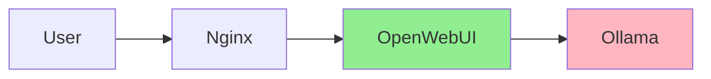

# Политика запрета эмоджи в проекте ERNI-KI

## Executive Summary

**КРИТИЧЕСКИ ВАЖНО:** Использование эмоджи во всех файлах проекта ERNI-KI строго
ЗАПРЕЩЕНО.

**Дата внедрения:** 2025-11-25 **Статус:** Активная политика **Эмоджи удалено:**
5543 из 134 файлов (первичная очистка)

---

## 1. Обоснование запрета

### 1.1 Технические проблемы

**Поиск и индексация:**

- Эмоджи усложняют полнотекстовый поиск
- Системы индексирования (Elasticsearch, Algolia) могут неправильно обрабатывать
  Unicode
- Grep/ripgrep требуют специальной обработки для эмоджи

**Экспорт и совместимость:**

- Проблемы при экспорте в PDF, Word, LaTeX
- Несовместимость с некоторыми системами контроля версий
- Проблемы с email-клиентами и RSS-ридерами

**Парсинг и автоматизация:**

- Затрудняют автоматическую обработку markdown
- Усложняют написание скриптов для анализа документации
- Проблемы с регулярными выражениями

### 1.2 Профессиональные стандарты

**Техническая документация:**

- Не соответствует стандартам IEEE, ISO, ANSI для технической документации
- Профессиональная документация не использует эмоджи
- Несовместимо с корпоративными стандартами большинства компаний

**Международная аудитория:**

- Эмоджи имеют разное культурное значение
- Отображаются по-разному на разных платформах (Apple, Android, Windows)
- Создают барьеры для неносителей языка

### 1.3 Доступность (Accessibility)

**Screen readers:**

- Screen readers озвучивают эмоджи полными описаниями
- "Fire emoji" вместо простого текста
- Затрудняют восприятие для людей с нарушениями зрения

**Когнитивная нагрузка:**

- Отвлекают от содержания
- Усложняют восприятие для людей с когнитивными особенностями
- Непонятны для людей, незнакомых с эмоджи-культурой

---

## 2. История внедрения

### 2.1 Первичная очистка (2025-11-25)

**Статистика:**

```
Всего файлов просканировано: 343 markdown файла
Файлов с эмоджи: 134
Эмоджи удалено: 5543

Top файлов по количеству эмоджи:
 959 - docs/archive/audits/comprehensive-documentation-audit-2025-11-25.md
 193 - docs/archive/audits/best-practices-audit-2025-10-20.md
 166 - docs/archive/diagnostics/full-server-diagnostics-2025-11-04.md
 163 - docs/archive/audits/comprehensive-project-audit-2025-10-17.md
 153 - docs/architecture/architecture.md
```

**Затронутые категории:**

- Корневые файлы: README.md, CHANGELOG.md, CONTRIBUTING.md
- Документация в docs/
- Архивные файлы в docs/archive/
- Переводы в docs/de/ и docs/en/
- Конфигурационные backup файлы

**Типы удаленных эмоджи:**

- Индикаторы статуса: [OK], [WARNING], [ERROR], [CRITICAL], [INFO]
- Флаги стран: EN (была UK flag), DE (была German flag)
- Декоративные: звезды, графики, инструменты, ракеты
- Указатели: стрелки, руки
- Технические: контейнеры, замки, шестеренки

---

## 3. Альтернативные подходы

### 3.1 Текстовые маркеры

**Вместо эмоджи используйте:**

```markdown
<!-- Вместо emoji -->

[OK] вместо [ERROR] вместо [WARNING] вместо [CRITICAL] вместо [INFO] вместо ℹ
[TIP] вместо
```

**Примеры:**

```markdown
<!-- Плохо -->

Сервис работает Критическая ошибка Совет: используйте кэширование

<!-- Хорошо -->

[OK] Сервис работает [CRITICAL] Критическая ошибка [TIP] Совет: используйте
кэширование
```

### 3.2 Admonition Boxes

**Используйте blockquotes для важной информации:**

```markdown
> **Важно:** Критически важная информация.

> [WARNING] Предупреждение о потенциальных рисках.

> [TIP] Рекомендация или best practice.

> [INFO] Дополнительные детали или контекст.
```

### 3.3 Структурированные таблицы

**Для статусов используйте таблицы:**

```markdown
| Компонент  | Статус     | Версия |
| ---------- | ---------- | ------ |
| PostgreSQL | Production | 16.1   |
| Redis      | Production | 7.2    |
| Nginx      | Production | 1.25   |
```

### 3.4 Mermaid диаграммы

**Для визуализации используйте диаграммы:**

````markdown

````

````

---

## 4. Инструменты для обеспечения соблюдения

### 4.1 Скрипт удаления эмоджи

**Расположение:** `scripts/remove-all-emoji.py`

**Использование:**
```bash
# Dry-run (проверка без изменений)
python3 scripts/remove-all-emoji.py --dry-run

# Удалить все эмоджи
python3 scripts/remove-all-emoji.py
````

**Функциональность:**

- Сканирует все markdown файлы в проекте
- Удаляет Unicode эмоджи и текстовые эмоджи
- Заменяет статусные эмоджи на текстовые маркеры
- Создает детальный отчет об изменениях

### 4.2 Валидация в pre-commit

**Файл:** `.pre-commit-config.yaml`

**Hook конфигурация:**

```yaml
- repo: local
 hooks:
 - id: no-emoji-in-docs
 name: 'Docs: validate no emoji'
 entry: python3 scripts/validate-no-emoji.py
 language: python
 files: ^docs/.*\.md$
 pass_filenames: true
```

**Создайте скрипт валидации:**

```bash
cat > scripts/validate-no-emoji.py << 'EOF'
#!/usr/bin/env python3
"""Validate that files contain no emoji."""
import re
import sys
from pathlib import Path

EMOJI_PATTERN = re.compile(
 "["
 "\U0001F600-\U0001F64F"
 "\U0001F300-\U0001F5FF"
 "\U0001F680-\U0001F6FF"
 "\U0001F1E0-\U0001F1FF"
 "\U00002702-\U000027B0"
 "\U000024C2-\U0001F251"
 "\U0001F900-\U0001F9FF"
 "\U0001F018-\U0001F270"
 "]+",
 flags=re.UNICODE
)

TEXT_EMOJI = ['', '', '', '', '', '[WARNING]', '[OK]', 'ℹ', '', '']

files_with_emoji = []
for file_path in sys.argv[1:]:
 try:
 content = Path(file_path).read_text()
 if EMOJI_PATTERN.search(content) or any(e in content for e in TEXT_EMOJI):
 files_with_emoji.append(file_path)
 except:
 pass

if files_with_emoji:
 print("ERROR: Emoji found in files:")
 for f in files_with_emoji:
 print(f" - {f}")
 print("\nRemove emoji using: python3 scripts/remove-all-emoji.py")
 sys.exit(1)

print("[OK] No emoji found")
EOF

chmod +x scripts/validate-no-emoji.py
```

### 4.3 CI/CD проверка

**GitHub Actions workflow:**

```yaml
# .github/workflows/docs-validation.yml
name: Documentation Validation

on:
 pull_request:
 paths:
 - '**/*.md'
 - 'scripts/validate-no-emoji.py'

jobs:
 validate-no-emoji:
 runs-on: ubuntu-latest
 steps:
 - uses: actions/checkout@v4

 - name: Validate no emoji
 run: |
 find . -name "*.md" -type f ! -path "*/node_modules/*" ! -path "*/.venv/*" \
 -exec python3 scripts/validate-no-emoji.py {} +
```

---

## 5. Исключения

### 5.1 НЕТ исключений

**Политика строгая и не допускает исключений:**

- Нет исключений для README
- Нет исключений для CHANGELOG
- Нет исключений для "дружелюбности"
- Нет исключений для "визуальной привлекательности"
- Нет исключений для маркетинговых материалов

### 5.2 Внешние файлы

**Файлы, которые НЕ контролируются политикой:**

- `data/` - внешние данные и модели (часто с restricted permissions)
- `.config-backup/` - backup файлы (архивные)
- `node_modules/` - зависимости
- `.venv/` - Python окружение
- `site/` - сгенерированный сайт

**Причина:** Эти файлы либо внешние, либо автоматически генерируются.

---

## 6. Процесс обновления

### 6.1 Для разработчиков

**При создании нового документа:**

1. Используйте текстовые маркеры ([OK], [WARNING], [ERROR])
2. Используйте admonition boxes для важной информации
3. Используйте таблицы для структурированных данных
4. Используйте Mermaid для диаграмм

**При обновлении существующего документа:**

1. Удалите любые случайно добавленные эмоджи
2. Замените эмоджи на текстовые альтернативы
3. Запустите pre-commit hooks перед коммитом

**При review PR:**

1. Проверьте отсутствие эмоджи
2. Предложите текстовые альтернативы если найдены
3. CI/CD автоматически проверит при создании PR

### 6.2 Периодическая проверка

**Ежемесячно:**

```bash
# Проверка на наличие эмоджи
python3 scripts/remove-all-emoji.py --dry-run

# Если найдены, удалить
python3 scripts/remove-all-emoji.py

# Коммит изменений
git add .
git commit -m "docs: remove emoji (monthly cleanup)"
```

**Ежеквартально:**

- Обзор политики
- Обновление инструментов
- Обучение новых членов команды

---

## 7. Обучение команды

### 7.1 Onboarding новых разработчиков

**Обязательно сообщить:**

1. Политика запрета эмоджи существует и обязательна
2. Причины запрета (техническая документация, доступность, профессионализм)
3. Альтернативы (текстовые маркеры, admonitions, таблицы)
4. Инструменты (скрипты, pre-commit hooks, CI/CD)

### 7.2 Документация в Style Guide

**См. также:**

- `style-guide.md` - раздел 1 "Emoji - СТРОГО ЗАПРЕЩЕНЫ"
- `documentation-maintenance-strategy.md`

---

## 8. Метрики соблюдения

### 8.1 Целевые показатели

| Метрика                      | Цель  | Текущее |
| ---------------------------- | ----- | ------- |
| Файлов с эмоджи              | 0     | 0       |
| Pre-commit rejections/month  | <5    | TBD     |
| CI/CD failures due to emoji  | 0     | TBD     |
| Time to fix emoji violations | <5min | TBD     |

### 8.2 Мониторинг

**Еженедельно:**

```bash
python3 scripts/remove-all-emoji.py --dry-run | grep "Total emoji removed"
```

**Ожидаемый результат:** `Total emoji removed: 0`

---

## 9. FAQ

### Q: Почему так строго? Эмоджи делают документацию дружелюбнее.

**A:** Техническая документация должна быть профессиональной, доступной и
совместимой с различными системами. Эмоджи создают больше проблем, чем приносят
пользы. Используйте admonition boxes и структурированное форматирование для
выделения важной информации.

### Q: А как насчет README на GitHub? Там все используют эмоджи.

**A:** Популярность не означает правильность. Наш проект придерживается
профессиональных стандартов технической документации. GitHub отлично отображает
текстовые маркеры и admonitions.

### Q: Можно ли использовать эмоджи в commit messages?

**A:** Нет. Наша политика распространяется на все текстовые файлы проекта.
Используйте conventional commits с текстовыми префиксами.

### Q: Что делать, если я случайно добавил эмоджи?

**A:** Pre-commit hook остановит коммит. Запустите
`python3 scripts/remove-all-emoji.py` для автоматического удаления.

### Q: А как насчет внешних библиотек с эмоджи в их README?

**A:** Внешние зависимости (node_modules/, data/) не контролируются политикой.
Мы не изменяем сторонний код.

---

## 10. Связанные документы

- `style-guide.md` - Полное руководство по стилю документации
- `documentation-maintenance-strategy.md` - Стратегия поддержки
- `../../CONTRIBUTING.md` - Руководство для контрибьюторов
- `../../.pre-commit-config.yaml` - Hooks конфигурация

---

**Версия политики:** 1.0 **Дата принятия:** 2025-11-25 **Ответственный:** Tech
Documentation Team **Следующий review:** 2026-02-25
