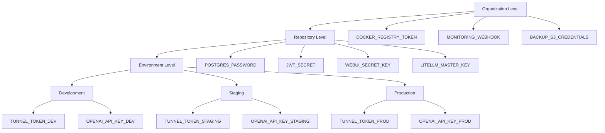

# GitHub Environments Setup для ERNI-KI

[TOC]

**Дата:**2025-09-19**Версия:**1.0

## Обзор

Данная документация описывает процесс настройки GitHub Environments для проекта
ERNI-KI с трехуровневой архитектурой управления секретами и environment-specific
конфигурациями.

## Архитектура

### Трехуровневая структура секретов



## Быстрый старт

### 1. Предварительные требования

```bash
# Установка GitHub CLI
curl -fsSL https://cli.github.com/packages/githubcli-archive-keyring.gpg | sudo dd of=/usr/share/keyrings/githubcli-archive-keyring.gpg
echo "deb [arch=$(dpkg --print-architecture) signed-by=/usr/share/keyrings/githubcli-archive-keyring.gpg] https://cli.github.com/packages stable main" | sudo tee /etc/apt/sources.list.d/github-cli.list > /dev/null
sudo apt update && sudo apt install gh

# Аутентификация
gh auth login --scopes repo,admin:org
```

## 2. Создание окружений

```bash
# Выполнить из корня проекта ERNI-KI
./scripts/infrastructure/security/setup-github-environments.sh
```

## 3. Настройка protection rules

```bash
./scripts/infrastructure/security/configure-environment-protection.sh
```

### 4. Добавление секретов

```bash
./scripts/infrastructure/security/setup-environment-secrets.sh
```

### 5. Валидация настроек

```bash
./scripts/infrastructure/security/validate-environment-secrets.sh
```

## Детальная настройка

### Создание окружений вручную

```bash
# Development окружение
gh api repos/:owner/:repo/environments/development -X PUT \
 --field "wait_timer=0" \
 --field "prevent_self_review=false" \
 --field "reviewers=[]"

# Staging окружение
gh api repos/:owner/:repo/environments/staging -X PUT \
 --field "wait_timer=300" \
 --field "prevent_self_review=true" \
 --field "reviewers=[{\"type\":\"Team\",\"id\":null}]"

# Production окружение
gh api repos/:owner/:repo/environments/production -X PUT \
 --field "wait_timer=600" \
 --field "prevent_self_review=true" \
 --field "deployment_branch_policy={\"protected_branches\":true}"
```

## Добавление секретов вручную

```bash
# Environment-specific секреты
gh secret set TUNNEL_TOKEN_DEV --env development --body "dev-tunnel-token"
gh secret set TUNNEL_TOKEN_STAGING --env staging --body "staging-tunnel-token"
gh secret set TUNNEL_TOKEN_PROD --env production --body "prod-tunnel-token"

# Repository-level секреты
gh secret set POSTGRES_PASSWORD --body "$(openssl rand -base64 32)"
gh secret set JWT_SECRET --body "$(openssl rand -hex 32)"
```

## Проверка и мониторинг

### Просмотр окружений

```bash
# Список всех окружений
gh api repos/:owner/:repo/environments | jq '.[].name'

# Детали конкретного окружения
gh api repos/:owner/:repo/environments/production | jq '.'
```

## Просмотр секретов

```bash
# Repository секреты
gh secret list

# Environment секреты
gh secret list --env development
gh secret list --env staging
gh secret list --env production
```

## Проверка protection rules

```bash
# Получение protection rules для окружения
gh api repos/:owner/:repo/environments/production | jq '.protection_rules'
```

## Использование в GitHub Actions

### Environment-specific деплой



```yaml
name: Deploy to Environment

on:
 workflow_dispatch:
 inputs:
 environment:
 type: choice
 options:
 - development
 - staging
 - production

jobs:
 deploy:
 runs-on: ubuntu-latest
 environment: ${{ inputs.environment }}

 steps:
 - name: Deploy with environment secrets
 run: |
 echo "Deploying to ${{ inputs.environment }}"
 env:
 TUNNEL_TOKEN:
 ${{ secrets[format('TUNNEL_TOKEN_{0}', inputs.environment ==
 'development' && 'DEV' || inputs.environment == 'staging' &&
 'STAGING' || 'PROD')] }}
 OPENAI_API_KEY:
 ${{ secrets[format('OPENAI_API_KEY_{0}', inputs.environment ==
 'development' && 'DEV' || inputs.environment == 'staging' &&
 'STAGING' || 'PROD')] }}
```



### Автоматический выбор окружения

```yaml
jobs:
 determine-environment:
 outputs:
 environment: ${{ steps.env.outputs.environment }}
 steps:
 - id: env
 run: |
 if [ "${{ github.ref }}" = "refs/heads/main" ]; then
 echo "environment=production" >> $GITHUB_OUTPUT
 elif [ "${{ github.ref }}" = "refs/heads/develop" ]; then
 echo "environment=development" >> $GITHUB_OUTPUT
 else
 echo "environment=staging" >> $GITHUB_OUTPUT
 fi

 deploy:
 needs: determine-environment
 environment: ${{ needs.determine-environment.outputs.environment }}
 steps:
 - name: Deploy
 run:
 echo "Deploying to ${{ needs.determine-environment.outputs.environment
 }}"
```

## Troubleshooting

### Проблема: "Environment not found"

**Причина:**Окружение не создано или нет прав доступа.

**Решение:**

```bash
# Проверить существование окружения
gh api repos/:owner/:repo/environments | jq '.[].name'

# Создать окружение
gh api repos/:owner/:repo/environments/development -X PUT
```

## Проблема: "Secret not found"

**Причина:**Секрет не добавлен в нужное окружение.

**Решение:**

```bash
# Проверить секреты в окружении
gh secret list --env development

# Добавить секрет
gh secret set SECRET_NAME --env development --body "secret-value"
```

## Проблема: "Insufficient permissions"

**Причина:**Недостаточно прав для создания окружений или секретов.

**Решение:**

```bash
# Проверить права доступа
gh api user | jq '.login'
gh api repos/:owner/:repo | jq '.permissions'

# Переаутентификация с расширенными правами
gh auth login --scopes repo,admin:org
```

## Проблема: "Protection rules not working"

**Причина:**Неправильно настроены protection rules.

**Решение:**

```bash
# Проверить текущие правила
gh api repos/:owner/:repo/environments/production | jq '.protection_rules'

# Обновить правила
gh api repos/:owner/:repo/environments/production -X PUT \
 --field "deployment_branch_policy={\"protected_branches\":true}"
```

## Мониторинг и аудит

### Регулярные проверки

```bash
# Еженедельная валидация секретов
./scripts/infrastructure/security/validate-environment-secrets.sh

# Проверка последних изменений секретов
gh api repos/:owner/:repo/actions/secrets | jq '.secrets[] | {name, updated_at}'
```

## Аудит доступа

```bash
# Просмотр истории деплоев
gh api repos/:owner/:repo/deployments | jq '.[] | {environment, created_at, creator}'

# Проверка protection rules
for env in development staging production; do
 echo "=== $env ==="
 gh api "repos/:owner/:repo/environments/$env" | jq '.protection_rules'
done
```

## Ротация секретов

### Автоматическая ротация

```bash
# Создать новый секрет
NEW_SECRET=$(openssl rand -hex 32)

# Обновить во всех окружениях
for env in development staging production; do
 suffix=""
 case $env in
 development) suffix="_DEV" ;;
 staging) suffix="_STAGING" ;;
 production) suffix="_PROD" ;;
 esac

 gh secret set "JWT_SECRET${suffix}" --env "$env" --body "$NEW_SECRET"
done
```

## Плановая ротация

```bash
# Использовать существующий скрипт ротации
./scripts/infrastructure/security/rotate-secrets.sh --service all
```

## Чеклист для production

- [ ] Все окружения созданы (development, staging, production)
- [ ] Protection rules настроены корректно
- [ ] Все обязательные секреты добавлены
- [ ] Production секреты заменены на реальные значения
- [ ] Валидация секретов прошла успешно
- [ ] GitHub Actions workflows обновлены
- [ ] Документация актуализирована
- [ ] Команда обучена работе с новой системой

## Журнал проверки (2025-11-17)

| Шаг                                                                                                                         | Статус                  | Комментарий / следующее действие                                                                                                                                               |
| --------------------------------------------------------------------------------------------------------------------------- | ----------------------- | ------------------------------------------------------------------------------------------------------------------------------------------------------------------------------ |
| Создание окружений `development`, `staging`, `production`                                                                   | Требуется подтверждение | Нет доступа к настройкам GitHub из текущей среды. Проверьте `gh api repos/:owner/:repo/environments` и задокументируйте результат.                                             |
| Protection rules (reviewers, wait timers, запрет force push)                                                                | Требуется подтверждение | Запустите `scripts/infrastructure/security/configure-environment-protection.sh` или обновите правила вручную и приложите вывод `gh api repos/:owner/:repo/environments/<env>`. |
| Environment secrets (`TUNNEL_TOKEN_*`, `OPENAI_API_KEY_*`, `CONTEXT7_API_KEY_*`, `ANTHROPIC_API_KEY_*`, `GOOGLE_API_KEY_*`) | Требуется подтверждение | Выполните `scripts/infrastructure/security/setup-environment-secrets.sh` и затем `gh secret list --env <env>` чтобы убрать placeholder-значения.                               |
| Валидация (`validate-environment-secrets.sh`)                                                                               | Требуется подтверждение | После обновления секретов запустите скрипт и приложите лог в `docs/archive/audits/ci-health.md` или сюда.                                                                      |

> Обновляйте таблицу после каждой проверки, чтобы команда видела фактическое
> состояние GitHub Environments.

## Best Practices

### Безопасность секретов

1.**Принцип минимальных привилегий**

- Используйте разные API ключи для разных окружений
- Ограничивайте scope API ключей до минимально необходимого
- Регулярно ротируйте секреты (каждые 90 дней)

  2.**Мониторинг и аудит**

- Логируйте все изменения секретов
- Мониторьте использование API ключей
- Настройте алерты на подозрительную активность

  3.**Разделение окружений**

- Никогда не используйте production секреты в dev/staging
- Используйте тестовые API ключи с ограничениями для разработки
- Изолируйте production окружение максимально

### Управление окружениями

1.**Naming conventions**

- Используйте консистентные суффиксы: `_DEV`, `_STAGING`, `_PROD`
- Группируйте связанные секреты логически
- Документируйте назначение каждого секрета

  2.**Protection rules**

- Development: без ограничений для быстрой итерации
- Staging: минимум 1 reviewer для проверки
- Production: минимум 2 reviewers + branch protection

  3.**Автоматизация**

- Используйте скрипты для массовых операций
- Автоматизируйте валидацию секретов в CI/CD
- Настройте автоматические уведомления об изменениях

## Критические предупреждения

**НИКОГДА НЕ КОММИТЬТЕ СЕКРЕТЫ В КОД** **ЗАМЕНЯЙТЕ PLACEHOLDER ЗНАЧЕНИЯ ПЕРЕД
PRODUCTION** **РЕГУЛЯРНО РОТИРУЙТЕ PRODUCTION СЕКРЕТЫ** **МОНИТОРЬТЕ
ИСПОЛЬЗОВАНИЕ API КЛЮЧЕЙ**

## Полезные ссылки

- [GitHub Environments Documentation](https://docs.github.com/en/actions/deployment/targeting-different-environments/using-environments-for-deployment)
- [GitHub Secrets Documentation](https://docs.github.com/en/actions/security-guides/encrypted-secrets)
- [GitHub CLI Documentation](https://cli.github.com/manual/)
- [ERNI-KI Security Policy](../security/security-policy.md)

---

**Поддержка:**Для вопросов и проблем создайте issue в репозитории или обратитесь
к Tech Lead команды.
