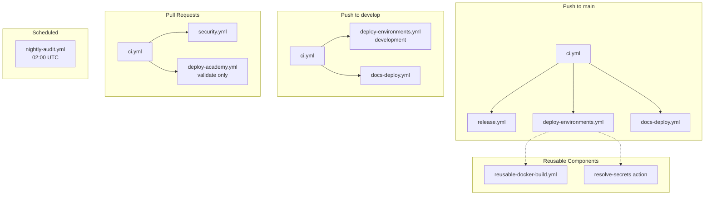

# GitHub Actions Workflow Architecture

> **Document Version:** 1.0 **Last Updated:** 2025-12-07

This document describes the GitHub Actions CI/CD architecture for ERNI-KI,
including all workflows, their dependencies, triggers, required secrets, and
troubleshooting guide.

## Overview

The project uses **9 workflow files** and **1 composite action** organized by
function:

| Category          | Workflow                    | Purpose                         |
| ----------------- | --------------------------- | ------------------------------- |
| **CI/CD**         | `ci.yml`                    | Continuous Integration pipeline |
| **CI/CD**         | `release.yml`               | Semantic versioning releases    |
| **CI/CD**         | `deploy-environments.yml`   | Multi-environment deployment    |
| **Documentation** | `docs-deploy.yml`           | Main docs to GitHub Pages       |
| **Documentation** | `deploy-academy.yml`        | Academy docs to GitHub Pages    |
| **Security**      | `security.yml`              | Security scanning pipeline      |
| **Maintenance**   | `nightly-audit.yml`         | Scheduled documentation audit   |
| **Maintenance**   | `update-status.yml`         | Auto-update status snippets     |
| **Reusable**      | `reusable-docker-build.yml` | Standardized Docker builds      |

## Workflow Dependency Graph



## Workflow Details

### 1. ci.yml - Continuous Integration

**Purpose:** Code quality checks, testing, security scanning, and Docker build
validation.

**Triggers:**

- Push to `main`, `develop`
- Pull requests to `main`, `develop`
- Manual dispatch

**Jobs:**

| Job             | Timeout | Description                           |
| --------------- | ------- | ------------------------------------- |
| `lint`          | 15 min  | Code quality (Ruff, ESLint, Prettier) |
| `test-go`       | 15 min  | Go service unit tests                 |
| `security-scan` | 20 min  | Trivy vulnerability scan              |
| `docker-build`  | 20 min  | Build validation (no push)            |

**Required Permissions:**

```yaml
permissions:
  contents: read
  actions: read
  security-events: write
```

**Key Features:**

- Concurrency: Cancels previous runs on new push
- SHA-pinned actions for supply chain security
- Trivy scan with strict exit-code (fails on CRITICAL/HIGH)
- Multi-platform Docker build (amd64, arm64)

---

### 2. release.yml - Automated Releases

**Purpose:** Create semantic version releases with Docker images and GitHub
releases.

**Triggers:**

- Push to `main` (excluding docs and CI workflow changes)
- Manual dispatch with release type selection (patch/minor/major)

**Jobs:**

| Job           | Timeout | Description                         |
| ------------- | ------- | ----------------------------------- |
| `version`     | 10 min  | Determine version from commits      |
| `pre-release` | 30 min  | Run comprehensive tests             |
| `release`     | 30 min  | Build images, create GitHub release |
| `notify`      | 10 min  | Post release summary                |

**Required Permissions:**

```yaml
permissions:
  contents: write
  packages: write
```

**Concurrency:** `cancel-in-progress: false` (prevents concurrent releases)

**Artifacts:**

- Docker images: `ghcr.io/<org>/erni-ki/auth:<version>`
- Docker images: `ghcr.io/<org>/erni-ki/auth:latest`
- GitHub Release with changelog

---

### 3. deploy-environments.yml - Environment Deployment

**Purpose:** Deploy to development, staging, or production environments with
environment-specific secrets.

**Triggers:**

- Push to `main` → production
- Push to `develop` → development
- Manual dispatch with environment selection

**Jobs:**

| Job                     | Timeout | Description                   |
| ----------------------- | ------- | ----------------------------- |
| `determine-environment` | 5 min   | Calculate target environment  |
| `validate-secrets`      | 5 min   | Verify required secrets exist |
| `build-and-deploy`      | 30 min  | Build and push Docker image   |
| `deploy`                | 30 min  | Deploy to target environment  |
| `notify`                | 5 min   | Send deployment notification  |

**Required Secrets by Environment:**

| Secret                | Development | Staging  | Production |
| --------------------- | ----------- | -------- | ---------- |
| `TUNNEL_TOKEN_*`      | Required    | Required | Required   |
| `OPENAI_API_KEY_*`    | Required    | Required | Required   |
| `CONTEXT7_API_KEY_*`  | Optional    | Optional | Optional   |
| `ANTHROPIC_API_KEY_*` | Optional    | Optional | Optional   |
| `GOOGLE_API_KEY_*`    | Optional    | Optional | Optional   |

**Uses:** `resolve-secrets` composite action for DRY secret handling.

---

### 4. security.yml - Security Scanning

**Purpose:** Comprehensive security analysis including SAST, dependency
scanning, container scanning, and secrets detection.

**Triggers:**

- Push to `main`, `develop`
- Pull requests to `main`, `develop`
- Manual dispatch

**Jobs:**

| Job               | Timeout | Description                      |
| ----------------- | ------- | -------------------------------- |
| `sast`            | 15 min  | Static analysis (gosec)          |
| `dependency-scan` | 15 min  | Vulnerability scan (Trivy)       |
| `container-scan`  | 20 min  | Container image scan             |
| `secrets-scan`    | 10 min  | Secrets detection (Gitleaks)     |
| `iac-scan`        | 10 min  | Infrastructure as Code (Checkov) |

**Exit Code Configuration:**

| Scanner  | Exit Code | Behavior                        |
| -------- | --------- | ------------------------------- |
| Trivy    | 1         | Fails on CRITICAL/HIGH          |
| Gitleaks | Non-zero  | Fails on secret detection       |
| Checkov  | Non-zero  | Fails on security violations    |
| gosec    | Continue  | Warnings only (SSA panic issue) |

---

### 5. docs-deploy.yml - Documentation Deployment

**Purpose:** Build and deploy main MkDocs documentation to GitHub Pages.

**Triggers:**

- Push to `main`, `develop` (when docs/\*\* or mkdocs.yml changed)
- Manual dispatch

**Jobs:**

| Job      | Timeout | Description            |
| -------- | ------- | ---------------------- |
| `build`  | 15 min  | Build MkDocs site      |
| `deploy` | 10 min  | Deploy to GitHub Pages |

**Required Permissions:**

```yaml
permissions:
  contents: read
  pages: write
  id-token: write
```

**Environment:** `github-pages`

---

### 6. deploy-academy.yml - Academy Documentation

**Purpose:** Separate CI/CD for Academy KI documentation with validation and
link checking.

**Triggers:**

- Push to `main` (when docs/academy/\*\* changed)
- Pull requests (validate only)
- Manual dispatch with deploy option

**Jobs:**

| Job          | Timeout | Description                    |
| ------------ | ------- | ------------------------------ |
| `validate`   | 10 min  | Metadata and anchor validation |
| `build`      | 15 min  | Build Academy site             |
| `link-check` | 10 min  | Check internal links (Lychee)  |
| `pr-comment` | 5 min   | Post build status to PR        |
| `deploy`     | 10 min  | Deploy to GitHub Pages         |

---

### 7. nightly-audit.yml - Scheduled Audit

**Purpose:** Daily documentation health check with link validation.

**Triggers:**

- Scheduled: `0 2 * * *` (02:00 UTC daily)
- Manual dispatch

**Jobs:**

| Job     | Timeout | Description                           |
| ------- | ------- | ------------------------------------- |
| `audit` | 30 min  | Validate metadata, build, check links |

**Link Exclusions:** See
[Lychee Configuration](#lychee-link-checker-configuration).

---

### 8. update-status.yml - Status Snippet Updates

**Purpose:** Auto-update status snippets when status.yml or VERSION.yaml
changes.

**Triggers:**

- Push to `docs/reference/status.yml` or `docs/VERSION.yaml`
- Manual dispatch

**Jobs:**

| Job               | Timeout | Description                  |
| ----------------- | ------- | ---------------------------- |
| `update-snippets` | 5 min   | Generate and commit snippets |

**Auto-commits:** Uses `stefanzweifel/git-auto-commit-action`.

---

### 9. reusable-docker-build.yml - Reusable Docker Build

**Purpose:** Standardized Docker build workflow for use by other workflows.

**Usage:**

```yaml
jobs:
  build:
    uses: ./.github/workflows/reusable-docker-build.yml
    with:
      context: './auth'
      dockerfile: './auth/Dockerfile'
      platforms: 'linux/amd64,linux/arm64'
      push: true
      trivy-scan: true
    secrets:
      registry-token: ${{ secrets.GITHUB_TOKEN }}
```

**Inputs:**

| Input                 | Type    | Default                   | Description            |
| --------------------- | ------- | ------------------------- | ---------------------- |
| `context`             | string  | `./auth`                  | Docker build context   |
| `dockerfile`          | string  | `./auth/Dockerfile`       | Dockerfile path        |
| `platforms`           | string  | `linux/amd64,linux/arm64` | Target platforms       |
| `push`                | boolean | `true`                    | Push to registry       |
| `image-suffix`        | string  | `/auth`                   | Image name suffix      |
| `tags`                | string  | `""`                      | Additional tags        |
| `labels`              | string  | `""`                      | Image labels           |
| `build-args`          | string  | `""`                      | Build arguments        |
| `use-metadata-action` | boolean | `true`                    | Use metadata for tags  |
| `metadata-tags`       | string  | See workflow              | Metadata tag config    |
| `trivy-scan`          | boolean | `false`                   | Run vulnerability scan |
| `trivy-exit-code`     | string  | `"1"`                     | Exit code on vulns     |
| `trivy-severity`      | string  | `CRITICAL,HIGH`           | Severity levels        |

**Outputs:**

| Output      | Description          |
| ----------- | -------------------- |
| `image-ref` | Full image reference |
| `digest`    | Image digest         |
| `metadata`  | Image metadata JSON  |

---

## Composite Actions

### resolve-secrets

**Location:** `.github/actions/resolve-secrets/action.yml`

**Purpose:** Resolves and validates environment-specific secrets, reducing
duplication in deployment workflows.

**Usage:**

```yaml
- uses: ./.github/actions/resolve-secrets
  with:
    environment: development
    tunnel-token: ${{ secrets.TUNNEL_TOKEN_DEV }}
    openai-api-key: ${{ secrets.OPENAI_API_KEY_DEV }}
    validate: 'true'
```

**Inputs:**

| Input               | Required | Description                  |
| ------------------- | -------- | ---------------------------- |
| `environment`       | Yes      | Target environment name      |
| `tunnel-token`      | Yes      | Cloudflare Tunnel token      |
| `openai-api-key`    | Yes      | OpenAI API key               |
| `context7-api-key`  | No       | Context7 API key             |
| `anthropic-api-key` | No       | Anthropic API key            |
| `google-api-key`    | No       | Google API key               |
| `validate`          | No       | Enable validation (`"true"`) |

**Behavior:**

- Exports secrets to `$GITHUB_ENV`
- Validates required secrets are not placeholder values
- Fails on production if required secrets missing
- Warns on non-production for missing optional secrets

---

## Secrets Configuration

### Required Secrets

Configure these in GitHub repository settings → Secrets and variables → Actions:

**Per Environment (development, staging, production):**

| Secret                   | Description                     |
| ------------------------ | ------------------------------- |
| `TUNNEL_TOKEN_DEV`       | Cloudflare Tunnel - Development |
| `TUNNEL_TOKEN_STAGING`   | Cloudflare Tunnel - Staging     |
| `TUNNEL_TOKEN_PROD`      | Cloudflare Tunnel - Production  |
| `OPENAI_API_KEY_DEV`     | OpenAI API - Development        |
| `OPENAI_API_KEY_STAGING` | OpenAI API - Staging            |
| `OPENAI_API_KEY_PROD`    | OpenAI API - Production         |

**Optional (per environment):**

| Secret                | Description       |
| --------------------- | ----------------- |
| `CONTEXT7_API_KEY_*`  | Context7 API key  |
| `ANTHROPIC_API_KEY_*` | Anthropic API key |
| `GOOGLE_API_KEY_*`    | Google API key    |

### Built-in Secrets

These are automatically available:

| Secret         | Description                    |
| -------------- | ------------------------------ |
| `GITHUB_TOKEN` | Auto-generated, scoped per job |

---

## Lychee Link Checker Configuration

Consistent exclusion patterns across all workflows:

```yaml
args: >
  --exclude 'localhost' --exclude '127\.0\.0\.1' --exclude 'example\.com'
  --exclude 'your-domain' --exclude 'ki\.erni-gruppe\.ch' --exclude
  'status\.erni-ki\.ch' --exclude '192\.168\.\d+\.\d+' --exclude 'nginx:8080'
  --exclude 'openwebui:8080' --exclude 'searxng:8080' --exclude
  'dash\.cloudflare\.com' --exclude 'docs\.openwebui\.com/api' --exclude
  'github\.com/nginx/nginx/issues' --exclude
  'github\.com/DIZ-admin/erni-ki/discussions' --exclude 'docs\.litellm\.ai'
```

> В CI оставляем стандартные аргументы выше; в офлайн/airgapped окружениях
> добавляйте `--exclude 'github.com/ollama'`, чтобы не блокироваться на
> недоступном хосте.

---

## Troubleshooting Guide

### Common Issues

#### 1. Docker Build Fails with "Tag Not Lowercase"

**Symptom:** Build fails with Docker tag validation error.

**Cause:** Repository name contains uppercase characters.

**Solution:** The workflows normalize repository names:

```bash
repo_lc=$(echo "${GITHUB_REPOSITORY}" | tr '[:upper:]' '[:lower:]')
```

Ensure `scripts/utilities/check-docker-tags.sh` is executable.

---

#### 2. Security Scan Fails on CRITICAL Vulnerabilities

**Symptom:** Trivy scan fails with exit code 1.

**Cause:** Container image contains CRITICAL or HIGH vulnerabilities.

**Solution:**

1. Check the Trivy SARIF output in Security tab
2. Update base images in Dockerfile
3. Update vulnerable dependencies
4. If false positive, configure `.trivyignore`

---

#### 3. Secrets Validation Fails

**Symptom:** `validate-secrets` job fails with "Missing required secrets."

**Cause:** Environment secrets not configured or contain placeholder values.

**Solution:**

1. Go to Settings → Secrets and variables → Actions
2. Add the missing secrets for the target environment
3. Ensure secrets don't contain `REPLACE_WITH_REAL` placeholder

---

#### 4. Gitleaks Detects False Positive

**Symptom:** `secrets-scan` fails on legitimate code.

**Cause:** Pattern matches non-secret content.

**Solution:** Add to `.gitleaks.toml`:

```toml
[[rules.allowlist]]
path = "path/to/file"
regexes = ["pattern-to-ignore"]
```

---

#### 5. MkDocs Build Fails

**Symptom:** Documentation build fails with plugin errors.

**Cause:** Missing or incompatible dependencies.

**Solution:**

1. Ensure `requirements-docs.txt` has pinned versions
2. Verify plugin compatibility with MkDocs version
3. Check `mkdocs.yml` syntax

---

#### 6. GitHub Pages Deployment Fails

**Symptom:** "Deployment in progress" error.

**Cause:** Concurrent deployments to GitHub Pages.

**Solution:** Workflows use concurrency groups:

```yaml
concurrency:
  group: pages-${{ github.ref }}
  cancel-in-progress: false
```

Wait for current deployment to complete.

---

#### 7. Pre-commit Hook Blocks Commit

**Symptom:** `detect-secrets` blocks workflow file changes.

**Cause:** Word "secret" triggers false positive.

**Solution:** Add pragma comment:

```yaml
- name: Step name # pragma: allowlist secret
  run: | # pragma: allowlist secret
    echo "SOME_SECRET=${{ inputs.secret }}" >> "$GITHUB_ENV"
```

---

### Debug Mode

Enable debug logging for any workflow:

1. Go to Settings → Secrets and variables → Actions
2. Add repository variable: `ACTIONS_STEP_DEBUG = true`
3. Re-run the workflow

---

## Version History

| Version | Date       | Changes               |
| ------- | ---------- | --------------------- |
| 1.0     | 2025-12-07 | Initial documentation |

---

## Related Documentation

- [Setup Guide](./setup-guide.md)
- [Pre-commit Guide](./pre-commit-guide.md)
- [Testing Guide](./testing-guide.md)
