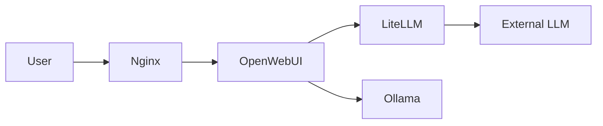

# Руководство по стилю написания документации ERNI-KI

[TOC]

## Введение

Это руководство определяет стандарты написания и форматирования для всей
документации проекта ERNI-KI. Цель - обеспечить консистентность, профессионализм
и доступность документации для всех пользователей.

### Область применения

Данное руководство применяется к:

- Всем файлам Markdown в `docs/`
- README.md, CONTRIBUTING.md, CHANGELOG.md
- Комментариям в коде (где применимо)
- Commit messages
- Pull request descriptions

### Приоритет правил

При конфликте между разделами этого руководства применяйте следующий порядок
приоритетов:

1. NO-EMOJI-POLICY.md (абсолютный приоритет)
2. Технические требования (форматирование, frontmatter)
3. Стилистические рекомендации

## 1. Тон и голос

### 1.1 Профессиональный технический стиль

**Принципы:**

- Пишите ясно и прямо
- Избегайте неформального языка, жаргона и шуток
- Используйте технически точную терминологию
- Будьте объективны и фактуальны

**Примеры:**

```markdown
<!-- Плохо -->

Круто! Теперь давайте запустим эту штуку и посмотрим, что получится!

<!-- Хорошо -->

Запустите сервис и проверьте статус развертывания.
```

### 1.2 Активный залог

**Предпочитайте активный залог пассивному:**

```markdown
<!-- Пассивный залог (избегать) -->

Конфигурация была обновлена системным администратором.

<!-- Активный залог (предпочтительно) -->

Системный администратор обновил конфигурацию.
```

**Исключения:** Пассивный залог допустим, когда исполнитель неважен или
неизвестен:

```markdown
Файл был изменен во время автоматического обновления.
```

### 1.3 Императивное наклонение для инструкций

**Для пошаговых инструкций используйте повелительное наклонение:**

```markdown
<!-- Плохо -->

Вы должны сначала установить Docker. Пользователь должен создать файл
конфигурации.

<!-- Хорошо -->

Установите Docker. Создайте файл конфигурации.
```

**Структура инструкций:**

1. Начинайте с глагола действия
2. Будьте конкретны
3. Укажите ожидаемый результат, если это не очевидно

````markdown
### Настройка базы данных

Создайте файл конфигурации PostgreSQL:

```bash
cp env/postgres.env.example env/postgres.env
```
````

Результат: файл `env/postgres.env` создан и готов к редактированию.

````

### 1.4 Адресация читателя

**Используйте "вы" для обращения к читателю:**

```markdown
<!-- Хорошо -->
Вы можете настроить параметры в файле конфигурации.
Убедитесь, что Docker запущен.

<!-- Избегать -->
Мы настроим параметры...
Нужно убедиться...
````

**Исключение:** В концептуальных документах можно использовать безличные формы:

```markdown
Система использует PostgreSQL для хранения данных. LiteLLM предоставляет
унифицированный API для различных LLM провайдеров.
```

## 2. Форматирование

### 2.1 Иерархия заголовков

**Правила:**

- **H1 (`#`)**: Только один на документ, для заголовка документа
- **H2 (`##`)**: Основные разделы
- **H3 (`###`)**: Подразделы
- **H4 (`####`)**: Детализация подразделов
- **H5-H6**: Редко используются, только для глубокой вложенности

**Запрещено пропускать уровни:**

```markdown
<!-- Плохо -->

# Заголовок документа

### Подраздел (пропущен H2)

<!-- Хорошо -->

# Заголовок документа

## Основной раздел

### Подраздел
```

**Автоматическая нормализация:**

Скрипт `scripts/docs/content_lint.py --fix-headings` автоматически исправляет
иерархию.

### 2.2 Оглавление (TOC)

**Требования:**

- Автоматически добавляется для документов >500 слов
- Размещается после frontmatter и первого заголовка
- Используется директива `[TOC]`

**Пример:**

```markdown
---
title: 'Название'
language: ru
---

# Название документа

[TOC]

## Первый раздел
```

**Автоматическая вставка:**

```bash
python3 scripts/docs/content_lint.py --add-toc --word-threshold 500
```

### 2.3 Блоки кода

**Всегда указывайте язык:**

````markdown
<!-- Плохо -->

```
docker-compose up -d
```

<!-- Хорошо -->

```bash
docker-compose up -d
```
````

**Поддерживаемые языки:**

- `bash`, `sh`, `zsh` - shell команды
- `python`, `javascript`, `typescript`, `go` - код
- `yaml`, `json`, `toml`, `ini` - конфигурация
- `dockerfile` - Dockerfiles
- `sql` - SQL запросы
- `markdown` - примеры Markdown
- `text` - plain text, когда язык не применим

**НЕ используйте префиксы в командах:**

```bash
<!-- Плохо -->
$ docker ps
$ npm install

<!-- Хорошо -->
docker ps
npm install
```

**Добавляйте комментарии для пояснения:**

```bash
# Создать резервную копию перед обновлением
docker-compose exec postgres pg_dump erni_ki > backup.sql

# Применить миграции
docker-compose exec postgres psql -U erni_ki -d erni_ki -f migrations/001_init.sql
```

**Показывайте ожидаемый вывод, когда это полезно:**

```bash
docker ps

# Ожидаемый вывод:
# CONTAINER ID IMAGE STATUS PORTS
# abc123def456 nginx:latest Up 2 hours 0.0.0.0:80->80/tcp
```

### 2.4 Списки

**Маркированные списки:**

- Используйте `-` для bullet points
- Вложенность - 2 пробела
- Пустая строка перед и после списка

```markdown
Требования:

- Docker 20.10+
- Python 3.11+
- pip 23.0+
- venv
- Git 2.25+

Следующий раздел...
```

**Нумерованные списки:**

- Используйте для последовательных шагов
- Начинайте с `1.` для всех элементов (Markdown автоматически пронумерует)
- Пустая строка между элементами, если они содержат много текста

```markdown
Процесс установки:

1. Клонируйте репозиторий
1. Настройте environment файлы
1. Запустите Docker Compose
1. Проверьте статус сервисов
```

**Списки определений (для терминологии):**

```markdown
**PostgreSQL** : Реляционная база данных с поддержкой pgvector для векторного
поиска.

**LiteLLM** : Унифицированный API-шлюз для различных LLM провайдеров.
```

### 2.5 Таблицы

**Базовая структура:**

```markdown
| Заголовок 1 | Заголовок 2 | Заголовок 3 |
| ----------- | ----------- | ----------- |
| Данные 1    | Данные 2    | Данные 3    |
| Данные 4    | Данные 5    | Данные 6    |
```

**Выравнивание:**

- `:---` - по левому краю (по умолчанию, для текста)
- `:---:` - по центру (для коротких значений, статусов)
- `---:` - по правому краю (для чисел)

```markdown
| Сервис     | Статус | Порт | CPU % |
| ---------- | :----: | ---- | ----: |
| PostgreSQL |   OK   | 5432 |  12.5 |
| Redis      |   OK   | 6379 |   3.2 |
| Nginx      | ERROR  | 80   |  45.0 |
```

**Заголовки в bold:**

```markdown
| **Параметр** | **Значение** | **Описание** |
| ------------ | ------------ | ------------ |
```

**Когда использовать таблицы:**

- Структурированные данные (конфигурация, статусы)
- Сравнение опций
- Справочная информация (порты, версии, метрики)

**Когда НЕ использовать таблицы:**

- Для длинных описаний (используйте списки)
- Для одного-двух элементов (используйте текст)
- Для сложных вложенных структур (используйте JSON/YAML блоки)

### 2.6 Admonitions (Выноски)

**Стандартные шаблоны:**

```markdown
> **Важно:** Критически важная информация, которую нельзя пропустить.

> **ВНИМАНИЕ:** Предупреждение о потенциальных рисках или проблемах.

> **Совет:** Рекомендация или best practice.

> **Информация:** Дополнительные детали или контекст.
```

**Когда использовать:**

- **Важно** - конфигурация, безопасность, критичные шаги
- **ВНИМАНИЕ** - потенциальная потеря данных, breaking changes
- **Совет** - оптимизации, лучшие практики
- **Информация** - дополнительный контекст, ссылки

**Примеры:**

```markdown
> **Важно:** Перед обновлением создайте резервную копию базы данных.

> **ВНИМАНИЕ:** Удаление volume приведет к потере всех данных PostgreSQL.

> **Совет:** Используйте Docker Compose profiles для управления окружениями.

> **Информация:** Подробнее о конфигурации см.
> `docs/operations/configuration.md`.
```

### 2.7 Ссылки

**Внутренние ссылки:**

- Используйте относительные пути
- Всегда проверяйте работоспособность ссылок

```markdown
<!-- Из docs/ru/development/ в docs/ru/operations/ -->

См. [руководство по мониторингу](../operations/monitoring/monitoring-guide.md).

<!-- Якоря в том же документе -->

См. раздел [Установка](#установка).
```

**Внешние ссылки:**

```markdown
Документация [Docker Compose](https://docs.docker.com/compose/)
```

**Текст ссылки должен быть осмысленным:**

```markdown
<!-- Плохо -->

Для получения дополнительной информации кликните [здесь](https://example.com).

<!-- Хорошо -->

См. [официальную документацию PostgreSQL](https://www.postgresql.org/docs/).
```

**Проверка ссылок:**

```bash
# Используйте lychee для проверки
lychee docs/**/*.md
```

### 2.8 Изображения и диаграммы

**Предпочитайте Mermaid диаграммы изображениям:**

````markdown

````

**Если используете изображения:**

```markdown

```

**Требования к изображениям:**

- Всегда указывайте alt text
- Храните в `docs/assets/images/`
- Используйте форматы: PNG, SVG, WebP
- Избегайте больших размеров (>500KB)

## 3. Терминология

### 3.1 Глоссарий

**Всегда используйте термины из GLOSSARY.md:**

См. `/docs/ru/GLOSSARY.md` для канонического списка терминов.

**При первом упоминании:**

```markdown
LiteLLM - унифицированный API-шлюз для различных LLM провайдеров. В дальнейшем
LiteLLM...
```

**Для аббревиатур:**

```markdown
<!-- Первое упоминание -->

Model Context Protocol (MCP) предоставляет стандартизированный интерфейс...

<!-- Последующие упоминания -->

MCP server запущен на порту 8000...
```

### 3.2 Консистентные названия

**Стандартизированные названия продуктов:**

| Правильно  | Неправильно                    |
| ---------- | ------------------------------ |
| OpenWebUI  | Open WebUI, open-webui, Owui   |
| PostgreSQL | Postgres, postgreSQL, postgres |
| Docker     | docker                         |
| LiteLLM    | LitellM, lite-llm, Lite LLM    |
| Ollama     | ollama, OLLAMA                 |
| SearXNG    | Searxng, searXNG, Searx        |

**Названия файлов и путей:**

- Всегда используйте code formatting: `docker-compose.yml`
- Полные пути от корня проекта: `/docs/ru/development/setup-guide.md`
- Относительные пути с явным контекстом: `../operations/monitoring-guide.md`

### 3.3 Технические термины

**Русский vs. Английский:**

Используйте русские термины, где они устоявшиеся:

| Английский  | Русский       | Когда использовать английский     |
| ----------- | ------------- | --------------------------------- |
| Container   | Контейнер     | Имя контейнера: `nginx_container` |
| Service     | Сервис        | В названиях: `auth-service`       |
| Volume      | Том/Volume    | Команды Docker: `volume`          |
| Environment | Окружение     | Файлы: `.env`                     |
| Deployment  | Развертывание | -                                 |
| Monitoring  | Мониторинг    | -                                 |

**«Сервис» vs. «Служба»:**

- **Сервис** - для microservices, Docker services, API endpoints
- **Служба** - только для системных служб (systemd services)

```markdown
<!-- Правильно -->

LiteLLM сервис предоставляет унифицированный API. Systemd служба управляет
Docker daemon.

<!-- Неправильно -->

Docker служба запущена.
```

### 3.4 Капитализация

**Заголовки - Sentence case:**

```markdown
<!-- Правильно -->

## Установка и настройка

### Требования к системе

<!-- Неправильно -->

## Установка И Настройка

### Требования К Системе
```

**Исключения:**

- Названия продуктов сохраняют оригинальную капитализацию: PostgreSQL, OpenWebUI
- Аббревиатуры: API, LLM, GPU, CPU

## 4. Языковые особенности

### 4.1 Русский (RU) - Канонический источник

**Характеристики:**

- Формальный стиль
- Техническая точность
- Вежливость без излишнего формализма

**Кавычки:**

- `«»` для русской прозы: Параметр «debug» включает отладку
- `""` для технических контекстов и примеров кода: Установите `DEBUG="true"`

**Тире и дефисы:**

- `—` (em dash) для вставных конструкций: LiteLLM — унифицированный API-шлюз
- `-` (дефис) для составных слов: Docker-контейнер, API-запрос

**Пробелы с единицами измерения:**

```markdown
<!-- Правильно -->

16 ГБ RAM 2.5 ГГц процессор

<!-- Неправильно -->

16ГБ RAM
```

### 4.2 Английский (EN) - Перевод

**Стиль:**

- Технический английский
- Американское написание (color, not colour; analyze, not analyse)
- Короткие предложения

**Термины:**

```markdown
<!-- Правильно -->

Container, Service, Authentication, Authorization

<!-- Неправильно -->

Контейнер (transliteration), Сервис (transliteration)
```

### 4.3 Немецкий (DE) - Перевод

**Стиль:**

- Формальный немецкий
- Sie-форма для обращения
- Длинные составные слова разбивайте для читаемости

**Термины:**

- Используйте устоявшиеся немецкие термины, где возможно
- Английские термины без перевода: Container, Service, API

## 5. Что НЕ включать

### 5.1 Запрет эмоджи

**СТРОГО ЗАПРЕЩЕНО использование эмоджи во всех файлах проекта.**

См. подробности в `docs/ru/reference/NO-EMOJI-POLICY.md`.

**Альтернативы:**

```markdown
<!-- Вместо эмоджи используйте текстовые маркеры -->

[OK] Сервис работает [ERROR] Ошибка подключения [WARNING] Низкий объем памяти
[INFO] Дополнительная информация [TIP] Рекомендация
```

**Автоматическое удаление:**

```bash
python3 scripts/remove-all-emoji.py --dry-run
python3 scripts/remove-all-emoji.py
```

### 5.2 Даты в именах файлов

**Запрещено (кроме исключений):**

```markdown
<!-- Неправильно -->

monitoring-guide-2025-12-10.md setup-2025.md
```

**Исключения:**

- `docs/archive/` - архивные документы
- `docs/news/` - новости и объявления

**Правильный подход:**

- Используйте frontmatter `last_updated` для отслеживания дат
- Версионируйте через `doc_version`

```markdown
---
title: 'Monitoring Guide'
language: ru
doc_version: '2.1'
last_updated: 2025-12-10
---
```

### 5.3 Неформальный язык

**Избегайте:**

- Шутки и игра слов
- Сленг и жаргон (если не технический термин)
- Восклицательные знаки (кроме critical warnings)
- Лирические отступления

```markdown
<!-- Плохо -->

Давайте разберемся с этой штукой! Это будет легко, обещаю!

<!-- Хорошо -->

Рассмотрим процесс настройки сервиса.
```

### 5.4 Placeholder контент

**Запрещено:**

```markdown
<!-- Неправильно -->

Lorem ipsum dolor sit amet... TODO: Написать этот раздел TBD Здесь будет
текст...
```

**Исключения:**

- `TODO` с pragma комментарием в коде
- Явно помеченные draft документы

**Правильно:**

```markdown
## <!-- Для draft документов -->

title: "Draft: New Feature" status: draft

---

> **ВНИМАНИЕ:** Этот документ находится в разработке.
```

### 5.5 Устаревшая информация

**Регулярно обновляйте:**

- Версии зависимостей
- Команды и флаги CLI
- Ссылки на внешние ресурсы
- Скриншоты UI

**Используйте версионирование:**

```markdown
---
doc_version: '2.1'
last_updated: 2025-12-10
compatible_with:
  - erni-ki: '>=1.5.0'
  - docker: '>=20.10'
---
```

## 6. Frontmatter

### 6.1 Обязательные поля

**Минимальный frontmatter:**

```markdown
---
title: 'Название документа'
language: ru
translation_status: source
doc_version: '1.0'
last_updated: 2025-12-10
---
```

**Поля:**

- `title` - заголовок документа (String)
- `language` - код языка: `ru`, `en`, `de` (String)
- `translation_status` - статус перевода (String)
- `doc_version` - версия документа (String)
- `last_updated` - дата последнего обновления в формате YYYY-MM-DD (String)

### 6.2 Translation Status

**Возможные значения:**

- `source` - оригинальный документ (обычно RU)
- `complete` - перевод завершен и синхронизирован
- `partial` - перевод частичный или устарел
- `outdated` - перевод устарел относительно source
- `planned` - перевод запланирован

**Примеры:**

```markdown
## <!-- Оригинальный русский документ -->

language: ru translation_status: source

---

## <!-- Полный английский перевод -->

language: en translation_status: complete source_version: "1.0"

---

## <!-- Устаревший немецкий перевод -->

language: de translation_status: outdated source_version: "0.9" needs_update:
"Section 3: Updated configuration"

---
```

### 6.3 Дополнительные поля

**Опциональные поля:**

```markdown
---
title: 'Advanced Monitoring'
language: ru
translation_status: source
doc_version: '2.1'
last_updated: 2025-12-10

# Опциональные поля
authors:
  - 'DevOps Team'
reviewers:
  - 'Security Team'
tags:
  - monitoring
  - prometheus
  - grafana
compatible_with:
  - erni-ki: '>=1.5.0'
related_docs:
  - '../operations/alerting-guide.md'
  - '../reference/metrics.md'
---
```

### 6.4 Валидация Frontmatter

**Автоматическая проверка:**

```bash
# Проверка всех frontmatter
python3 scripts/docs/validate-frontmatter.py

# Проверка конкретного файла
python3 scripts/docs/validate-frontmatter.py docs/ru/development/setup-guide.md
```

## 7. Примеры документов

### 7.1 Руководство по установке

````markdown
---
title: 'PostgreSQL Installation Guide'
language: ru
translation_status: source
doc_version: '1.0'
last_updated: 2025-12-10
tags:
  - installation
  - postgresql
  - database
---

# Руководство по установке PostgreSQL

[TOC]

## Обзор

Это руководство описывает процесс установки и первоначальной настройки
PostgreSQL 17 с расширением pgvector для ERNI-KI.

> **Важно:** Перед началом убедитесь, что у вас есть права администратора.

## Требования

- Ubuntu 22.04 LTS или новее
- 4 ГБ RAM минимум (8 ГБ рекомендуется)
- 20 ГБ свободного дискового пространства

## Установка

### 1. Добавьте PostgreSQL APT репозиторий

```bash
# Добавить официальный репозиторий PostgreSQL
sudo sh -c 'echo "deb http://apt.postgresql.org/pub/repos/apt $(lsb_release -cs)-pgdg main" > /etc/apt/sources.list.d/pgdg.list'

# Импортировать ключ подписи
wget --quiet -O - https://www.postgresql.org/media/keys/ACCC4CF8.asc | sudo apt-key add -

# Обновить индекс пакетов
sudo apt-get update
```
````

### 2. Установите PostgreSQL

```bash
sudo apt-get install -y postgresql-17 postgresql-contrib-17
```

> **Совет:** Используйте `postgresql-common` для управления несколькими версиями
> PostgreSQL.

### 3. Проверьте установку

```bash
sudo systemctl status postgresql

# Ожидаемый вывод:
# postgresql.service - PostgreSQL RDBMS
# Loaded: loaded
# Active: active (running)
```

## Конфигурация

См. [руководство по настройке PostgreSQL](./postgresql-configuration.md).

## Устранение неполадок

### PostgreSQL не запускается

Проверьте логи:

```bash
sudo journalctl -u postgresql -n 50
```

Распространенные проблемы:

- Порт 5432 уже занят
- Недостаточно памяти
- Поврежденные файлы данных

См.
[руководство по устранению неполадок](../operations/database/database-troubleshooting.md).

## Связанные документы

- [Мониторинг базы данных](../operations/database/database-monitoring-plan.md)
- [Резервное копирование и восстановление](../operations/database/backup-restore-guide.md)
- [Оптимизация производительности](../operations/database/database-production-optimizations.md)

````

### 7.2 Справочный документ

```markdown
---
title: "Environment Variables Reference"
language: ru
translation_status: source
doc_version: "1.2"
last_updated: 2025-12-10
tags:
 - reference
 - configuration
 - environment
---

# Справочник по переменным окружения

[TOC]

## Обзор

Полный справочник всех переменных окружения, используемых в ERNI-KI.

## Общие переменные

### COMPOSE_PROJECT_NAME

| Параметр | Значение |
|--------------|-------------------|
| Тип | String |
| По умолчанию | `erni-ki` |
| Обязательна | Нет |
| Где задается | `.env` |

**Описание:** Префикс имени для всех Docker контейнеров и сетей.

**Пример:**

```bash
COMPOSE_PROJECT_NAME=erni-ki-prod
````

### LOG_LEVEL

| Параметр     | Значение                    |
| ------------ | --------------------------- |
| Тип          | Enum                        |
| Допустимо    | DEBUG, INFO, WARNING, ERROR |
| По умолчанию | INFO                        |
| Обязательна  | Нет                         |

**Описание:** Уровень логирования для всех сервисов.

> **Совет:** Используйте DEBUG только для разработки, так как это генерирует
> большой объем логов.

## PostgreSQL

### POSTGRES_PASSWORD

| Параметр     | Значение           |
| ------------ | ------------------ |
| Тип          | String             |
| По умолчанию | -                  |
| Обязательна  | Да                 |
| Где задается | `env/postgres.env` |

**Описание:** Пароль для пользователя PostgreSQL.

> **ВНИМАНИЕ:** Используйте сильные пароли (минимум 16 символов, включая
> спецсимволы).

**Пример:**

```bash
POSTGRES_PASSWORD="$(openssl rand -base64 32)"
```

## См. также

- [Руководство по конфигурации](../operations/configuration-guide.md)
- [Безопасность](../operations/security/security-best-practices.md)

````

### 7.3 Концептуальный документ

```markdown
---
title: "RAG Architecture Overview"
language: ru
translation_status: source
doc_version: "1.0"
last_updated: 2025-12-10
tags:
 - architecture
 - rag
 - concepts
---

# Обзор архитектуры RAG

[TOC]

## Введение

Retrieval-Augmented Generation (RAG) - ключевая технология в ERNI-KI, обеспечивающая контекстуально точные ответы путем комбинирования поиска информации и генерации текста.

## Компоненты

### Векторная база данных (pgvector)

PostgreSQL с расширением pgvector обеспечивает хранение и быстрый поиск векторных представлений документов.

**Возможности:**

- Хранение embeddings до 1536 измерений
- Similarity search через cosine distance
- Индексация через HNSW для быстрого поиска

```mermaid
graph LR
 A[Document] --> B[Embedding Model]
 B --> C[Vector]
 C --> D[(pgvector)]
 E[Query] --> F[Embedding Model]
 F --> G[Query Vector]
 G --> D
 D --> H[Top-K Results]
````

### Search Engine (SearXNG)

SearXNG предоставляет веб-поиск для расширения контекста:

- Агрегация результатов из множества источников
- Приватность (без отслеживания)
- API для программного доступа

### Document Processor (Docling)

Docling обрабатывает загруженные документы:

- Извлечение текста (PDF, DOCX, PPTX)
- OCR для изображений
- Структурный анализ

## Процесс RAG

1. **Indexing:**

- Документ загружается пользователем
- Docling извлекает текст
- Текст разбивается на chunks
- Каждый chunk преобразуется в embedding
- Embeddings сохраняются в pgvector

2. **Retrieval:**

- Пользователь задает вопрос
- Вопрос преобразуется в embedding
- Выполняется similarity search в pgvector
- Возвращаются Top-K наиболее релевантных chunks

3. **Augmentation:**

- Retrieved chunks добавляются в context
- Опционально: дополнительные результаты из SearXNG
- Формируется расширенный prompt

4. **Generation:**

- Расширенный prompt отправляется в LLM
- LLM генерирует ответ на основе контекста
- Ответ включает ссылки на источники

## Метрики производительности

| Метрика              | Целевое значение | Описание                     |
| -------------------- | ---------------- | ---------------------------- |
| Retrieval latency    | <100ms           | Время векторного поиска      |
| Embedding generation | <50ms            | Время генерации embedding    |
| End-to-end latency   | <2s              | От запроса до первого токена |
| Relevance score      | >0.7             | Cosine similarity threshold  |

## См. также

- [Мониторинг RAG](../operations/monitoring/rag-monitoring.md)
- [Оптимизация производительности](../operations/performance/rag-optimization.md)
- [Настройка pgvector](../operations/database/pgvector-tuning.md)

````

## 8. Инструменты и автоматизация

### 8.1 Linting и форматирование

**Content lint:**

```bash
# Проверить и исправить заголовки
python3 scripts/docs/content_lint.py --path docs --fix-headings

# Добавить TOC в длинные документы
python3 scripts/docs/content_lint.py --path docs --add-toc --word-threshold 500

# Найти короткие документы (<200 слов)
python3 scripts/docs/content_lint.py --path docs --short-threshold 200
````

**Проверка ссылок:**

```bash
# Проверить все Markdown ссылки
lychee docs/**/*.md

# С конфигурацией
lychee --config .lychee.toml docs/
```

**Удаление эмоджи:**

```bash
# Dry-run
python3 scripts/remove-all-emoji.py --dry-run

# Удалить
python3 scripts/remove-all-emoji.py
```

### 8.2 Pre-commit hooks

**Файл `.pre-commit-config.yaml`:**

```yaml
repos:
 - repo: local
 hooks:
 # Проверка эмоджи
 - id: no-emoji-in-docs
 name: 'Docs: validate no emoji'
 entry: python3 scripts/validate-no-emoji.py
 language: python
 files: ^docs/.*\.md$

 # Проверка frontmatter
 - id: validate-frontmatter
 name: 'Docs: validate frontmatter'
 entry: python3 scripts/docs/validate-frontmatter.py
 language: python
 files: ^docs/.*\.md$

 # Проверка ссылок
 - id: check-links
 name: 'Docs: check markdown links'
 entry: lychee
 language: system
 files: ^docs/.*\.md$
 args: ['--offline']
```

**Установка:**

```bash
# Установить pre-commit
pip install pre-commit

# Установить hooks
pre-commit install

# Запустить вручную
pre-commit run --all-files
```

### 8.3 CI/CD проверки

**GitHub Actions workflow:**

```yaml
# .github/workflows/docs-validation.yml
name: Documentation Validation

on:
 pull_request:
 paths:
 - '**/*.md'
 push:
 branches:
 - main
 - develop

jobs:
 validate:
 runs-on: ubuntu-latest
 steps:
 - uses: actions/checkout@v4

 - name: Set up Python
 uses: actions/setup-python@v4
 with:
 python-version: '3.11'

 - name: Install dependencies
 run: |
 pip install -r scripts/requirements.txt

 - name: Validate no emoji
 run: |
 python3 scripts/validate-no-emoji.py docs/**/*.md

 - name: Check frontmatter
 run: |
 python3 scripts/docs/validate-frontmatter.py

 - name: Lint content
 run: |
 python3 scripts/docs/content_lint.py --path docs

 - name: Check links
 uses: lycheeverse/lychee-action@v1
 with:
 args: '--offline docs/**/*.md'
```

## 9. Процесс обновления документации

### 9.1 Создание нового документа

1. **Определите тип документа:**

- Руководство (Guide) - пошаговые инструкции
- Справка (Reference) - детальная техническая информация
- Концепция (Concept) - объяснение архитектуры/идей
- Устранение неполадок (Troubleshooting) - решение проблем

2. **Выберите правильную директорию:**

```
docs/ru/
development/ # Для разработчиков
operations/ # Для администраторов
reference/ # Справочная информация
archive/ # Устаревшие документы
```

3. **Создайте файл с frontmatter:**

```markdown
---
title: 'Название документа'
language: ru
translation_status: source
doc_version: '1.0'
last_updated: 2025-12-10
---

# Название документа

[TOC]

## Обзор

...
```

4. **Запустите проверку:**

```bash
# Проверить форматирование
python3 scripts/docs/content_lint.py --path docs/ru/your-new-doc.md

# Проверить на эмоджи
python3 scripts/validate-no-emoji.py docs/ru/your-new-doc.md
```

5. **Создайте PR:**

```bash
git checkout -b docs/new-feature-guide
git add docs/ru/development/new-feature-guide.md
git commit -m "docs: add new feature guide"
git push origin docs/new-feature-guide
```

### 9.2 Обновление существующего документа

1. **Прочитайте текущую версию полностью**
2. **Внесите изменения**
3. **Обновите frontmatter:**

```markdown
---
doc_version: '1.1' # Инкрементируйте версию
last_updated: 2025-12-10 # Обновите дату
---
```

4. **Если изменения значительные, отметьте переводы как устаревшие:**

```bash
# В EN и DE версиях обновите:
---
translation_status: outdated
needs_update: "Section 3: Updated installation process"
---
```

5. **Запустите проверки и создайте PR**

### 9.3 Перевод документа

1. **Убедитесь, что RU версия - source:**

```markdown
## <!-- docs/ru/guide.md -->

language: ru translation_status: source doc_version: "1.0"

---
```

2. **Создайте перевод:**

```markdown
## <!-- docs/en/guide.md -->

title: "Guide Title" language: en translation_status: complete source_version:
"1.0" doc_version: "1.0" last_updated: 2025-12-10

---
```

3. **Переведите содержимое, сохраняя:**

- Структуру заголовков
- Блоки кода (без изменений)
- Форматирование
- Ссылки (адаптируйте на соответствующий язык)

4. **Проверьте технические термины** - некоторые не переводятся

## 10. Связанные документы

- [NO-EMOJI-POLICY.md](../reference/NO-EMOJI-POLICY.md) - Политика запрета
  эмоджи
- [style-guide.md](../reference/style-guide.md) - Краткое руководство по стилю
- [GLOSSARY.md](../GLOSSARY.md) - Глоссарий терминов
- [CONTRIBUTING.md](../../../CONTRIBUTING.md) - Руководство для контрибьюторов

## 11. Контрольный список

Используйте этот контрольный список при создании или обновлении документации:

**Структура:**

- [ ] Frontmatter присутствует и корректен
- [ ] Только один H1 заголовок
- [ ] Иерархия заголовков не нарушена
- [ ] TOC добавлен (если >500 слов)

**Содержание:**

- [ ] Нет эмоджи
- [ ] Нет placeholder контента (Lorem ipsum, TODO)
- [ ] Нет дат в имени файла (кроме archive/)
- [ ] Термины соответствуют GLOSSARY.md
- [ ] Используется активный залог и императив для инструкций

**Форматирование:**

- [ ] Блоки кода имеют language tags
- [ ] Списки правильно отформатированы
- [ ] Таблицы имеют заголовки
- [ ] Ссылки имеют осмысленный текст
- [ ] Admonitions используют стандартные шаблоны

**Технические проверки:**

- [ ] Все ссылки работают (lychee)
- [ ] Нет эмоджи (validate-no-emoji.py)
- [ ] Frontmatter валиден (validate-frontmatter.py)
- [ ] Заголовки нормализованы (content_lint.py)

**Переводы:**

- [ ] RU версия помечена как `source`
- [ ] EN/DE версии ссылаются на `source_version`
- [ ] При обновлении RU, переводы помечены `outdated`

---

**Версия руководства:** 1.0 **Дата принятия:** 2025-12-10 **Ответственный:**
Documentation Team **Следующий review:** 2026-03-10
