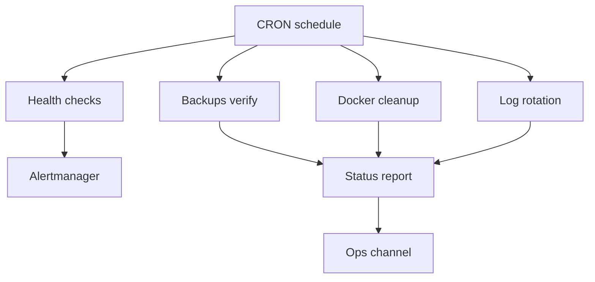

# Automated Maintenance Guide - ERNI-KI

**Version:**1.0**Last Updated:**2025-10-24**Status:**Production Ready

---

## 1. Введение

ERNI-KI реализует комплексное автоматизированное обслуживание для обеспечения
оптимальной производительности, надежности и использования ресурсов. Данное
руководство описывает настроенные автоматические процессы, их расписание и
способы ручного запуска.

### Компоненты автоматизации

| Компонент             | Расписание       | Назначение              | Статус |
| :-------------------- | :--------------- | :---------------------- | :----- |
| **PostgreSQL VACUUM** | Воскресенье 3:00 | Оптимизация базы данных | Active |
| **Docker Cleanup**    | Воскресенье 4:00 | Очистка ресурсов        | Active |
| **Log Rotation**      | Ежедневно 3:00   | Управление логами       | Active |
| **System Monitoring** | Ежечасно         | Проверки здоровья       | Active |
| **Backrest Backups**  | Ежедневно 1:30   | Защита данных           | Active |

## 2. Предварительные требования

Для управления и проверки автоматизации требуется:

-**Доступ к серверу:**SSH доступ с правами root или
sudo. -**Docker:**Установленный и запущенный Docker Engine. -**Скрипты:**Наличие
скриптов в директории `scripts/` (или `/tmp/` для некоторых legacy
задач). -**Утилиты:**`crontab`, `grep`, `tail`.

## 3. Инструкции по обслуживанию

### 3.1 PostgreSQL VACUUM

Автоматическая очистка базы данных для освобождения места и обновления
статистики.

**Конфигурация:**

-**Расписание:**Каждое воскресенье в
3:00 -**Скрипт:**`/tmp/pg_vacuum.sh` -**Лог:**`/tmp/pg_vacuum.log`

**Ручной запуск:**

```bash
/tmp/pg_vacuum.sh
tail -f /tmp/pg_vacuum.log
```

### 3.2 Docker Cleanup

Автоматическая очистка неиспользуемых Docker ресурсов (образы, тома, кэш).

**Конфигурация:**

-**Расписание:**Каждое воскресенье в
4:00 -**Скрипт:**`/tmp/docker-cleanup.sh` -**Лог:**`/tmp/docker-cleanup.log`

**Ручной запуск:**

```bash
/tmp/docker-cleanup.sh
tail -f /tmp/docker-cleanup.log
```

### 3.3 Log Rotation

Автоматическая ротация логов для предотвращения переполнения диска.

**Конфигурация:**

-**Docker Logging:**`json-file`, max-size 10m, max-file 3. -**Скрипт
очистки:**`scripts/rotate-logs.sh` (ежедневно в 3:00).

**Ручной запуск:**

```bash
./scripts/rotate-logs.sh
```

### 3.4 System Monitoring & Backups

-**Health Monitor:**Запускается ежечасно
(`scripts/health-monitor.sh`). -**Backrest Backups:**Ежедневно в 1:30. Бэкапы
конфигурации и данных.

## 4. Верификация

Используйте следующие методы для проверки работоспособности автоматизации.

### Проверка выполнения скриптов

```bash
# PostgreSQL VACUUM
grep "completed successfully" /tmp/pg_vacuum.log | tail -n 5

# Docker Cleanup
grep "cleanup completed" /tmp/docker-cleanup.log | tail -n 5

# Health Monitor
tail -n 20 .config-backup/monitoring/cron.log
```

## Проверка Cron Jobs

```bash
# Проверка статуса службы cron
systemctl status cron

# Просмотр логов cron
journalctl -u cron --since "1 day ago"
```

## Критерии успеха

| Метрика                 | Цель          | Текущее | Статус |
| :---------------------- | :------------ | :------ | :----- |
| **PostgreSQL VACUUM**   | Еженедельно   | Активно |        |
| **Docker Cleanup**      | Еженедельно   | Активно |        |
| **Log Rotation**        | Автоматически | Активно |        |
| **Disk Usage**          | <60%          | 60%     |        |
| **Backup Success Rate** | >99%          | 100%    |        |

## Визуализация: автоподдержание



## 5. Связанная документация

- [Admin Guide](../core/admin-guide.md) - Администрирование системы
- [Monitoring Guide](../monitoring/monitoring-guide.md) - Мониторинг и алерты
- [Docker Cleanup Guide](docker-cleanup-guide.md) - Детальные процедуры очистки
- [Docker Log Rotation](docker-log-rotation.md) - Управление логами
