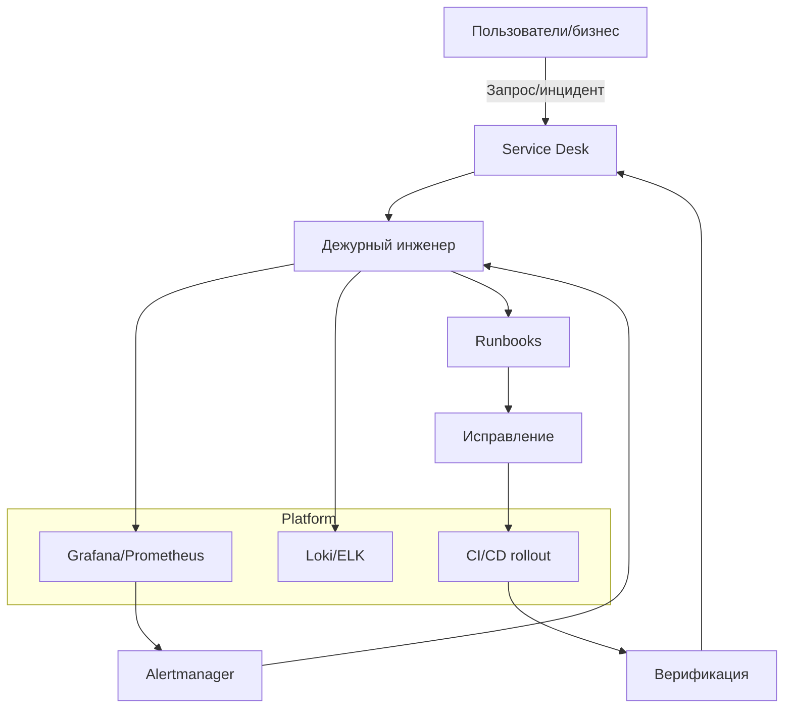

# ‍ Administration Guide - ERNI-KI

> **Версия:**8.1**Дата обновления:**24.10.2025**Статус системы:**Production
> Ready [TOC]

## 1. Введение

Данное руководство предназначено для администраторов системы ERNI-KI. Оно
охватывает все аспекты управления платформой, включая мониторинг, резервное
копирование, управление сервисами, безопасность и оптимизацию
производительности.

### Обзор системы

ERNI-KI — это Production-Ready AI Platform с архитектурой 15+ сервисов,
включающая:

-**AI Core:**Ollama, LiteLLM, OpenWebUI -**Data:**PostgreSQL, Redis,
Qdrant -**Observability:**Prometheus, Grafana, Loki, Fluent
Bit -**Security:**Nginx, Cloudflare Tunnel

## 2. Предварительные требования

Для выполнения административных задач необходимо:

-**Доступ:**

- SSH доступ к серверу с правами `sudo`.
- Доступ к веб-интерфейсам (Grafana, Portainer, OpenWebUI). -**Инструменты:**
- Docker & Docker Compose v2.
- `curl`, `jq`, `htop`, `nc` (netcat).
- `git` для управления конфигурациями. -**Знания:**
- Базовое понимание Docker и Linux администрирования.
- Понимание архитектуры ERNI-KI (см.
  [Architecture Guide](../../architecture/architecture.md)).

## 3. Инструкции по администрированию

### 3.1 Ежедневное обслуживание

#### Утренняя проверка

Рекомендуется выполнять ежедневно в начале рабочего дня:

```bash
# Проверка здоровья всех сервисов
./scripts/maintenance/health-check.sh

# Быстрый аудит системы
./scripts/maintenance/quick-audit.sh

# Проверка веб-интерфейсов
./scripts/maintenance/check-web-interfaces.sh
```

## Мониторинг ресурсов

```bash
# Мониторинг системы
./scripts/performance/system-health-monitor.sh

# Мониторинг GPU
./scripts/performance/gpu-monitor.sh

# Проверка дисков
df -h
```

## 3.2 Система мониторинга

### Healthcheck Стандартизация

Система использует стандартизированные healthcheck'и для всех компонентов.

| Exporter   | Метод                           | Статус |
| :--------- | :------------------------------ | :----- |
| **Redis**  | TCP (`/dev/tcp/localhost/9121`) | Active |
| **Nginx**  | TCP (`/dev/tcp/localhost/9113`) | Active |
| **NVIDIA** | TCP (`/dev/tcp/localhost/9445`) | Active |
| **Ollama** | HTTP (`wget localhost`)         | Active |

#### Доступ к дашбордам

-**Grafana:**`https://your-domain/grafana`
(admin/admin) -**Prometheus:**`https://your-domain/prometheus` -**AlertManager:**`https://your-domain/alertmanager`

### 3.3 Управление сервисами

```bash
# Просмотр статуса всех сервисов
docker compose ps

# Просмотр логов
docker compose logs -f [service-name]

# Перезапуск сервиса
docker compose restart [service-name]

# Обновление сервиса
docker compose pull [service-name]
docker compose up -d [service-name]
```

## Управление Ollama

```bash
# Просмотр доступных моделей
docker compose exec ollama ollama list

# Загрузка новой модели
docker compose exec ollama ollama pull llama2

# Удаление модели
docker compose exec ollama ollama rm model-name
```

## Управление PostgreSQL

```bash
# Подключение к базе данных
docker compose exec db psql -U postgres -d openwebui

# Создание backup базы данных
docker compose exec db pg_dump -U postgres openwebui > backup.sql

# Восстановление базы данных
docker compose exec -T postgres psql -U postgres openwebui < backup.sql
```

## Управление логами

### Просмотр логов

```bash
# Логи всех сервисов
docker compose logs -f

# Логи конкретного сервиса
docker compose logs -f openwebui

# Логи с фильтрацией по времени
docker compose logs --since="1h" --until="30m"
```

## Ротация логов

```bash
# Автоматическая ротация логов
./scripts/maintenance/log-rotation-manager.sh

# Настройка ротации логов
./scripts/core/deployment/setup-log-rotation.sh

# Очистка старых логов
./scripts/security/rotate-logs.sh
```

## Управление безопасностью

### Мониторинг безопасности

```bash
# Проверка безопасности системы
./scripts/security/security-monitor.sh

# Аудит конфигураций безопасности
./scripts/security/security-hardening.sh --audit

# Ротация секретов
./scripts/security/rotate-secrets.sh
```

## Управление SSL сертификатами

```bash
# Проверка срока действия сертификатов
openssl x509 -in conf/ssl/cert.pem -text -noout | grep "Not After"

# Обновление сертификатов
./conf/ssl/generate-ssl-certs.sh

# Перезагрузка nginx после обновления
docker compose restart nginx
```

## Оптимизация производительности

### Мониторинг производительности

```bash
# Быстрый тест производительности
./scripts/performance/quick-performance-test.sh

# Тест производительности GPU
./scripts/performance/gpu-performance-test.sh

# Нагрузочное тестирование
./scripts/performance/load-testing.sh
```

## Оптимизация ресурсов

```bash
# Оптимизация сети
./scripts/maintenance/optimize-network.sh

# Оптимизация SearXNG
./scripts/maintenance/optimize-searxng.sh

# Анализ использования ресурсов
./scripts/performance/hardware-analysis.sh
```

## Обслуживание системы

### Автоматизированное обслуживание (добавлено 24.10.2025)

ERNI-KI использует полностью автоматизированное обслуживание для поддержания
оптимальной производительности:

#### PostgreSQL VACUUM

-**Расписание:**Каждое воскресенье в
3:00 -**Скрипт:**`/tmp/pg_vacuum.sh` -**Лог:**`/tmp/pg_vacuum.log` -**Назначение:**Оптимизация
БД, освобождение дискового пространства

```bash
# Проверка последнего выполнения
grep "completed successfully" /tmp/pg_vacuum.log | tail -n 1

# Ручной запуск
/tmp/pg_vacuum.sh
```

## Docker Cleanup

-**Расписание:**Каждое воскресенье в
4:00 -**Скрипт:**`/tmp/docker-cleanup.sh` -**Лог:**`/tmp/docker-cleanup.log` -**Назначение:**Очистка
неиспользуемых образов (>7 дней), volumes, build cache

```bash
# Проверка последнего выполнения
grep "cleanup completed" /tmp/docker-cleanup.log | tail -n 1

# Ручной запуск
/tmp/docker-cleanup.sh
```

## Log Rotation

-**Конфигурация:**`compose.yml`
(x-critical-logging) -**Параметры:**max-size=10m, max-file=3,
compress=true -**Назначение:**Автоматическая ротация логов контейнеров

### Мониторинг автоматизации

```bash
# Проверка cron jobs
crontab -l | grep -i erni-ki

# Проверка статуса автоматизации
systemctl status cron
journalctl -u cron --since "1 day ago"
```

**Подробная документация:**
[Automated Maintenance Guide](../automation/automated-maintenance-guide.md)

## Еженедельные задачи

```bash
# Полный аудит системы
./scripts/maintenance/comprehensive-audit.sh

# Очистка неиспользуемых Docker образов (автоматизировано)
docker system prune -f

# Проверка обновлений
docker compose pull
```

## Ежемесячные задачи

```bash
# Обновление системы
sudo apt update && sudo apt upgrade

# Проверка дискового пространства
./scripts/performance/hardware-analysis.sh

# Архивирование старых логов
./scripts/maintenance/log-rotation-manager.sh --archive
```

## Аварийное восстановление

### Автоматическое восстановление

```bash
# Запуск автоматического восстановления
./scripts/troubleshooting/automated-recovery.sh

# Исправление критических проблем
./scripts/troubleshooting/fix-critical-issues.sh

# Исправление нездоровых сервисов
./scripts/troubleshooting/fix-unhealthy-services.sh
```

## Ручное восстановление

```bash
# Корректный перезапуск системы
./scripts/maintenance/graceful-restart.sh

# Восстановление из backup
./scripts/backup/backrest-management.sh restore

# Проверка целостности данных
./scripts/troubleshooting/test-healthcheck.sh
```

## Масштабирование

### Горизонтальное масштабирование

```bash
# Добавление дополнительных worker'ов
docker compose up -d --scale openwebui=3

# Настройка load balancer
nano conf/nginx/nginx.conf
```

## Вертикальное масштабирование

```bash
# Увеличение ресурсов для сервисов
nano compose.yml
# Изменить memory и cpu limits

# Применение изменений
docker compose up -d
```

## Диагностика проблем

### Общая диагностика

```bash
# Проверка статуса всех сервисов
docker compose ps

# Проверка использования ресурсов
docker stats

# Проверка сетевых подключений
docker network ls
```

## Специфичная диагностика

```bash
# Диагностика Ollama
./scripts/troubleshooting/test-healthcheck.sh

# Диагностика SearXNG
./scripts/troubleshooting/test-searxng-integration.sh

# Диагностика сети
./scripts/troubleshooting/test-network-simple.sh
```

## Nginx и API диагностика (обновлено v7.0)

### Проверка nginx конфигурации

```bash
# Проверка синтаксиса конфигурации
docker exec erni-ki-nginx-1 nginx -t

# Просмотр полной конфигурации
docker exec erni-ki-nginx-1 nginx -T

# Проверка include файлов
docker exec erni-ki-nginx-1 ls -la /etc/nginx/includes/
docker exec erni-ki-nginx-1 cat /etc/nginx/includes/searxng-api-common.conf
```

## Тестирование API эндпоинтов

```bash
# Проверка health endpoint
curl -v http://localhost:8080/health
# Ожидаемый ответ: {"status":true}

# Тестирование SearXNG API (исправлено)
curl -v "http://localhost:8080/api/searxng/search?q=test&format=json"
# Ожидаемый ответ: JSON с результатами поиска

# Проверка конфигурации системы
curl -v http://localhost:8080/api/config
# Ожидаемый ответ: JSON с настройками OpenWebUI
```

## Диагностика WebSocket соединений

```bash
# Проверка WebSocket заголовков в логах nginx
docker logs --tail=20 erni-ki-nginx-1 | grep -i upgrade

# Тестирование WebSocket соединения
wscat -c ws://localhost:8080/ws
```

## Решение частых проблем

**1. 404 ошибки на API эндпоинтах:**

```bash
# Проверить include файлы в контейнере
docker exec erni-ki-nginx-1 ls -la /etc/nginx/includes/

# Скопировать обновленные include файлы
docker cp conf/nginx/includes/ erni-ki-nginx-1:/etc/nginx/

# Применить изменения
docker exec erni-ki-nginx-1 nginx -s reload
```

**2. SSL/HTTPS проблемы:**

```bash
# Проверить SSL сертификаты
docker exec erni-ki-nginx-1 openssl x509 -in /etc/nginx/ssl/nginx-fullchain.crt -text -noout

# Проверить CSP заголовки
curl -I https://localhost:443/ | grep -i content-security
```

**3. SearXNG API не работает:**

```bash
# Проверить upstream статус через публичный API маршрут
docker exec erni-ki-nginx-1 curl -s http://localhost/api/searxng/search?q=test&format=json

# Проверить переменную $universal_request_id
docker exec erni-ki-nginx-1 grep "universal_request_id" /etc/nginx/nginx.conf
```

## Контакты и поддержка

### Внутренние ресурсы

-**Мониторинг:**<https://your-domain/grafana> -**Логи:**<https://your-domain/grafana>
(Explore → Loki) -**Метрики:**<https://your-domain/prometheus>

### Внешние ресурсы

-**Документация:**
[Troubleshooting Guide](../troubleshooting/troubleshooting-guide.md) -**Database
Troubleshooting:**
[docs/operations/database/database-troubleshooting.md](../database/database-troubleshooting.md) -**Database
Monitoring:**
[docs/operations/database/database-monitoring-plan.md](../database/database-monitoring-plan.md) -**Production
Optimizations:**
[docs/operations/database/database-production-optimizations.md](../database/database-production-optimizations.md)

## 4. Верификация

Используйте следующие критерии для проверки корректности работы системы после
административных действий.

### Критерии успеха

| Компонент    | Метрика       | Целевое значение | Команда проверки              |
| :----------- | :------------ | :--------------- | :---------------------------- |
| **Services** | Status        | 29+ Healthy      | `docker ps \| grep healthy`   |
| **API**      | Response Time | < 200ms          | `curl -w "%{time_total}" ...` |
| **Database** | Cache Hit     | > 95%            | `psql ...`                    |
| **Backup**   | Success Rate  | 100%             | `curl .../GetOperations`      |

### Процедуры проверки



```bash
# 1. Проверка статуса всех сервисов
docker ps --format "table {{.Names}}\t{{.Status}}" | grep -E "(healthy|Up)" | wc -l
# Ожидаемый результат: 29+ сервисов

# 2. Проверка Cloudflare туннеля (отсутствие DNS ошибок)
docker logs --since=5m erni-ki-cloudflared-1 2>&1 | grep -E "(ERROR|ERR)" | wc -l
# Ожидаемый результат: 0

# 3. Проверка SearXNG API производительности
time curl -s "http://localhost:8080/api/searxng/search?q=test&format=json" | jq '.results | length'
# Ожидаемый результат: <2s, 40+ результатов

# 4. Проверка Backrest API
curl -X POST "http://localhost:9898/v1.Backrest/GetOperations" -H "Content-Type: application/json" -d '{}' -s | jq 'has("operations")'
# Ожидаемый результат: true или false (API отвечает)

# 5. Проверка GPU Ollama
docker exec erni-ki-ollama-1 nvidia-smi -L | grep -c "GPU"
# Ожидаемый результат: 1

# 6. Проверка OpenWebUI доступности
curl -s -o /dev/null -w "%{http_code}" http://localhost:8080/health
# Ожидаемый результат: 200
```



## Rollback процедуры

```bash
# 1. Остановка сервисов
docker compose down

# 2. Восстановление конфигураций из snapshot
cp -r .config-backup/pre-update-YYYYMMDD-HHMMSS/* .

# 3. Запуск предыдущей версии
docker compose up -d

# 4. Проверка критических сервисов
./scripts/maintenance/health-check.sh

# Время выполнения: 5-10 минут
```

## Визуализация: контур администрирования



---

**Примечание:**Данное руководство актуализировано для архитектуры 29 сервисов
ERNI-KI версии 5.1 (август 2025).
