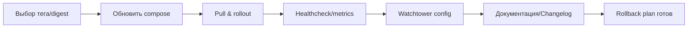

# Checklist: Обновление Docker-образов ERNI-KI

Этот чеклист фиксирует процесс обновления любых контейнерных образов без
возврата к плавучим тегам `latest`.

## Поток обновления



## Чеклист

1.**Выбор релиза**

- Найдите стабильный семантический тег или SHA256 digest (во всех случаях –
  `docker pull IMAGE@digest`).
- Сохраните ссылку на changelog/релиз, где описаны изменения.

  2.**Обновление репозитория**

- В `compose.yml` и `compose.yml.example` замените тег на выбранный.
- Обновите документацию (service-inventory, monitoring-guide, architecture, и
  др.) чтобы теги совпадали с конфигурацией.
- Если образ использует Docker secrets/entrypoint, убедитесь что инструкции в
  `docs/` тоже обновлены.

  3.**Тестирование**

- `docker compose pull SERVICE && docker compose up -d SERVICE` (или
  `--no-deps`).
- Проверьте healthchecks и основные эндпоинты:

```bash
docker compose ps SERVICE
docker compose logs SERVICE --tail=50
```

- Для экспортёров: `curl -s http://localhost:<port>/metrics | head`.

  4.**Watchtower**

- Убедитесь, что для сервисов с автообновлением (`watchtower.enable=true`)
  указан новый тег. Watchtower подтянет его при следующем цикле.
- Для критических сервисов (nginx, db) автообновление остаётся выключенным.

  5.**Документация релиза**

- В `CHANGELOG.md`/релизных заметках перечислите обновлённые образы.
- Добавьте инструкции по откату (предыдущий digest) при необходимости.

  6.**Валидация**

- Выполните `docker compose config` и убедитесь, что результат содержит только
  закреплённые теги.
- Запустите `rg ':latest'` – в репозитории не должно остаться упоминаний о
  контейнерных образах с этим тегом.

Соблюдение чеклиста гарантирует, что Watchtower не подтянет несовместимые релизы
и упростит откаты при проблемах с обновлениями.
