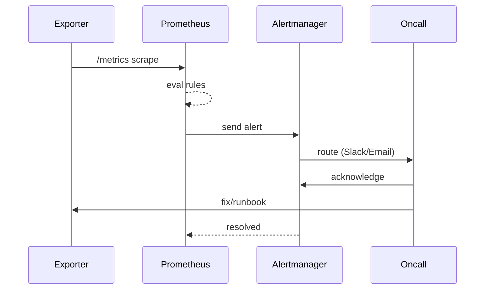

# Prometheus Alerts Guide - ERNI-KI

[TOC]

**Version:**1.0**Last Updated:**2025-10-24**Status:**Production Ready

---

## Overview

This guide provides comprehensive documentation for all 27 Prometheus alert
rules active in the ERNI-KI system.

### Alert Distribution

| Category                | Count | File                                                    |
| ----------------------- | ----- | ------------------------------------------------------- |
| **System Alerts (New)** | 18    | `conf/prometheus/alerts.yml`                            |
| **Existing Alerts**     | 9     | `conf/prometheus/alert_rules.yml`, `logging-alerts.yml` |
| **Total Active**        | 27    | -                                                       |

### Severity Levels

-**Critical**- Immediate action required (system failure, data loss risk)

- [WARNING]**Warning**- Attention needed (performance degradation, approaching
  limits) -**Info**- Informational (non-critical events)

---

## Critical Alerts

### 1. DiskSpaceCritical

**Severity:**Critical**Component:**System**Threshold:**Disk usage >85%
**Duration:**5 minutes

**Expression:**

```promql
(node_filesystem_avail_bytes{mountpoint="/"} / node_filesystem_size_bytes{mountpoint="/"}) * 100 < 15
```

**Description:**Triggers when root filesystem has less than 15% free space.

**Impact:**

- System may become unresponsive
- Docker containers may fail to start
- Database writes may fail
- Log files may be truncated

**Resolution:**

```bash
# Check disk usage
df -h /

# Find large files
du -sh /* | sort -rh | head -n 10

# Clean Docker resources
docker system prune -a --volumes -f

# Run automated cleanup
/tmp/docker-cleanup.sh
```

**Related Automation:**Docker cleanup runs every Sunday at 4:00 AM

---

## 2. MemoryCritical

**Severity:**Critical**Component:**System**Threshold:**Available memory <5%
**Duration:**5 minutes

**Expression:**

```promql
(node_memory_MemAvailable_bytes / node_memory_MemTotal_bytes) * 100 < 5
```

**Description:**Triggers when system has less than 5% available memory.

**Impact:**

- OOM killer may terminate processes
- System performance severely degraded
- Services may crash

**Resolution:**

```bash
# Check memory usage
free -h

# Find memory-intensive processes
ps aux --sort=-%mem | head -n 10

# Check Docker container memory
docker stats --no-stream --format "table {{.Container}}\t{{.MemUsage}}"

# Restart high-memory containers if needed
docker compose restart SERVICE_NAME
```

---

## 3. ContainerDown

**Severity:**Critical**Component:**Docker**Threshold:**Container not
running**Duration:**1 minute

**Expression:**

```promql
up{job=~".*"} == 0
```

**Description:**Triggers when any monitored container is down.

**Impact:**

- Service unavailable
- Dependent services may fail
- User-facing features broken

**Resolution:**

```bash
# Check container status
docker compose ps

# View container logs
docker compose logs SERVICE_NAME --tail 50

# Restart container
docker compose restart SERVICE_NAME

# Check healthcheck
docker inspect SERVICE_NAME | jq '.[0].State.Health'
```

---

## 4. PostgreSQLDown

**Severity:**Critical**Component:**Database**Threshold:**PostgreSQL
unavailable**Duration:**1 minute

**Expression:**

```promql
pg_up == 0
```

**Description:**Triggers when PostgreSQL database is unavailable.

**Impact:**

- OpenWebUI cannot store data
- LiteLLM cannot access configuration
- All database-dependent features fail

**Resolution:**

```bash
# Check PostgreSQL status
docker compose ps db

# View PostgreSQL logs
docker compose logs db --tail 50

# Check connections
docker compose exec db psql -U postgres -c "SELECT count(*) FROM pg_stat_activity;"

# Restart if needed
docker compose restart db
```

---

## 5. RedisDown

**Severity:**Critical**Component:**Cache**Threshold:**Redis unavailable
**Duration:**1 minute

**Expression:**

```promql
redis_up == 0
```

**Description:**Triggers when Redis cache is unavailable.

**Impact:**

- WebSocket manager fails
- SearXNG caching disabled
- Session management broken

**Resolution:**

```bash
# Check Redis status
docker compose ps redis

# Test Redis connection
docker compose exec redis redis-cli -a $REDIS_PASSWORD ping

# View Redis logs
docker compose logs redis --tail 50

# Restart if needed
docker compose restart redis
```

---

## 6. OllamaGPUDown

**Severity:**Critical**Component:**AI/GPU**Threshold:**Ollama GPU
unavailable**Duration:**2 minutes

**Expression:**

```promql
ollama_up == 0
```

**Description:**Triggers when Ollama AI service with GPU is unavailable.

**Impact:**

- AI model inference fails
- OpenWebUI cannot generate responses
- GPU resources wasted

**Resolution:**

```bash
# Check Ollama status
docker compose ps ollama

# Check GPU availability
nvidia-smi

# Test Ollama API
curl http://localhost:11434/api/tags

# View Ollama logs
docker compose logs ollama --tail 50

# Restart if needed
docker compose restart ollama
```

---

## 7. NginxDown

**Severity:**Critical**Component:**Gateway**Threshold:**Nginx unavailable
**Duration:**1 minute

**Expression:**

```promql
nginx_up == 0
```

**Description:**Triggers when Nginx reverse proxy is unavailable.

**Impact:**

- All web services inaccessible
- SSL termination fails
- External access broken

**Resolution:**

```bash
# Check Nginx status
docker compose ps nginx

# Test Nginx configuration
docker compose exec nginx nginx -t

# View Nginx logs
docker compose logs nginx --tail 50

# Restart if needed
docker compose restart nginx
```

---

## [WARNING] Warning Alerts

### 8. DiskSpaceWarning

**Severity:**Warning**Component:**System**Threshold:**Disk usage >75%
**Duration:**10 minutes

**Expression:**

```promql
(1 - (node_filesystem_avail_bytes{fstype!~"tmpfs|vfat",mountpoint!="/boot/efi"} /
 node_filesystem_size_bytes{fstype!~"tmpfs|vfat",mountpoint!="/boot/efi"})) * 100 > 80
```

**Notes:**EFI-раздел (`/boot/efi`, `vfat`) исключён, чтобы не получать ложных
срабатываний из‑за небольшого загрузочного тома.

**Resolution:**Same as DiskSpaceCritical, but less urgent.

---

### 9. MemoryWarning

**Severity:**Warning**Component:**System**Threshold:**Available memory <15%
**Duration:**10 minutes

**Resolution:**Same as MemoryCritical, but less urgent.

---

### 10. HighCPUUsage

**Severity:**Warning**Component:**System**Threshold:**CPU usage >80%
**Duration:**5 minutes

**Expression:**

```promql
100 - (avg by (instance) (rate(node_cpu_seconds_total{mode="idle"}[5m])) * 100) > 80
```

**Resolution:**

```bash
# Check CPU usage
top -bn1 | head -n 20

# Find CPU-intensive processes
ps aux --sort=-%cpu | head -n 10

# Check Docker container CPU
docker stats --no-stream --format "table {{.Container}}\t{{CPUPerc}}"
```

---

## 11. ContainerRestarting

**Severity:**Warning**Component:**Docker**Threshold:**≥2 restarts per container
within 15 minutes**Duration:**1 minute (debounce)

**Expression:**

```promql
sum by (name) (
 changes(
 container_start_time_seconds{
 job="cadvisor",
 container_label_com_docker_compose_project="erni-ki",
 name!~"erni-ki-(cadvisor|node-exporter|alertmanager).*"
 }[15m]
 )
) >= 2
```

**Notes:**

- `changes(container_start_time_seconds...)` реагирует только когда контейнер
  действительно стартует заново, поэтому исчез шум от `container_last_seen`.
- Исключены инфраструктурные контейнеры (cadvisor, node-exporter, alertmanager)
  чтобы alert не срабатывал на агенты мониторинга.

**Resolution:**

```bash
# Проверить фактическое количество рестартов
docker inspect SERVICE_NAME | jq '.[0].RestartCount'

# Посмотреть последние логи и причины выхода
docker compose logs SERVICE_NAME --since 15m

# Проверить healthcheck/exit code
docker inspect SERVICE_NAME | jq '.[0].State | {Status, ExitCode, Health}'
```

---

## 12. PostgreSQLHighConnections

**Severity:**Warning**Component:**Database**Threshold:**>80 connections
**Duration:**5 minutes

**Expression:**

```promql
pg_stat_database_numbackends{datname="openwebui"} > 80
```

**Resolution:**

```bash
# Check active connections
docker compose exec db psql -U postgres -d openwebui -c "SELECT count(*) FROM pg_stat_activity WHERE state = 'active';"

# View connection details
docker compose exec db psql -U postgres -d openwebui -c "SELECT pid, usename, application_name, client_addr, state FROM pg_stat_activity;"

# Terminate idle connections if needed
docker compose exec db psql -U postgres -d openwebui -c "SELECT pg_terminate_backend(pid) FROM pg_stat_activity WHERE state = 'idle' AND state_change < now() - interval '1 hour';"
```

---

## 13. RedisHighMemory

**Severity:**Warning**Component:**Cache**Threshold:**Memory usage >1GB
**Duration:**10 minutes

**Expression:**

```promql
redis_memory_used_bytes > 1073741824
```

**Resolution:**

```bash
# Check Redis memory
docker compose exec redis redis-cli -a $REDIS_PASSWORD INFO memory

# Check key count
docker compose exec redis redis-cli -a $REDIS_PASSWORD DBSIZE

# Flush cache if needed (CAUTION)
docker compose exec redis redis-cli -a $REDIS_PASSWORD FLUSHDB
```

---

## 14. RedisHighFragmentation

**Severity:**Warning**Component:**Cache**Threshold:**
`redis_mem_fragmentation_ratio > 5`**Duration:**10 minutes

**Expression:**

```promql
redis_mem_fragmentation_ratio > 5
```

**Resolution:**

```bash
# Проверить текущую фрагментацию и память
docker compose exec redis redis-cli INFO memory | grep -E "mem_fragmentation_ratio|used_memory"

# Проверить лог watchdog
tail -n 50 logs/redis-fragmentation-watchdog.log

# Принудительно выполнить очистку (если watchdog не сработал)
docker compose exec redis redis-cli MEMORY PURGE
```

**Notes:**Cron-задача `*/5 * * * * ... redis-fragmentation-watchdog.sh`
автоматически запускает `MEMORY PURGE`. Alert служит ранним сигналом и указывает
runbook на раздел _docs/security/log-audit.md › Выполненные remediation_.

---

## 15. OllamaHighVRAM

**Severity:**Warning**Component:**AI/GPU**Threshold:**VRAM usage >80%
**Duration:**10 minutes

**Expression:**

```promql
(nvidia_gpu_memory_used_bytes / nvidia_gpu_memory_total_bytes) * 100 > 80
```

**Resolution:**

```bash
# Check GPU memory
nvidia-smi

# Check loaded models
docker compose exec ollama ollama list

# Unload unused models
docker compose exec ollama ollama rm MODEL_NAME
```

---

## 16. NginxHighErrorRate

**Severity:**Warning**Component:**Gateway**Threshold:**>10 5xx errors/min
**Duration:**5 minutes

**Expression:**

```promql
rate(nginx_http_requests_total{status=~"5.."}[1m]) > 10
```

**Resolution:**

```bash
# Check Nginx error logs
docker compose logs nginx --tail 100 | grep "error"

# Check upstream status
curl -s http://localhost:8080/nginx_status

# Test backend services
curl -I http://localhost:8080
```

---

## Performance Alerts

### 17. OpenWebUISlowResponse

**Severity:**Warning**Component:**Application**Threshold:**Response
time >5s**Duration:**5 minutes

**Resolution:**

```bash
# Check OpenWebUI logs
docker compose logs openwebui --tail 50

# Check database performance
docker compose exec db psql -U postgres -d openwebui -c "SELECT query, mean_exec_time FROM pg_stat_statements ORDER BY mean_exec_time DESC LIMIT 10;"

# Check Ollama response time
time curl -X POST http://localhost:11434/api/generate -d '{"model":"llama3.2","prompt":"test"}'
```

---

## 18. SearXNGSlowSearch

**Severity:**Warning**Component:**Search**Threshold:**Search time >3s
**Duration:**5 minutes

**Resolution:**

```bash
# Test SearXNG API
time curl -s "http://localhost:8080/search?q=test&format=json"

# Check Redis cache
docker compose exec redis redis-cli -a $REDIS_PASSWORD INFO stats

# Check SearXNG logs
docker compose logs searxng --tail 50
```

---

## 19. DockerStoragePoolAlmostFull

**Severity:**Warning**Component:**Infrastructure**Threshold:**Docker
storage >85%**Duration:**10 minutes

**Resolution:**

```bash
# Check Docker disk usage
docker system df

# Run cleanup
docker system prune -a --volumes -f

# Run automated cleanup script
/tmp/docker-cleanup.sh
```

---

## Alert Management

### Viewing Alerts

**Prometheus UI:**

```
http://localhost:9091/alerts
```

**API:**

```bash
# All alerts
curl -s http://localhost:9091/api/v1/alerts

# Firing alerts only
curl -s http://localhost:9091/api/v1/alerts | jq '.data.alerts[] | select(.state=="firing")'

# Alerts by severity
curl -s http://localhost:9091/api/v1/rules | jq '.data.groups[].rules[] | select(.labels.severity=="critical")'
```

## Testing Alerts

See [Monitoring Guide](monitoring-guide.md#alert-testing) for alert testing
procedures.

### Silencing Alerts

**Temporary silence (via Alertmanager):**

```bash
# Silence specific alert for 1 hour
curl -X POST http://localhost:9093/api/v1/silences \
 -H "Content-Type: application/json" \
 -d '{
 "matchers": [{"name":"alertname","value":"DiskSpaceWarning","isRegex":false}],
 "startsAt":"'$(date -u +%Y-%m-%dT%H:%M:%S.000Z)'",
 "endsAt":"'$(date -u -d '+1 hour' +%Y-%m-%dT%H:%M:%S.000Z)'",
 "createdBy":"admin",
 "comment":"Maintenance window"
 }'
```

---

## Визуализация: путь алерта



---

## Related Documentation

- [Monitoring Guide](monitoring-guide.md) - Complete monitoring documentation
- [Admin Guide](../core/admin-guide.md) - System administration
- [Architecture](../../architecture/architecture.md) - System architecture

---

**Last Updated:**2025-10-24**Next Review:**2025-11-24
