# Руководство по диагностике проблем ERNI-KI

> **Версия:**1.0**Дата:**2025-09-25**Статус:**Production Ready [TOC]

## 1. Введение

Данное руководство содержит инструкции по диагностике и устранению
неисправностей в системе ERNI-KI. Оно разделено на критические инциденты
(требующие немедленного вмешательства) и частые проблемы.

## Визуализация: поток triage

```mermaid
flowchart TD
 Alert[Алерт/Жалоба] --> Triage[Классификация P1/P2/P3]
 Triage --> Observe[Метрики/Логи]
 Observe --> Runbook[Runbook или SOP]
 Runbook --> Fix[Фикс/Роллбек]
 Fix --> Validate[Проверка health]
 Validate --> Report[Запись в Archon + пост-мортем]
```



## 2. Предварительные требования

Для эффективной диагностики необходимо:

-**Доступ:**SSH (`sudo`), Grafana, Portainer. -**Инструменты:**`docker`, `curl`,
`nc`, `htop`, `nvidia-smi`. -**Логи:**Доступ к логам через `docker logs` или
Grafana/Loki.

## 3. Инструкции по диагностике

### 3.1 Критические проблемы (SLA < 15m)

### **Система полностью недоступна**

#### **Симптомы:**

- Внешние домены не отвечают (ki.erni-gruppe.ch, webui.diz.zone)
- Локальный доступ <http://localhost> недоступен
- Множественные контейнеры в статусе "unhealthy" или "exited"

#### **Диагностика:**

```bash
# 1. Проверка статуса всех сервисов
docker compose ps

# 2. Проверка системных ресурсов
df -h # Проверка места на диске
free -h # Проверка памяти
nvidia-smi # Проверка GPU

# 3. Проверка Docker
docker system df # Использование места Docker
docker system events --since 1h # События за последний час
```

## **Решение:**

```bash
# 1. Экстренный перезапуск
docker compose down
docker compose up -d

# 2. Если не помогает - очистка и перезапуск
docker system prune -f
docker compose up -d --force-recreate

# 3. Крайняя мера - полная очистка
docker compose down -v
docker system prune -a -f
docker compose up -d
```

## **OpenWebUI недоступен (основной интерфейс)**

### **Симптомы:**

- <http://localhost/health> возвращает 502/503/504
- Пользователи не могут войти в систему
- Ошибки подключения к базе данных

#### **Диагностика:**

```bash
# 1. Проверка статуса OpenWebUI
docker compose logs openwebui --tail=50

# 2. Проверка зависимостей
docker compose ps db redis ollama

# 3. Проверка подключения к БД
docker exec erni-ki-db-1 pg_isready -U postgres

# 4. Проверка Redis
docker exec erni-ki-redis-1 redis-cli -a $REDIS_PASSWORD ping
```

## **Решение:**

```bash
# 1. Перезапуск зависимостей
docker compose restart db redis

# 2. Перезапуск OpenWebUI
docker compose restart openwebui

# 3. Проверка восстановления
sleep 30
curl -f http://localhost/health
```

---

## ЧАСТЫЕ ПРОБЛЕМЫ И РЕШЕНИЯ

### **GPU/AI Сервисы**

#### **Проблема: Ollama не использует GPU**

```bash
# Диагностика
nvidia-smi # Проверка доступности GPU
docker exec erni-ki-ollama-1 nvidia-smi # GPU в контейнере

# Решение
docker compose restart ollama
# Проверка использования GPU после запуска модели
docker exec erni-ki-ollama-1 nvidia-smi
```

## **Проблема: LiteLLM возвращает ошибки 500**

```bash
# Диагностика
docker compose logs litellm --tail=30
curl -f http://localhost:4000/health

# Решение
docker compose restart litellm
sleep 15
curl -f http://localhost:4000/health
```

## **Сетевые проблемы**

### **Проблема: Nginx 502 Bad Gateway**

```bash
# Диагностика
docker compose logs nginx --tail=20
docker exec erni-ki-nginx-1 nginx -t # Проверка конфигурации

# Проверка upstream сервисов
curl -f http://openwebui:8080/health # Из контейнера nginx
curl -f http://localhost:8080/health # Прямое подключение

# Решение
docker compose restart nginx
```

## **Проблема: Cloudflare туннели не работают**

```bash
# Диагностика
docker compose logs cloudflared --tail=20
docker exec erni-ki-cloudflared-1 nslookup nginx

# Решение
docker compose restart cloudflared
```

## **База данных**

### **Проблема: PostgreSQL connection refused**

```bash
# Диагностика
docker compose logs db --tail=30
docker exec erni-ki-db-1 pg_isready -U postgres

# Проверка подключений
docker exec erni-ki-db-1 psql -U postgres -c "SELECT count(*) FROM pg_stat_activity;"

# Решение
docker compose restart db
sleep 10
docker exec erni-ki-db-1 pg_isready -U postgres
```

## **Проблема: Redis connection timeout**

```bash
# Диагностика
docker compose logs redis --tail=20
docker exec erni-ki-redis-1 redis-cli -a $REDIS_PASSWORD info

# Решение
docker compose restart redis
sleep 5
docker exec erni-ki-redis-1 redis-cli -a $REDIS_PASSWORD ping
```

## **Мониторинг**

### **Проблема: Prometheus не собирает метрики**

```bash
# Диагностика
curl -f http://localhost:9090/api/v1/targets # Проверка targets
docker compose logs prometheus --tail=20

# Решение
docker exec erni-ki-prometheus promtool check config /etc/prometheus/prometheus.yml
docker compose restart prometheus
```

## **Проблема: Grafana не показывает данные**

```bash
# Диагностика
curl -f http://localhost:3000/api/health
docker compose logs grafana --tail=20

# Решение
docker compose restart grafana
```

---

## 4. Верификация и Инструменты

Используйте эти команды для подтверждения устранения проблем и общей проверки
здоровья системы.

### Системная диагностика

```bash
# Общий статус системы
docker compose ps
docker stats --no-stream

# Использование ресурсов
df -h
free -h
nvidia-smi

# Сетевая диагностика
docker network ls
docker network inspect erni-ki_default
```

## Диагностика логов

```bash
# Поиск ошибок в логах за последний час
docker compose logs --since 1h | grep -i error

# Критические ошибки
docker compose logs --since 1h | grep -E "(FATAL|CRITICAL|ERROR)"

# Проблемы с подключением
docker compose logs --since 1h | grep -E "(connection|timeout|refused)"

# GPU проблемы
docker compose logs --since 1h | grep -E "(cuda|gpu|nvidia)"
```

## Проверка конфигураций

```bash
# Nginx конфигурация
docker exec erni-ki-nginx-1 nginx -t

# Prometheus конфигурация
docker exec erni-ki-prometheus promtool check config /etc/prometheus/prometheus.yml

# Проверка переменных окружения
docker compose config | grep -A 5 -B 5 "environment:"
```

## 5. Связанная документация

- [Admin Guide](../core/admin-guide.md)
- [Monitoring Guide](../monitoring/monitoring-guide.md)
- [Service Restart Procedures](../maintenance/service-restart-procedures.md)
