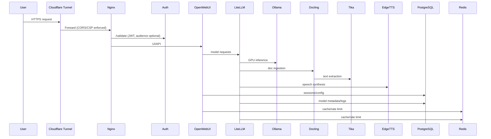

# Diagrams

## High-level Architecture

```mermaid
graph LR
  U[Users/Browser] --> CF[Cloudflare Tunnel]
  CF --> NG[Nginx]
  NG --> AU[Auth (JWT)]
  NG --> OW[OpenWebUI]
  OW --> LL[LiteLLM]
  LL --> OL[Ollama (GPU)]
  LL --> DL[Docling]
  DL --> TK[Tika]
  LL --> ET[EdgeTTS]
  AU --> DB[(PostgreSQL)]
  LL --> DB
  OW --> DB
  LL --> RD[(Redis)]
  OW --> RD
  NG --> SX[SearXNG]
  subgraph Observability
    PR[Prometheus] --> AM[Alertmanager]
    FB[Fluent Bit] --> LK[Loki]
    PR --> EX[Exporters]
  end
  NG -. metrics .-> EX
  DB -. metrics .-> EX
  RD -. metrics .-> EX
  OL -. metrics .-> EX
  LL -. logs .-> FB
  OW -. logs .-> FB
```

## Request & Data Flow



## Observability Pipeline

```mermaid
flowchart LR
  subgraph Services
    OW[OpenWebUI]:::svc
    LL[LiteLLM]:::svc
    OL[Ollama]:::svc
    DL[Docling]:::svc
    NG[Nginx]:::svc
    DB[(PostgreSQL)]:::data
    RD[(Redis)]:::data
  end

  OW -->|logs| FB[Fluent Bit]
  LL -->|logs| FB
  OL -->|logs| FB
  NG -->|logs| FB
  FB --> LK[Loki]

  OW -->|metrics| EX[Exporters]
  LL -->|metrics| EX
  OL -->|metrics| EX
  NG -->|metrics| EX
  DB -->|metrics| EX
  RD -->|metrics| EX
  EX --> PR[Prometheus]
  PR --> AM[Alertmanager]
  AM --> WH[Webhook Receiver]
  WH --> NT[Notifications (Slack/PagerDuty)]

  classDef svc fill:#e8f1ff,stroke:#3b6cb7;
  classDef data fill:#fcefe3,stroke:#c27b36;
```

## Security & Perimeter

```mermaid
flowchart TD
  Internet --> CF[Cloudflare Tunnel]
  CF --> NG[Nginx]
  NG -->|ACL RFC1918/localhost| SX[SearXNG API]
  NG --> OW[OpenWebUI]
  NG --> LL[LiteLLM API]
  NG --> AU[Auth /validate]

  subgraph Controls
    CSP[CSP hardened (no inline/eval)]:::ctrl
    CORS[CORS allowlist reflect]:::ctrl
    ACL[ACL for SearXNG API]:::ctrl
    JWT[JWT audience support]:::ctrl
    RO[Read-only stateless (in progress)]:::ctrl
  end

  NG -.enforces.-> CSP
  NG -.enforces.-> CORS
  NG -.enforces.-> ACL
  AU -.validates.-> JWT
  NG -.pending.-> RO

  subgraph Secrets
    DS[Docker secrets: DB, LiteLLM, OpenWebUI, Grafana(pending)]:::secret
  end

  DS --> OW
  DS --> LL
  DS --> AU

  classDef ctrl fill:#e7fff5,stroke:#1f8a70;
  classDef secret fill:#f0e8ff,stroke:#6c4bb6;
```
